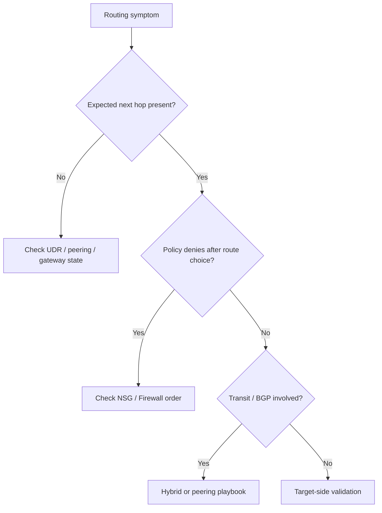

---
hide:
  - toc
content_sources:
  diagrams:
    - id: quick-context
      type: flowchart
      source: self-generated
      justification: "Synthesized troubleshooting flow for this guide from Microsoft Learn diagnostic and service documentation."
      based_on:
        - https://learn.microsoft.com/en-us/azure/virtual-network/virtual-networks-udr-overview
        - https://learn.microsoft.com/en-us/troubleshoot/azure/virtual-network/virtual-network-troubleshoot-peering-issues
---

# First 10 Minutes: Routing

## Quick Context
Use this checklist when traffic resolves correctly but takes the wrong path, never reaches a peered or hybrid network, or appears blocked by route and policy interaction.

<!-- diagram-id: quick-context -->


## Step 1: Inspect effective routes first
- Check the actual route selected for the failing destination.
- Good signal: expected next hop and prefix are active.
- Bad signal: unexpected UDR, missing peer prefix, or black-hole route.

## Step 2: Check whether policy changed the outcome
- Pair route evidence with effective NSG and firewall evidence.
- Good signal: chosen path also has a matching allow rule.
- Bad signal: route is correct but deny happens afterward.

## Step 3: If peering is involved, inspect both sides
- Check peering state, address spaces, and transit/forwarded-traffic flags.
- Good signal: both peerings are connected and symmetric.
- Bad signal: one side deleted, overlap introduced, or flags mismatched.

## Step 4: If hybrid is involved, inspect tunnel and route learning
- Check tunnel health, BGP state, and learned prefixes.
- Good signal: connected tunnel and expected route advertisements.
- Bad signal: tunnel down, BGP down, or missing on-prem prefixes.

## Step 5: Re-run reachability after route validation
- Once route and policy are proven, test end-to-end again to isolate target-side issues.

## Decision points
- **Policy-order confusion** -> [NSG vs UDR vs Firewall](../playbooks/routing/nsg-vs-udr-vs-firewall.md)
- **Peering path issue** -> [Peering and Routing Issues](../playbooks/routing/peering-and-routing-issues.md)
- **VPN / ExpressRoute issue** -> [Hybrid Connectivity Issues](../playbooks/routing/hybrid-connectivity-issues.md)

```bash
az network nic show-effective-route-table --resource-group <resource-group> --name <nic-name>
az network nic list-effective-nsg --resource-group <resource-group> --name <nic-name>
az network watcher show-next-hop --resource-group <resource-group> --vm <vm-name> --source-ip <source-ip> --dest-ip <dest-ip>
```

## See Also

- [Connectivity Checklist](connectivity.md)
- [Decision Tree](../decision-tree.md)
- [Routing Cheatsheet](../../reference/routing-cheatsheet.md)
- [Routing Playbooks](../playbooks/index.md#routing)

## Sources

- [Azure route tables overview](https://learn.microsoft.com/en-us/azure/virtual-network/virtual-networks-udr-overview)
- [Troubleshoot virtual network peering issues](https://learn.microsoft.com/en-us/troubleshoot/azure/virtual-network/virtual-network-troubleshoot-peering-issues)
