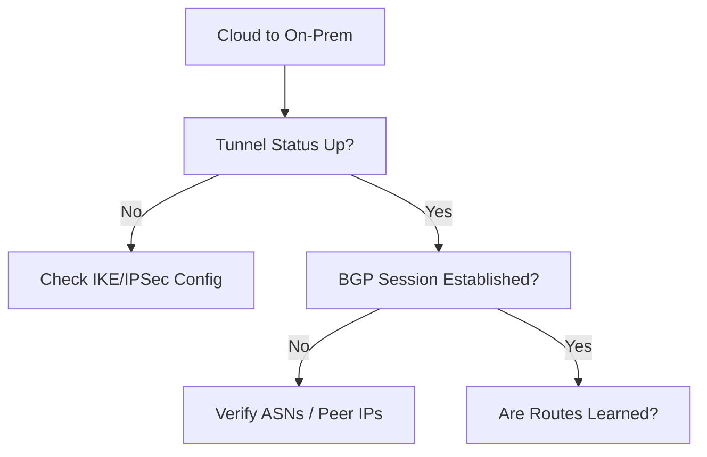

# Hybrid Connectivity Issues

Resolving tunnel and routing failures across VPN or ExpressRoute.

| Cause | Indicator | Resolution |
| --- | --- | --- |
| BGP State: Down | Routes not appearing in Azure. | Check BGP Peering IP / ASN. |
| Missing Routes | On-prem CIDR not advertised. | Update Local Network Gateway. |
| Tunnel State: Down | VPN Phase 1/2 mismatch. | Align IKE/IPSec Policy. |
| MTU Issues | Fragmentation drops. | Clamp MSS or lower MTU. |

!!! note
    Verify how far the packet travels by using `tracert` or Azure's Packet Capture tool on the Gateway.

## Sources

- [Troubleshoot VPN Gateway connections](https://learn.microsoft.com/en-us/azure/vpn-gateway/vpn-gateway-troubleshoot-site-to-site-cannot-connect)
- [Troubleshoot ExpressRoute connectivity](https://learn.microsoft.com/en-us/azure/expressroute/expressroute-troubleshooting-connectivity-problems)
