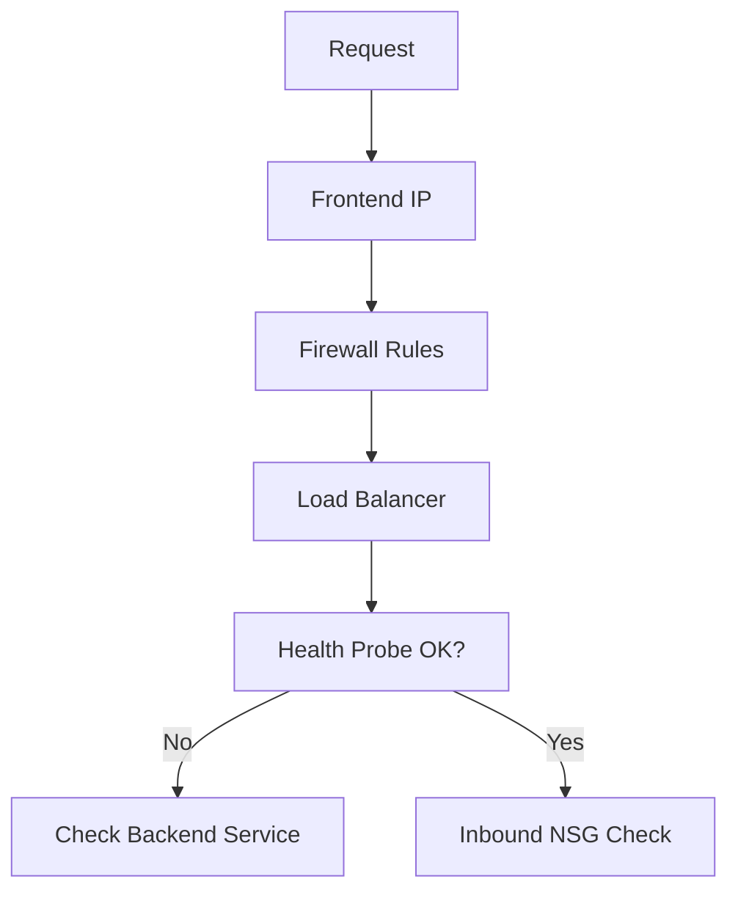

# Inbound Connectivity Issues

Resolving access failures for services exposed to the internet or VNet.

| Cause | Indicator | Resolution |
| --- | --- | --- |
| Health Probe Fail | Backends show Unhealthy. | Check Backend Service/Port. |
| NSG Inbound Deny | Traffic dropped at NIC. | Add Inbound Allow Rule. |
| Firewall Rule | Firewall drops packet. | Add DNAT / Application Rule. |
| Frontend IP | Resource unreachable. | Verify Public IP assignment. |

| Verification | Tool | Pass Condition |
| --- | --- | --- |
| Frontend listener | `curl` or browser test | Expected response code returned. |
| Probe path | Load Balancer or gateway diagnostics | Backend marked Healthy. |
| Security policy | Effective NSG and firewall logs | Allow rule matches flow. |

!!! tip
    Verify health probe status in the Load Balancer or Application Gateway metrics before checking OS firewall.

## See Also

- [Network Security Basics](../platform/network-security-basics.md)
- [Configure NSG](../operations/configure-nsg.md)
- [NSG vs UDR vs Firewall](./nsg-vs-udr-vs-firewall.md)

## Sources

- [Troubleshoot Application Gateway connectivity](https://learn.microsoft.com/en-us/azure/application-gateway/troubleshoot-app-service-redirection-app-service-url)
- [Troubleshoot Load Balancer health probes](https://learn.microsoft.com/en-us/azure/load-balancer/load-balancer-troubleshoot-health-probe-status)
