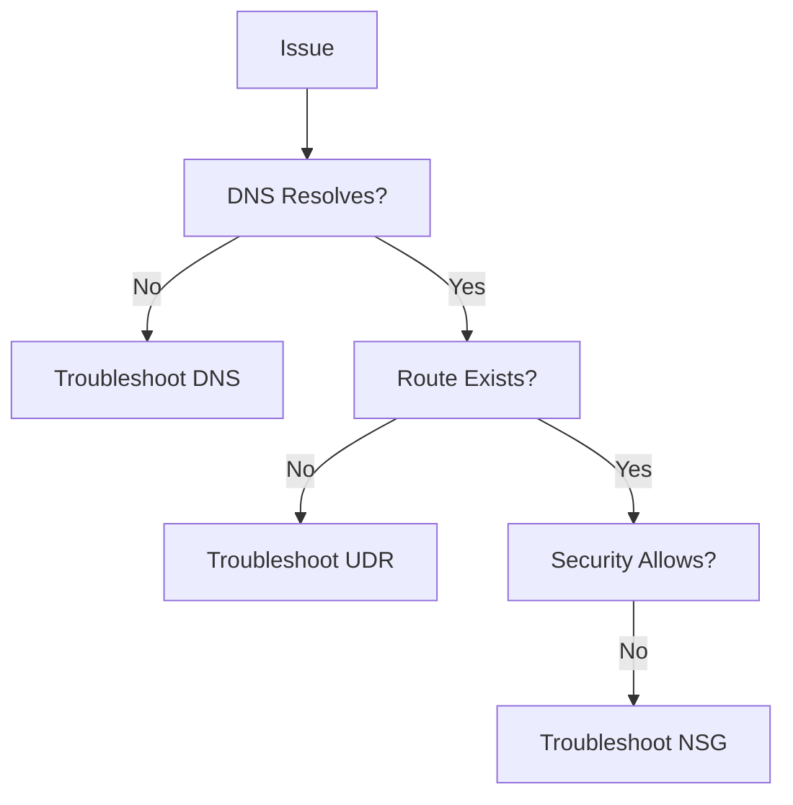

# Troubleshooting

Common issues and resolution paths for Azure Networking.

| Page | Scope | Focus |
| --- | --- | --- |
| [Cannot Reach Private Endpoint](cannot-reach-private-endpoint.md) | Private Endpoint. | DNS and Link. |
| [DNS Resolution Failures](dns-resolution-failures.md) | Resolution failures. | Zones and Forwarders. |
| [Outbound Connectivity Issues](outbound-connectivity-issues.md) | Internet/External access. | NAT and Firewall. |
| [Inbound Connectivity Issues](inbound-connectivity-issues.md) | Web/Service access. | LB and NSG. |
| [NSG vs UDR vs Firewall](nsg-vs-udr-vs-firewall.md) | Path blockages. | Evaluation order. |
| [Peering and Routing Issues](peering-and-routing-issues.md) | VNet-to-VNet. | State and Gateway. |
| [Hybrid Connectivity Issues](hybrid-connectivity-issues.md) | VPN/ExpressRoute. | BGP and Tunnels. |
| [Intermittent Network Failures](intermittent-network-failures.md) | Flapping issues. | Resources/DNS. |
| [Latency and Packet Loss](latency-and-packet-loss.md) | Performance issues. | RTT and saturation. |

!!! tip
    Always isolate DNS resolution first, as it's the root cause of most perceived network failures.

## See Also

- [Common Scenarios](../start-here/common-scenarios.md)
- [Cannot Reach Private Endpoint](./cannot-reach-private-endpoint.md)
- [DNS Resolution Failures](./dns-resolution-failures.md)

## Sources

- [Troubleshoot network issues](https://learn.microsoft.com/en-us/azure/network-watcher/network-watcher-connectivity-overview)
- [Azure network monitoring and management documentation](https://learn.microsoft.com/en-us/azure/networking/monitoring-management/)
