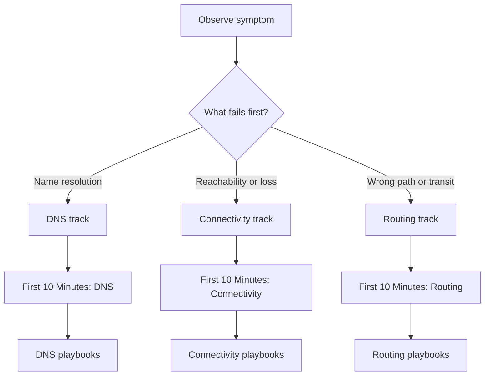

---
hide:
  - toc
content_sources:
  diagrams:
    - id: how-this-section-works
      type: flowchart
      source: self-generated
      justification: "Guide navigation diagram created for this repository and grounded in Microsoft Learn networking overview content."
      based_on:
        - https://learn.microsoft.com/en-us/azure/network-watcher/network-watcher-connectivity-overview
        - https://learn.microsoft.com/en-us/azure/networking/fundamentals/monitoring-management-overview
---

# Troubleshooting

Hypothesis-driven troubleshooting for Azure Networking incidents: start with symptom classification, collect the minimum evidence, then jump to the right playbook.

## How this section works

<!-- diagram-id: how-this-section-works -->

## Start Here

| Need | Go to |
| --- | --- |
| Understand where Azure networking fails | [Architecture Overview](architecture-overview.md) |
| Route a symptom to the right playbook | [Decision Tree](decision-tree.md) |
| Know what evidence to collect first | [Evidence Map](evidence-map.md) |
| Build a troubleshooting mindset | [Mental Model](mental-model.md) |
| Use 60-second triage cards | [Quick Diagnosis Cards](quick-diagnosis-cards.md) |
| Run first-response checks | [First 10 Minutes](first-10-minutes/index.md) |
| Open a canonical troubleshooting guide | [Playbooks](playbooks/index.md) |

## Quick symptom routing

| Symptom pattern | First response | Likely playbooks |
| --- | --- | --- |
| FQDN resolves to wrong IP, NXDOMAIN, or timeout | [DNS Checklist](first-10-minutes/dns.md) | [DNS Resolution Failures](playbooks/dns/dns-resolution-failures.md), [Cannot Reach Private Endpoint](playbooks/connectivity/cannot-reach-private-endpoint.md) |
| Service is unreachable from internet, VNet, or external target | [Connectivity Checklist](first-10-minutes/connectivity.md) | [Inbound Connectivity Issues](playbooks/connectivity/inbound-connectivity-issues.md), [Outbound Connectivity Issues](playbooks/connectivity/outbound-connectivity-issues.md) |
| Packets take the wrong path, peering fails, or hybrid routes disappear | [Routing Checklist](first-10-minutes/routing.md) | [Peering and Routing Issues](playbooks/routing/peering-and-routing-issues.md), [Hybrid Connectivity Issues](playbooks/routing/hybrid-connectivity-issues.md) |
| Failures are intermittent or latency-only | [Connectivity Checklist](first-10-minutes/connectivity.md) | [Intermittent Network Failures](playbooks/connectivity/intermittent-network-failures.md), [Latency and Packet Loss](playbooks/connectivity/latency-and-packet-loss.md) |
| You suspect policy ordering confusion | [Routing Checklist](first-10-minutes/routing.md) | [NSG vs UDR vs Firewall](playbooks/routing/nsg-vs-udr-vs-firewall.md) |

## Topic map

### Meta documents
- [Architecture Overview](architecture-overview.md)
- [Decision Tree](decision-tree.md)
- [Evidence Map](evidence-map.md)
- [Mental Model](mental-model.md)
- [Quick Diagnosis Cards](quick-diagnosis-cards.md)

### First 10 Minutes
- [Checklists Index](first-10-minutes/index.md)
- [Connectivity](first-10-minutes/connectivity.md)
- [DNS](first-10-minutes/dns.md)
- [Routing](first-10-minutes/routing.md)

### Playbooks
- [Playbooks Index](playbooks/index.md)
- [Connectivity playbooks](playbooks/index.md#connectivity)
- [DNS playbooks](playbooks/index.md#dns)
- [Routing playbooks](playbooks/index.md#routing)

!!! tip
    Separate the incident into three layers before going deep: name resolution, path selection, and policy enforcement. Most Azure networking incidents become much easier once those layers are isolated.

## See Also

- [Common Scenarios](../start-here/common-scenarios.md)
- [Monitor Network Paths](../operations/monitor-network-paths.md)
- [Packet Capture and Diagnostics](../operations/packet-capture-and-diagnostics.md)
- [Connectivity Decision Guide](../reference/connectivity-decision-guide.md)

## Sources

- [Troubleshoot connectivity problems using Azure Network Watcher](https://learn.microsoft.com/en-us/azure/network-watcher/network-watcher-connectivity-overview)
- [Azure networking monitoring and management](https://learn.microsoft.com/en-us/azure/networking/fundamentals/monitoring-management-overview)
