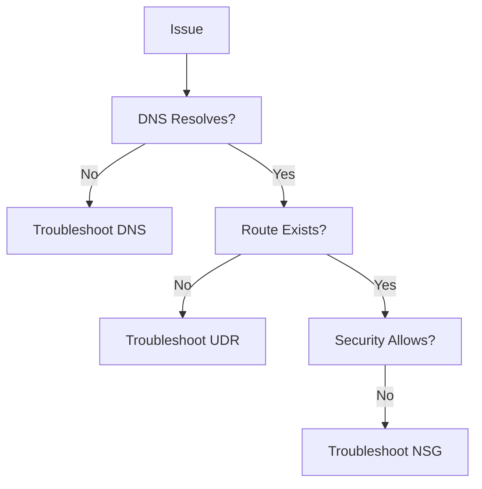

# Troubleshooting

Common issues and resolution paths for Azure Networking.

| Page | Scope | Focus |
| --- | --- | --- |
| Cannot Reach PE | Private Endpoint. | DNS and Link. |
| DNS Resolution | Resolution failures. | Zones and Forwarders. |
| Outbound Connectivity | Internet/External access. | NAT and Firewall. |
| Inbound Connectivity | Web/Service access. | LB and NSG. |
| NSG vs UDR vs Firewall | Path blockages. | Evaluation order. |
| Peering and Routing | VNet-to-VNet. | State and Gateway. |
| Hybrid Connectivity | VPN/ExpressRoute. | BGP and Tunnels. |
| Intermittent Failures | Flapping issues. | Resources/DNS. |
| Latency and Loss | Performance issues. | RTT and saturation. |

!!! tip
    Always isolate DNS resolution first, as it's the root cause of most perceived network failures.

## Sources

- [Troubleshoot network issues](https://learn.microsoft.com/en-us/azure/network-watcher/network-watcher-connectivity-overview)
- [Microsoft Learn: Network Troubleshooting](https://learn.microsoft.com/en-us/training/modules/troubleshoot-azure-network-infrastructure/)
