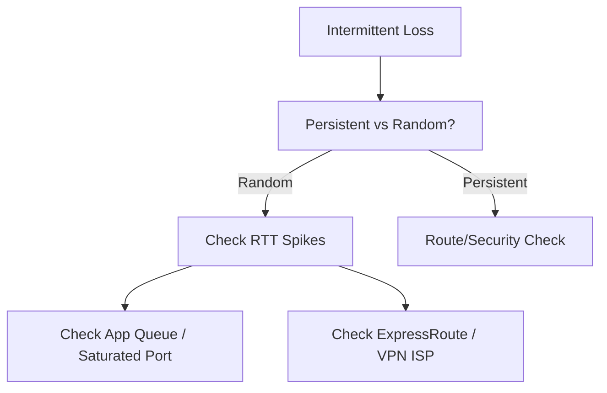

# Intermittent Network Failures

Diagnosing network issues that occur randomly.

| Failure Type | Analysis Approach | Diagnostic Tool |
| --- | --- | --- |
| Random Drops | Packet Capture over time. | Network Watcher PCAP. |
| Periodic Failures | Correlate with CPU/App logs. | Log Analytics. |
| Specific Protocol | Isolate TCP vs UDP vs ICMP. | Connection Monitor. |
| Client-specific | Cross-check other clients. | Agent-based Test. |

| Correlation Check | Data Source | Useful Signal |
| --- | --- | --- |
| Time-based spikes | Metrics timeline | Failures align with load changes. |
| DNS behavior | Resolver logs | Name flaps or cache expiry events. |
| Port allocation | SNAT and connection counters | Exhaustion pattern appears. |

!!! note
    Distinguish DNS flapping (cache expiration) from connection pool issues (SNAT exhaustion) when debugging.

## See Also

- [Monitor Network Paths](../operations/monitor-network-paths.md)
- [Packet Capture and Diagnostics](../operations/packet-capture-and-diagnostics.md)
- [Latency and Packet Loss](./latency-and-packet-loss.md)

## Sources

- [Troubleshoot VPN Gateway configurations and connections](https://learn.microsoft.com/en-us/troubleshoot/azure/vpn-gateway/vpn-gateway-troubleshoot)
- [Monitor with Azure Monitor Network Insights](https://learn.microsoft.com/en-us/azure/network-watcher/network-insights-overview)
