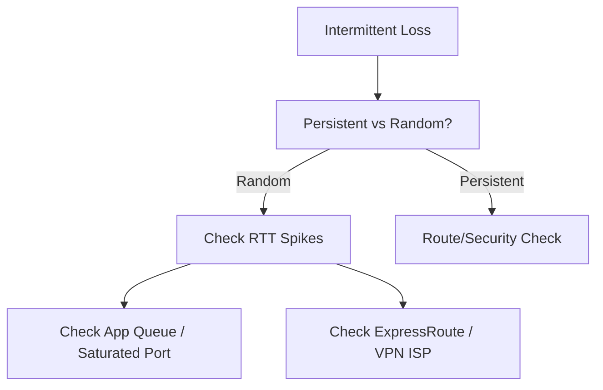

# Intermittent Network Failures

Diagnosing network issues that occur randomly.

| Failure Type | Analysis Approach | Diagnostic Tool |
| --- | --- | --- |
| Random Drops | Packet Capture over time. | Network Watcher PCAP. |
| Periodic Failures | Correlate with CPU/App logs. | Log Analytics. |
| Specific Protocol | Isolate TCP vs UDP vs ICMP. | Connection Monitor. |
| Client-specific | Cross-check other clients. | Agent-based Test. |

!!! note
    Distinguish DNS flapping (cache expiration) from connection pool issues (SNAT exhaustion) when debugging.

## Sources

- [Identify and troubleshoot intermittent connectivity](https://learn.microsoft.com/en-us/azure/vpn-gateway/vpn-gateway-troubleshoot-intermittent-connectivity)
- [Monitor with Azure Monitor Network Insights](https://learn.microsoft.com/en-us/azure/network-watcher/network-insights-overview)
