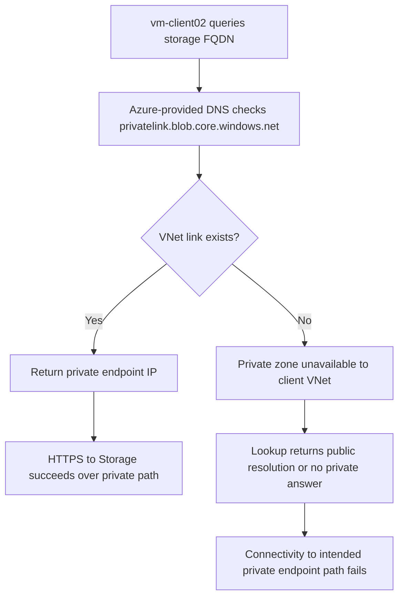

# Private Endpoint DNS link failure and recovery

This lab turns the existing substrate in `labs/private-endpoint-dns-link-failure/` into a reproducible troubleshooting exercise for a common private-endpoint failure mode: the private DNS zone exists, the private endpoint exists, but the client virtual network is no longer linked to the zone. The result is a name-resolution problem first, and an application-connectivity problem second.

## Lab Metadata

| Field | Value |
| --- | --- |
| Status | Documentation complete; live execution deferred |
| Scenario ID | ZLR-networking-03 |
| Substrate path | `labs/private-endpoint-dns-link-failure/` |
| Primary fault | Delete `link-vnet-lab02` from `privatelink.blob.core.windows.net` |
| Recovery action | Recreate the VNet link to the private DNS zone |
| Evidence model | CLI proof first, Portal proof second |
| Live artifacts | `labs/private-endpoint-dns-link-failure/evidence/` and `docs/assets/troubleshooting/private-endpoint-dns-link-failure/` |

## 1) Background

Azure private endpoints rely on two layers to work end to end:

1. The private endpoint NIC must exist in the target subnet.
2. The client network must be able to resolve the service FQDN to the private endpoint IP through the correct private DNS zone.

In this lab, the substrate deploys:

- `vnet-lab02` with a client subnet and a private-endpoints subnet
- `vm-client02` as the test client
- A storage account with a `blob` private endpoint named `pe-storage02`
- The private DNS zone `privatelink.blob.core.windows.net`
- The VNet link `link-vnet-lab02`

The fault is intentionally narrow: delete only the VNet link. That keeps the private endpoint resource in place while removing the DNS path that maps `$STORAGE_ACCOUNT_NAME.blob.core.windows.net` to the private IP.

<!-- diagram-id: private-endpoint-dns-link-failure-flow -->


Why this matters: operators often verify that the private endpoint resource is `Approved` and stop there. This lab shows why approval alone does not prove that clients can resolve or reach the service privately.

## 2) Hypothesis

**Failure theory:** the storage account private endpoint and DNS zone remain deployed, but deleting the virtual network link `link-vnet-lab02` breaks the client VNet's access to the private DNS zone.

**Prediction:**

- **If** `link-vnet-lab02` is deleted from `privatelink.blob.core.windows.net`, **then** `vm-client02` will no longer resolve `$STORAGE_ACCOUNT_NAME.blob.core.windows.net` to the private endpoint IP.
- **If** resolution no longer returns the private IP, **then** connectivity checks that depend on the intended private path should fail or take the public path instead.
- **If** the link is recreated, **then** `nslookup`/`dig` from `vm-client02` should again return the private IP and connectivity to the storage endpoint over port 443 should recover.

Success criteria for the hypothesis:

- A healthy baseline proves the VNet link exists before fault injection.
- A failed state proves the DNS answer changed after link deletion.
- A falsification step proves the same hostname resolves correctly again after recreating the link.

## 3) Runbook

Use the substrate exactly as authored under `labs/private-endpoint-dns-link-failure/`. Do not change the template while running the experiment; the troubleshooting value comes from isolating the DNS-link variable.

### Prerequisites

- Azure CLI installed and authenticated.
- Permission to create resource groups, storage accounts, private endpoints, private DNS zones, virtual network links, and virtual machines.
- A unique value for `$STORAGE_ACCOUNT_NAME`.
- A secure value for `$ADMIN_PASSWORD` supplied only at runtime.

Recommended variables:

```bash
export RG="rg-pe-dns-link-lab"
export LOCATION="eastus2"
export STORAGE_ACCOUNT_NAME="<globally-unique-storage-name>"
export ADMIN_PASSWORD="<secure-password>"
```

### Deploy the substrate

```bash
az group create \
    --name $RG \
    --location $LOCATION

az deployment group create \
    --resource-group $RG \
    --template-file labs/private-endpoint-dns-link-failure/main.bicep \
    --parameters @labs/private-endpoint-dns-link-failure/main.parameters.json \
    --parameters storageAccountName=$STORAGE_ACCOUNT_NAME adminPassword=$ADMIN_PASSWORD
```

| Command | Purpose |
| --- | --- |
| `az group create` | Create the disposable resource group for the lab substrate. |
| `--name $RG` | Sets the lab resource group name. |
| `--location $LOCATION` | Selects the Azure region for the resource group. |
| `az deployment group create` | Deploys the Bicep substrate that includes the VM, storage account, private endpoint, private DNS zone, and link. |
| `--resource-group $RG` | Targets the deployment to the lab resource group. |
| `--template-file labs/private-endpoint-dns-link-failure/main.bicep` | Points to the substrate template. |
| `--parameters @labs/private-endpoint-dns-link-failure/main.parameters.json` | Loads the baseline parameter file. |
| `--parameters storageAccountName=$STORAGE_ACCOUNT_NAME adminPassword=$ADMIN_PASSWORD` | Supplies the required runtime values without editing the template. |

Expected live outcome: `vm-client02`, `pe-storage02`, `privatelink.blob.core.windows.net`, and `link-vnet-lab02` all exist before fault injection.

### Establish the healthy baseline

```bash
az network private-dns link vnet show \
    --resource-group $RG \
    --zone-name privatelink.blob.core.windows.net \
    --name link-vnet-lab02

az vm run-command invoke \
    --resource-group $RG \
    --name vm-client02 \
    --command-id RunShellScript \
    --scripts "nslookup $STORAGE_ACCOUNT_NAME.blob.core.windows.net"
```

| Command | Purpose |
| --- | --- |
| `az network private-dns link vnet show` | Confirms that the client VNet is initially linked to the private DNS zone. |
| `--resource-group $RG` | Scopes the lookup to the lab resource group. |
| `--zone-name privatelink.blob.core.windows.net` | Selects the storage blob private DNS zone. |
| `--name link-vnet-lab02` | Selects the exact VNet link used by this lab. |
| `az vm run-command invoke` | Executes DNS checks inside the client VM without exposing public management access. |
| `--name vm-client02` | Selects the client VM that consumes the private endpoint. |
| `--command-id RunShellScript` | Uses the Linux shell run-command channel. |
| `--scripts "nslookup $STORAGE_ACCOUNT_NAME.blob.core.windows.net"` | Proves the starting DNS answer from the client VM before deleting the link. |

Save the raw output under `labs/private-endpoint-dns-link-failure/evidence/` during the live run. Do not pre-populate example IP addresses in this guide.

### Inject the fault

```bash
az network private-dns link vnet delete \
    --resource-group $RG \
    --zone-name privatelink.blob.core.windows.net \
    --name link-vnet-lab02 \
    --yes
```

| Command | Purpose |
| --- | --- |
| `az network private-dns link vnet delete` | Removes the only VNet link that makes the private DNS zone visible to the client VNet. |
| `--resource-group $RG` | Scopes the delete operation to the lab resource group. |
| `--zone-name privatelink.blob.core.windows.net` | Identifies the private DNS zone that owns the link. |
| `--name link-vnet-lab02` | Deletes the specific link that the substrate created. |
| `--yes` | Skips the interactive confirmation prompt. |

### Capture the failed state

```bash
az vm run-command invoke \
    --resource-group $RG \
    --name vm-client02 \
    --command-id RunShellScript \
    --scripts "nslookup $STORAGE_ACCOUNT_NAME.blob.core.windows.net; dig +short $STORAGE_ACCOUNT_NAME.blob.core.windows.net"
```

| Command | Purpose |
| --- | --- |
| `az vm run-command invoke` | Re-runs DNS checks from the affected client VM after fault injection. |
| `--resource-group $RG` | Scopes the command to the lab resource group. |
| `--name vm-client02` | Selects the VM expected to show the DNS failure. |
| `--command-id RunShellScript` | Uses the shell run-command channel. |
| `--scripts "nslookup $STORAGE_ACCOUNT_NAME.blob.core.windows.net; dig +short $STORAGE_ACCOUNT_NAME.blob.core.windows.net"` | Collects both resolver output and a compact answer list for comparison with the healthy baseline. |

### Apply the fix and validate recovery

```bash
az network private-dns link vnet create \
    --resource-group $RG \
    --zone-name privatelink.blob.core.windows.net \
    --name link-vnet-lab02 \
    --virtual-network vnet-lab02 \
    --registration-enabled false

az network watcher test-connectivity \
    --resource-group $RG \
    --source-resource $(az vm show --resource-group $RG --name vm-client02 --query id --output tsv) \
    --dest-address $STORAGE_ACCOUNT_NAME.blob.core.windows.net \
    --dest-port 443

az vm run-command invoke \
    --resource-group $RG \
    --name vm-client02 \
    --command-id RunShellScript \
    --scripts "nslookup $STORAGE_ACCOUNT_NAME.blob.core.windows.net; dig +short $STORAGE_ACCOUNT_NAME.blob.core.windows.net"
```

| Command | Purpose |
| --- | --- |
| `az network private-dns link vnet create` | Recreates the missing VNet link so the client VNet can use the private DNS zone again. |
| `--resource-group $RG` | Scopes the create operation to the lab resource group. |
| `--zone-name privatelink.blob.core.windows.net` | Selects the private DNS zone to relink. |
| `--name link-vnet-lab02` | Reuses the original link name during recovery. |
| `--virtual-network vnet-lab02` | Reattaches the lab VNet to the private DNS zone. |
| `--registration-enabled false` | Keeps autoregistration disabled, which is the expected mode for this service zone. |
| `az network watcher test-connectivity` | Validates that the client VM can again reach the storage FQDN on port 443 after DNS recovery. |
| `az vm show` | Retrieves the VM resource ID required by Network Watcher. |
| `--source-resource $(az vm show --resource-group $RG --name vm-client02 --query id --output tsv)` | Supplies the client VM resource ID to the connectivity test. |
| `--query id` | Extracts only the VM resource ID. |
| `--output tsv` | Emits the VM resource ID as plain text for command substitution. |
| `--dest-address $STORAGE_ACCOUNT_NAME.blob.core.windows.net` | Targets the storage blob endpoint hostname. |
| `--dest-port 443` | Confirms HTTPS connectivity after the fix. |
| `az vm run-command invoke` | Re-runs DNS proof from inside the client VM after recreating the link. |
| `--name vm-client02` | Selects the recovering client VM. |
| `--command-id RunShellScript` | Uses the shell run-command channel for the verification step. |
| `--scripts "nslookup $STORAGE_ACCOUNT_NAME.blob.core.windows.net; dig +short $STORAGE_ACCOUNT_NAME.blob.core.windows.net"` | Captures the post-fix DNS answer that falsifies the failure theory. |

## 4) Experiment Log

Use this section during the live run to record what happened, not what was expected.

### Baseline

- Record whether `az network private-dns link vnet show` returns `link-vnet-lab02` for `privatelink.blob.core.windows.net` before fault injection.
- Record whether `nslookup` and `dig +short` from `vm-client02` return the private endpoint IP, not a public storage endpoint answer.

### Injected failure

- Record whether the private DNS zone still exists after deleting `link-vnet-lab02`, but no longer shows a link to `vnet-lab02`.
- Record whether the next DNS lookup from `vm-client02` stops returning the private endpoint IP.
- [Inferred] If the answer changes immediately after link deletion and no other resources changed, the broken VNet link is the proximate cause.

### Analysis

- Compare the pre-fix and post-delete resolver output side by side in `labs/private-endpoint-dns-link-failure/evidence/`.
- [Inferred] A private endpoint resource in `Approved` state is insufficient evidence by itself; the client also needs access to the corresponding private DNS zone.
- [Not Proven] DNS failure alone does not prove application-layer success or failure until connectivity is re-tested.

### Conclusion and falsification

- Record whether recreating `link-vnet-lab02` restores private DNS answers for the same hostname.
- Record whether `az network watcher test-connectivity` succeeds only after the link is recreated.
- [Inferred] If the same hostname resolves to the private IP again after recreating the link, the original hypothesis survives falsification and the fix is validated.

??? note "Evidence notes"
    Record real timestamps, command names, and evidence filenames here during the live run.

    Suggested artifacts:

    - `01-baseline-nslookup.txt`
    - `02-link-show-before.txt`
    - `03-failed-nslookup-after-delete.txt`
    - `04-dig-after-delete.txt`
    - `05-link-create.txt`
    - `06-test-connectivity-after-fix.txt`
    - `07-recovered-nslookup.txt`

## 5) Verification Queries

This lab uses CLI-first verification because no Azure Monitor tables are required to prove the fault. The authoritative checks are the DNS answer from `vm-client02`, the presence or absence of the VNet link, and the post-fix connectivity result.

### Verification commands

```bash
az network private-dns link vnet show \
    --resource-group $RG \
    --zone-name privatelink.blob.core.windows.net \
    --name link-vnet-lab02

az vm run-command invoke \
    --resource-group $RG \
    --name vm-client02 \
    --command-id RunShellScript \
    --scripts "nslookup $STORAGE_ACCOUNT_NAME.blob.core.windows.net; dig +short $STORAGE_ACCOUNT_NAME.blob.core.windows.net"
```

| Command | Purpose |
| --- | --- |
| `az network private-dns link vnet show` | Confirms whether the link exists at the moment the query set is run. |
| `--resource-group $RG` | Scopes the lookup to the lab resource group. |
| `--zone-name privatelink.blob.core.windows.net` | Selects the relevant private DNS zone. |
| `--name link-vnet-lab02` | Requests the exact lab VNet link. |
| `az vm run-command invoke` | Executes DNS verification from inside the client VM. |
| `--name vm-client02` | Selects the client VM used for all comparisons. |
| `--command-id RunShellScript` | Uses the shell run-command path. |
| `--scripts "nslookup $STORAGE_ACCOUNT_NAME.blob.core.windows.net; dig +short $STORAGE_ACCOUNT_NAME.blob.core.windows.net"` | Produces the resolver evidence needed for pass/fail decisions. |

```bash
az network watcher test-connectivity \
    --resource-group $RG \
    --source-resource $(az vm show --resource-group $RG --name vm-client02 --query id --output tsv) \
    --dest-address $STORAGE_ACCOUNT_NAME.blob.core.windows.net \
    --dest-port 443
```

| Command | Purpose |
| --- | --- |
| `az network watcher test-connectivity` | Proves whether the recovered DNS path also restores network reachability to the service endpoint. |
| `--resource-group $RG` | Scopes the connectivity test to the lab resource group. |
| `az vm show` | Retrieves the VM resource ID required by Network Watcher. |
| `--source-resource $(az vm show --resource-group $RG --name vm-client02 --query id --output tsv)` | Supplies the source VM for the test. |
| `--query id` | Extracts only the resource ID value. |
| `--output tsv` | Emits the resource ID in plain text. |
| `--dest-address $STORAGE_ACCOUNT_NAME.blob.core.windows.net` | Tests the storage blob hostname, not a hard-coded IP. |
| `--dest-port 443` | Verifies the intended HTTPS path. |

### Pass/fail rule

| Stage | Required evidence | Pass condition | Fail condition |
| --- | --- | --- | --- |
| Baseline | Link exists + DNS lookup from `vm-client02` | `link-vnet-lab02` exists and the storage hostname resolves to the private endpoint IP | Link missing before injection, or the baseline already does not resolve privately |
| Fault injected | DNS lookup after deleting the link | The storage hostname no longer resolves to the private endpoint IP from `vm-client02` | The answer still returns the same private IP, which means the fault was not reproduced |
| Falsification after fix | Link recreated + DNS lookup + connectivity test | The recreated link exists, DNS again returns the private endpoint IP, and connectivity over port 443 succeeds | DNS remains broken, or connectivity still fails after the link is recreated |

### Deferred live values

- Pending live capture: actual private endpoint IP returned before deletion.
- Pending live capture: actual resolver output after deleting the link.
- Pending live capture: actual `az network watcher test-connectivity` result after recovery.

## 6) Portal Evidence

Portal evidence is intentionally deferred until a real lab run. Do not add image references until the captures exist and are visually verified.

Target directory for future captures:

- `docs/assets/troubleshooting/private-endpoint-dns-link-failure/`

Suggested capture set (all pending live capture):

1. **Private DNS zone overview** — show `privatelink.blob.core.windows.net` and confirm the zone exists.
2. **Virtual network links blade before injection** — show `link-vnet-lab02` attached to `vnet-lab02`.
3. **Virtual network links blade after deletion** — show the link absent to prove the fault injection.
4. **Private endpoint DNS configuration** — show the private endpoint still exists while DNS resolution is broken.
5. **Virtual network links blade after recovery** — show `link-vnet-lab02` recreated.

Capture notes:

- Mark every screenshot in the manifest-driven pipeline before referencing it from Markdown.
- Keep this page text-only until the final `.webp` files exist and are visually verified for PII.
- Store raw CLI proof in `labs/private-endpoint-dns-link-failure/evidence/`; store reader-facing portal captures under the docs assets path above.

## Clean Up

Delete the disposable lab resource group after the experiment finishes.

```bash
az group delete \
    --name $RG \
    --yes \
    --no-wait
```

| Command | Purpose |
| --- | --- |
| `az group delete` | Removes the entire disposable lab environment. |
| `--name $RG` | Selects the lab resource group to delete. |
| `--yes` | Skips the confirmation prompt. |
| `--no-wait` | Returns immediately while Azure completes deletion asynchronously. |

If you are iterating on the experiment, make sure the previous run finished deleting before reusing the same resource group or storage account name.

## Related Playbook

- [Cannot Reach Private Endpoint](../playbooks/connectivity/cannot-reach-private-endpoint.md)
- [DNS Resolution Failures](../playbooks/dns/dns-resolution-failures.md)

## See Also

- [Troubleshooting Lab Guides](index.md)
- [Troubleshooting Home](../index.md)
- [First 10 Minutes: DNS](../first-10-minutes/dns.md)
- [DNS Resolution Failures](../playbooks/dns/dns-resolution-failures.md)

## Sources

- [Azure private endpoint DNS values](https://learn.microsoft.com/en-us/azure/private-link/private-endpoint-dns)
- [Azure private endpoint DNS configuration](https://learn.microsoft.com/en-us/azure/private-link/private-endpoint-dns-integration)
- [Manage Azure Private DNS virtual network links](https://learn.microsoft.com/en-us/azure/dns/private-dns-virtual-network-links)
- [Troubleshoot Azure Private Endpoint connectivity problems](https://learn.microsoft.com/en-us/azure/private-link/troubleshoot-private-endpoint-connectivity)
