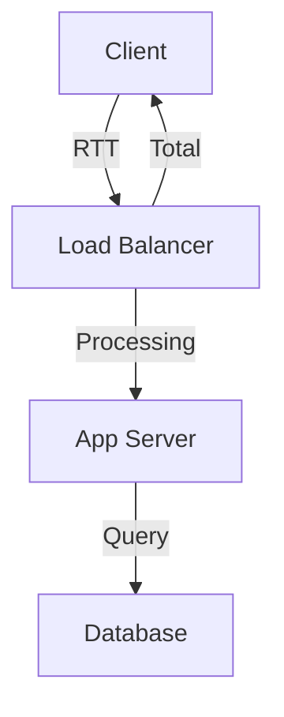

# Latency and Packet Loss

Isolating performance bottlenecks in the network path.

| Source | Characteristic | Investigation |
| --- | --- | --- |
| Network RTT | Consistent High Ping. | Check Geography / Hop. |
| App Processing | High Time-to-First-Byte. | Check Backend CPU. |
| Backend Saturation | Spikes during Load. | Check NIC Throttling. |
| ISP / Provider | Random Packet Loss. | Check ExpressRoute MSEE. |

| Measurement | Tool | Interpretation |
| --- | --- | --- |
| Round-trip time | Connection Monitor | Compare to known baseline. |
| Hop latency | Traceroute path | Find where delay increases. |
| Loss percentage | Continuous probe tests | Identify sustained vs burst loss. |

!!! note
    Separate network latency (ping/RTT) from application latency (HTTP response time) during triage.

## See Also

- [Monitor Network Paths](../operations/monitor-network-paths.md)
- [Observability Best Practices](../best-practices/observability-best-practices.md)
- [Intermittent Network Failures](./intermittent-network-failures.md)

## Sources

- [Test network latency between VMs](https://learn.microsoft.com/en-us/azure/virtual-network/virtual-network-test-latency)
- [Monitor ExpressRoute performance](https://learn.microsoft.com/en-us/azure/expressroute/expressroute-monitoring-metrics)
