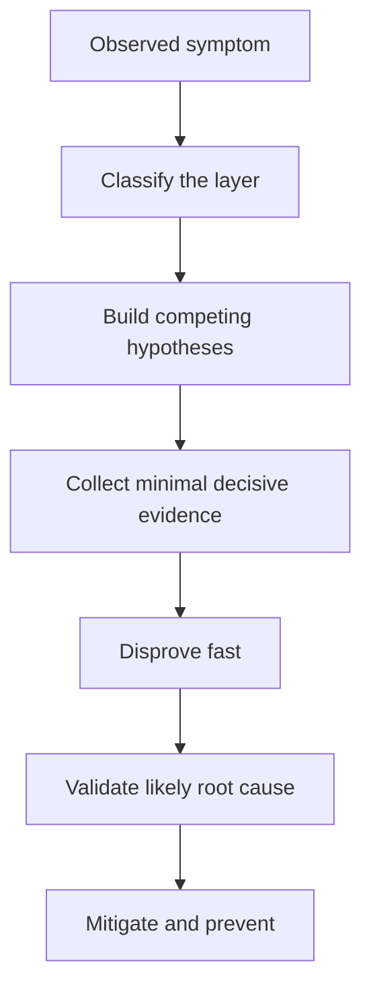
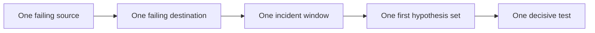

---
hide:
  - toc
content_sources:
  diagrams:
    - id: core-model
      type: flowchart
      source: self-generated
      justification: "Synthesized troubleshooting flow for this guide from Microsoft Learn diagnostic and service documentation."
      based_on:
        - https://learn.microsoft.com/en-us/azure/virtual-network/
        - https://learn.microsoft.com/en-us/azure/network-watcher/
    - id: practical-classification-flow
      type: flowchart
      source: self-generated
      justification: "Synthesized troubleshooting flow for this guide from Microsoft Learn diagnostic and service documentation."
      based_on:
        - https://learn.microsoft.com/en-us/azure/virtual-network/
        - https://learn.microsoft.com/en-us/azure/network-watcher/
---

# Troubleshooting Mental Model

The goal is not to guess the fix first. The goal is to identify the first broken layer and then prove or disprove competing hypotheses quickly.

## Core model

<!-- diagram-id: core-model -->

## The four Azure networking layers

| Layer | Key question | Typical mistake |
| --- | --- | --- |
| Resolution | Did we get the right destination IP? | Treating wrong DNS as packet loss |
| Path | Did Azure choose the intended next hop? | Looking only at NSG without checking routes |
| Policy | Was the chosen path allowed? | Blaming routing when firewall or NSG denied it |
| Target / performance | Did the backend answer correctly and on time? | Calling every slow response a network issue |

## Use competing hypotheses, not a single favorite

| Symptom | Common first guess | Competing hypotheses you should keep alive |
| --- | --- | --- |
| Cannot reach Private Endpoint | Private Endpoint is broken | wrong DNS, missing VNet link, NSG deny, stale record, target not listening |
| Peering traffic fails | Peering is disconnected | overlap, transit flag mismatch, NSG deny, UDR override |
| Outbound internet fails | Firewall is down | DNS failure, missing NAT path, route-all to wrong hop, target outage |
| High latency | Azure network issue | backend saturation, MTU, path asymmetry, probe mismatch, ISP issue |

## Practical classification flow

1. Pick one failing source, one failing destination, and one time window.
2. Ask whether the failure is primarily resolution, path, policy, or performance.
3. Collect only the first decisive artifact for that category.
4. Reclassify immediately if the artifact contradicts your initial category.

<!-- diagram-id: practical-classification-flow -->

## Anti-patterns this model prevents

- **DNS blindness**: troubleshooting TCP before proving name resolution.
- **Route blindness**: checking NSG or Firewall before proving next hop.
- **Portal-only bias**: trusting configured state without live test evidence.
- **Symptom drift**: mixing unrelated client, target, and time windows.
- **Single-cause bias**: stopping at the first plausible explanation.

## What “good troubleshooting” looks like

| Good habit | Why it matters |
| --- | --- |
| Compare IP-only and name-based tests | separates DNS from raw reachability |
| Use effective routes and effective NSG together | separates path choice from policy outcome |
| Check both sides of peering or hybrid links | many Azure links are bilateral by design |
| Correlate time-based failures | intermittent issues need time alignment, not static inspection |
| Document disproven hypotheses | prevents looping back to already falsified ideas |

!!! note "The first broken layer wins"
    If DNS is wrong, route analysis is premature. If the route is wrong, NSG tuning is premature. Move layer by layer.

## See Also

- [Architecture Overview](architecture-overview.md)
- [Decision Tree](decision-tree.md)
- [Evidence Map](evidence-map.md)
- [Quick Diagnosis Cards](quick-diagnosis-cards.md)
- [Playbooks Index](playbooks/index.md)

## Sources

- [Azure Virtual Network documentation](https://learn.microsoft.com/en-us/azure/virtual-network/)
- [Azure Network Watcher documentation](https://learn.microsoft.com/en-us/azure/network-watcher/)
