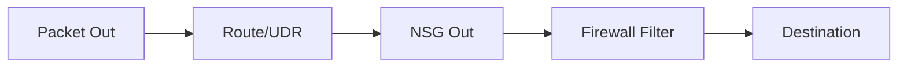

# NSG vs UDR vs Firewall

Understanding the order of packet evaluation in Azure.

| Component | Layer | Primary Action |
| --- | --- | --- |
| Route (UDR) | 3 | Determine the "Next Hop". |
| NSG | 3/4 | IP/Port Filtering (Allow/Deny). |
| Firewall | 3/4/7 | Deep Inspection / DNAT / FQDN. |
| Listener | 4-7 | Service socket (OS Firewall). |

!!! tip
    Use "Effective Routes" and "Effective Security Rules" on the VM's NIC in the portal to see final evaluated policies.

## Sources

- [How security rules are evaluated](https://learn.microsoft.com/en-us/azure/virtual-network/network-security-groups-overview#how-security-rules-are-evaluated)
- [Route selection and precedence](https://learn.microsoft.com/en-us/azure/virtual-network/virtual-networks-udr-overview#how-azure-selects-a-route)
