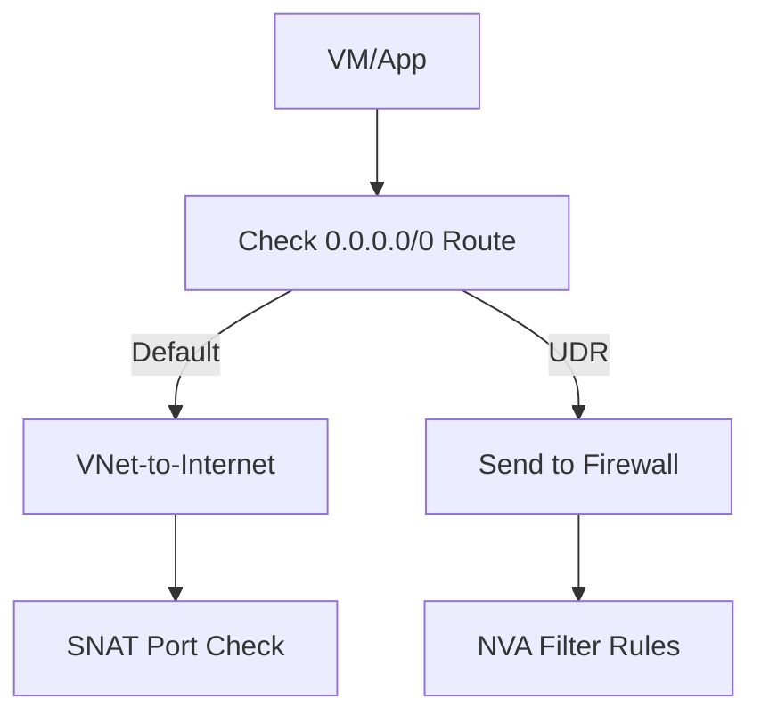

# Outbound Connectivity Issues

Resolving failures when workloads attempt to reach external targets.

| Cause | Indicator | Resolution |
| --- | --- | --- |
| SNAT Exhaustion | Load Balancer metrics high. | Increase Outbound Ports. |
| UDR 0.0.0.0/0 | Packet reaches NVA. | Check NVA/Firewall Rules. |
| NSG Outbound Deny | IP Flow Verify fails. | Update Outbound Rule. |
| Public IP missing | Internet access fails. | Associate Nat Gateway / Public IP. |

!!! note
    Separate TCP connection failures from DNS failures. If you can `ping 8.8.8.8` but not `ping google.com`, your issue is DNS.

## Sources

- [Troubleshoot outbound connectivity](https://learn.microsoft.com/en-us/azure/load-balancer/troubleshoot-outbound-connection)
- [Outbound rules for Azure Load Balancer](https://learn.microsoft.com/en-us/azure/load-balancer/load-balancer-outbound-rules-overview)
