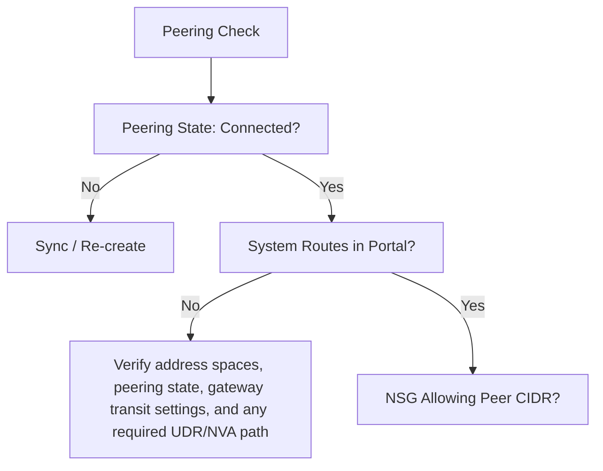

# Peering and Routing Issues

Troubleshooting connectivity between peered virtual networks.

| Issue | Cause | Fix |
| --- | --- | --- |
| State: Disconnected | Peering was deleted on one side. | Re-create peering on both sides. |
| Non-transitive | Using a chain of VNets (A-B-C). | Use direct peering or NVA/Azure Firewall service chaining. Gateway transit applies only for on-premises or gateway-connected networks. |
| Gateway Mismatch | Transit/Remote gateway misconfigured. | Update Transit settings. |
| CIDR Conflict | Overlapping address spaces. | Change VNet CIDR (destructive). |

| Verification | Tool | Expected State |
| --- | --- | --- |
| Peering settings | Portal peering blade | Matching allow-forwarded and transit flags. |
| Effective routes | NIC route table | Remote CIDRs visible and active. |
| Reachability | Connection troubleshoot | End-to-end test succeeds. |

!!! note
    Check BOTH sides of the peering. Peering requires two independent configurations that must align to function.

## See Also

- [Peering Basics](../operations/peering-basics.md)
- [Routing Basics](../platform/routing-basics.md)
- [Routing Cheatsheet](../reference/routing-cheatsheet.md)

## Sources

- [Troubleshoot virtual network peering](https://learn.microsoft.com/en-us/troubleshoot/azure/virtual-network/virtual-network-troubleshoot-peering-issues)
- [How to configure transit for peering](https://learn.microsoft.com/en-us/azure/vpn-gateway/vpn-gateway-peering-gateway-transit)
