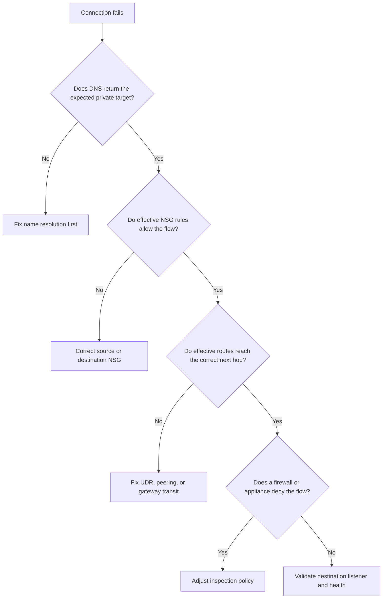

---
hide:
  - toc
---

# Connectivity Failures

## 1. Summary

Use this playbook when workloads cannot reach each other across Azure network boundaries and the failure could be caused by VNet peering, NSG rules, UDRs, firewall policy, or asymmetric path design.

The fastest diagnosis comes from splitting the path into five checks: name resolution, source NIC policy, effective routes, transit path policy, and destination listener health. Azure incidents often start with a symptom that sounds like "the network is down" when only one of those layers is broken.

### Symptoms

- Connections time out or are refused.
- Traffic works from one source but fails from another seemingly similar source.
- A private endpoint or hybrid path behaves differently after a recent change.
- Operators have a healthy-looking control plane but an unhealthy application path.



## 2. Common Misreadings

| Observation | Often Misread As | Actually Means |
|---|---|---|
| A VM in the same subnet can connect | Global Azure routing is healthy | The broken path may affect only one NIC, subnet, or peered route domain. |
| Peering state shows Connected | Peering alone guarantees end-to-end reachability | Peering does not override NSGs, UDRs, firewall policy, or DNS mistakes. |
| A single ping works | The application path is healthy | ICMP success does not prove TCP 443, SQL 1433, or a load-balanced listener path. |
| The firewall shows no denies | The firewall is not involved | Traffic may never reach the firewall because a route or NSG blocks it earlier. |

## 3. Competing Hypotheses

| Hypothesis | Likelihood | Key Discriminator |
|---|---|---|
| A source or destination NSG blocks the required flow | High | Effective NSG output lacks an allow rule for the destination port and direction. |
| A UDR or peering setting sends traffic to the wrong next hop | High | Effective routes show VirtualAppliance, None, or missing remote prefixes unexpectedly. |
| Gateway transit or forwarded traffic is misconfigured in peering | Medium | Spokes can reach the hub but not remote spoke or on-premises prefixes. |
| A firewall or NVA policy denies the traffic | Medium | Diagnostics show denies that match the source, destination, or FQDN. |
| The destination workload is unhealthy or not listening | Medium | The path is allowed but the listener port, health probe, or service process is down. |

## 4. What to Check First

1. **Inspect effective routes on the source NIC**

```bash
az network nic show-effective-route-table \
    --resource-group $RG \
    --name $SOURCE_NIC_NAME
```

2. **Inspect effective NSG rules on the source NIC**

```bash
az network nic show-effective-nsg \
    --resource-group $RG \
    --name $SOURCE_NIC_NAME
```

3. **Inspect peering configuration on both sides**

```bash
az network vnet peering list \
    --resource-group $RG \
    --vnet-name $VNET_NAME \
    --output table
```

4. **Run a path test from the source resource**

```bash
az network watcher test-connectivity \
    --resource-group $RG \
    --source-resource $SOURCE_ID \
    --dest-address $DESTINATION_IP \
    --dest-port 443
```

5. **Review firewall diagnostics for matching denies**

```bash
az monitor diagnostic-settings list \
    --resource $FIREWALL_ID
```

## 5. Evidence to Collect

### 5.1 KQL Queries

#### Azure Activity changes affecting routing or peering

```kusto
AzureActivity
| where TimeGenerated > ago(24h)
| where OperationNameValue has_any (
    "Microsoft.Network/routeTables/write",
    "Microsoft.Network/virtualNetworks/virtualNetworkPeerings/write",
    "Microsoft.Network/networkSecurityGroups/write"
)
| project TimeGenerated, OperationNameValue, ActivityStatusValue, Caller, ResourceGroup, ResourceId
| order by TimeGenerated desc
```

| Column | Interpretation |
|---|---|
| `OperationNameValue` | Recent writes highlight whether the outage aligns with a route, peering, or NSG change. |
| `Caller` | Use this to identify who or what automation touched the path. |
| `ResourceId` | Confirms the exact object changed before symptoms began. |

!!! tip "How to Read This"
    Start with the rows nearest the incident start time. Use them to separate configuration changes from recurring background noise.

#### Firewall or appliance deny trend

```kusto
AzureDiagnostics
| where TimeGenerated > ago(6h)
| where Category in ("AzureFirewallNetworkRule", "AzureFirewallApplicationRule")
| summarize Denies=countif(action_s == "Deny"), Allows=countif(action_s == "Allow") by Resource, msg_s, bin(TimeGenerated, 15m)
| order by TimeGenerated desc
```

| Column | Interpretation |
|---|---|
| `Denies` | A spike aligned with the incident window supports firewall involvement. |
| `msg_s` | The message often reveals rule collection, protocol, or destination context. |

!!! tip "How to Read This"
    Start with the rows nearest the incident start time. Use them to separate configuration changes from recurring background noise.

#### Network path health from Connection Monitor

```kusto
AzureDiagnostics
| where TimeGenerated > ago(6h)
| where Category == "ConnectionMonitorTestResult"
| project TimeGenerated, TestName=tostring(TestConfigurationName_s), Source=tostring(SourceAddress_s), Destination=tostring(DestinationAddress_s), Status=tostring(ConnectionStatus_s), AvgLatencyMs=todouble(AvgLatencyInMs_d)
| order by TimeGenerated desc
```

| Column | Interpretation |
|---|---|
| `Status` | Failed or Degraded states help prove the issue is on the monitored path. |
| `AvgLatencyMs` | Increasing latency before failure suggests a stressed or indirect path. |

!!! tip "How to Read This"
    Start with the rows nearest the incident start time. Use them to separate configuration changes from recurring background noise.

### 5.2 CLI Investigation

#### Show effective routes for the affected NIC

```bash
az network nic show-effective-route-table \
    --resource-group $RG \
    --name $SOURCE_NIC_NAME
```

Sample output:

```json
{"nextHopType":"VirtualAppliance","addressPrefix":"10.40.0.0/16"}
```

Interpretation:

- Unexpected next hops are a common root cause for black holes.
- Compare the returned prefixes with the destination network under investigation.

#### Show effective NSG rules for the same NIC

```bash
az network nic show-effective-nsg \
    --resource-group $RG \
    --name $SOURCE_NIC_NAME
```

Sample output:

```json
{"access":"Deny","direction":"Outbound","destinationPortRange":"443"}
```

Interpretation:

- Look for the exact destination port and direction.
- If the expected allow is absent, fix policy before touching routes.

#### Run end-to-end connectivity test

```bash
az network watcher test-connectivity \
    --resource-group $RG \
    --source-resource $SOURCE_ID \
    --dest-address $DESTINATION_FQDN \
    --dest-port 443
```

Sample output:

```json
{"connectionStatus":"Unreachable","hops":[{"type":"VirtualAppliance"}]}
```

Interpretation:

- The hop list can show where the path stops progressing.
- Use the result to decide whether to inspect firewall, route tables, or destination health next.

## 6. Validation and Disproof by Hypothesis

### Hypothesis: Source or destination NSG denies the flow

**Proves if**: Effective NSG results show Deny for the required port and direction, or the expected allow rule is missing.

**Disproves if**: The same effective NSG output shows an explicit allow and no later deny for the tested path.

```bash
az network nic show-effective-nsg \
    --resource-group $RG \
    --name $SOURCE_NIC_NAME
```

### Hypothesis: UDR or peering path is incorrect

**Proves if**: Effective routes lack the destination prefix, or the next hop differs from the intended architecture.

**Disproves if**: Effective routes show the expected remote prefix and next hop, and test-connectivity reaches the destination.

```bash
az network nic show-effective-route-table \
    --resource-group $RG \
    --name $SOURCE_NIC_NAME
```

### Hypothesis: Firewall or NVA policy denies traffic

**Proves if**: Diagnostics show deny events that match the source, destination, or FQDN during the failure window.

**Disproves if**: Logs show no matching denies and the path fails before the firewall hop.

```bash
az monitor log-analytics query \
    --workspace $WORKSPACE_ID \
    --analytics-query "AzureDiagnostics | where TimeGenerated > ago(30m) | where Category has "Firewall" | take 20" \
    --timespan PT30M
```

### Hypothesis: Destination service is unhealthy

**Proves if**: The network path is permitted but listener checks, health probes, or application logs show the endpoint is down.

**Disproves if**: A probe or listener test proves the destination answers normally once network policy is validated.

```bash
az network watcher test-connectivity \
    --resource-group $RG \
    --source-resource $SOURCE_ID \
    --dest-address $DESTINATION_IP \
    --dest-port 443
```

## 7. Likely Root Cause Patterns

| Pattern | Evidence | Resolution |
|---|---|---|
| Missing remote prefix in route table | Effective routes show no path to the target CIDR | Add or correct the UDR, peering setting, or gateway advertisement. |
| Outbound deny in source NSG | Effective NSG output contains Deny outbound for the destination port | Insert the precise allow rule with a documented business reason. |
| Peering without forwarded traffic or gateway use | Hub reachability works but transitive or hybrid reachability fails | Enable the correct peering flags on both peering objects. |
| Firewall rule mismatch | Firewall diagnostics show denies for the right path but wrong rule collection or FQDN policy | Update firewall policy and validate with a new connectivity test. |
| Healthy network, unhealthy destination | Routes and policies are correct but no listener responds | Engage the workload owner and fix the destination service or load balancer target. |

## 8. Immediate Mitigations

1. Restore the last known-good route table or NSG rule set if the outage aligns to a recent change.
2. Temporarily bypass an incorrect next hop only if the security owner approves the emergency exception.
3. Recreate the failed path test after every change so rollback and recovery are evidence based.
4. Keep a UTC incident timeline that records exactly when routes, policies, and results changed.

## 9. Prevention

### Prevention checklist

- [ ] Maintain a dependency map showing which subnets require hub transit, direct peering, or firewall inspection.
- [ ] Alert on peering, UDR, and NSG changes in production subscriptions.
- [ ] Run scheduled connectivity tests for the top east-west and hybrid paths.
- [ ] Review route and policy exceptions quarterly and retire stale temporary changes.
- [ ] Validate new workload onboarding with the same packet path tests used in incident response.

## See Also

- [Decision Tree](../decision-tree.md)
- [Evidence Map](../evidence-map.md)
- [Peering And Routing Issues](routing/peering-and-routing-issues.md)
- [Nsg Vs Udr Vs Firewall](routing/nsg-vs-udr-vs-firewall.md)

## Sources

- [connection-monitor-overview](https://learn.microsoft.com/en-us/azure/network-watcher/connection-monitor-overview)
- [diagnose-network-routing-problem](https://learn.microsoft.com/en-us/azure/virtual-network/diagnose-network-routing-problem)
- [network-security-group-how-it-works](https://learn.microsoft.com/en-us/azure/virtual-network/network-security-group-how-it-works)
