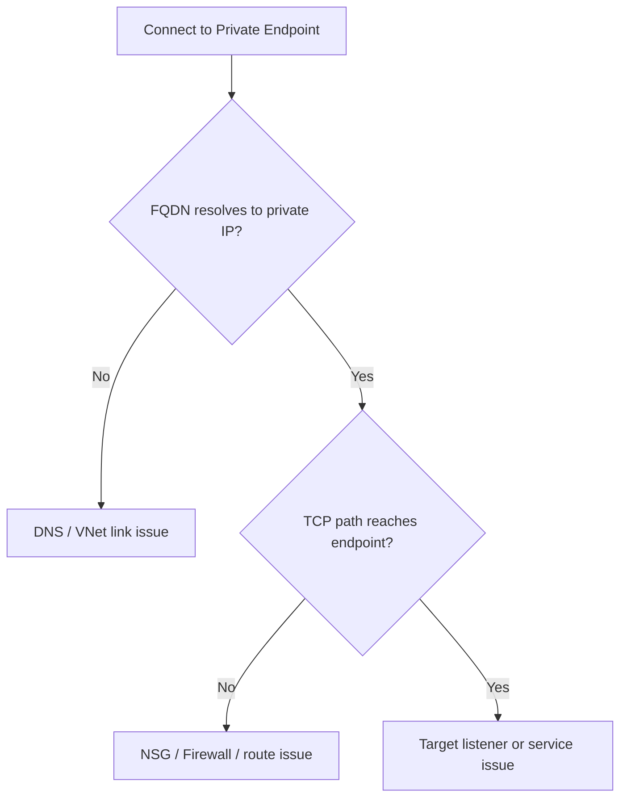

---
hide:
  - toc
content_sources:
  diagrams:
    - id: summary
      type: flowchart
      source: self-generated
      justification: "Synthesized troubleshooting flow for this guide from Microsoft Learn diagnostic and service documentation."
      based_on:
        - https://learn.microsoft.com/en-us/azure/private-link/troubleshoot-private-endpoint-connectivity
        - https://learn.microsoft.com/en-us/azure/private-link/private-endpoint-dns#validation
---

# Cannot Reach Private Endpoint

## 1. Summary
Private Endpoint failures usually come from a mismatch between DNS resolution, private DNS zone linkage, route choice, and effective allow rules.

<!-- diagram-id: summary -->

## 2. Common Misreadings
- "Private Endpoint is approved, so networking must be correct."
- "If it works from my laptop, it should work from the workload subnet."
- "Private connectivity failures are always NSG issues."

## 3. Competing Hypotheses
- H1: The service FQDN resolves to a public IP or stale record.
- H2: The Private DNS zone is not linked to the failing VNet.
- H3: NSG, Firewall, or UDR blocks the private path.
- H4: The target listener is not healthy even though the endpoint exists.

## 4. What to Check First

| Check | Tool / resource | Expected good signal |
| --- | --- | --- |
| DNS resolution | `nslookup`, `dig` | Name resolves to expected private IP |
| VNet link | Private DNS zone links | Failing VNet is linked |
| NSG rules | IP Flow Verify / effective NSG | Port is allowed |
| Routes | Effective routes | No UDR overrides intended path |
| Endpoint state | Private Endpoint connection | Status is `Approved` |

## 5. Evidence to Collect
- `nslookup <service-fqdn>` output from the failing source.
- Private DNS zone link list and record values.
- Effective routes and effective NSG rules.
- Firewall or NVA logs for the destination private IP and port.
- Private Endpoint connection state and NIC IP.

## 6. Validation

| Hypothesis | Signals that support | Signals that weaken |
| --- | --- | --- |
| H1 DNS wrong | public IP, NXDOMAIN, stale IP | expected private IP resolves consistently |
| H2 Zone link missing | failing VNet absent from zone links | correct link exists and record matches endpoint |
| H3 Path/policy block | next hop wrong or IP Flow Verify denies | route and policy both allow |
| H4 Target issue | TCP reaches endpoint but app listener fails | port listener responds normally |

## 7. Root Cause Patterns
- Missing Private DNS zone virtual network link.
- Service FQDN resolved publicly because split-horizon DNS was incomplete.
- UDR forced traffic through an NVA that did not allow the private target.
- NSG or Firewall allowed general traffic but not the specific private endpoint port.

## 8. Immediate Mitigations
- Link the correct VNet to the Private DNS zone.
- Correct or refresh the private DNS A record.
- Remove or adjust the UDR / Firewall rule blocking private-path traffic.
- Validate the target service listener and health after DNS is fixed.

## 9. Prevention
- Standardize Private Endpoint DNS design before deployment.
- Validate both DNS answer and TCP reachability in post-change checks.
- Document which VNets must be linked to each private zone.

## See Also

- [DNS Resolution Failures](../dns/dns-resolution-failures.md)
- [Outbound Connectivity Issues](outbound-connectivity-issues.md)
- [Private Connectivity Options](../../../platform/private-connectivity-options.md)
- [Connect Private Endpoints](../../../operations/connect-private-endpoints.md)

## Sources

- [Troubleshoot Azure Private Endpoint connectivity](https://learn.microsoft.com/en-us/azure/private-link/troubleshoot-private-endpoint-connectivity)
- [Azure Private Endpoint DNS configuration](https://learn.microsoft.com/en-us/azure/private-link/private-endpoint-dns#validation)
