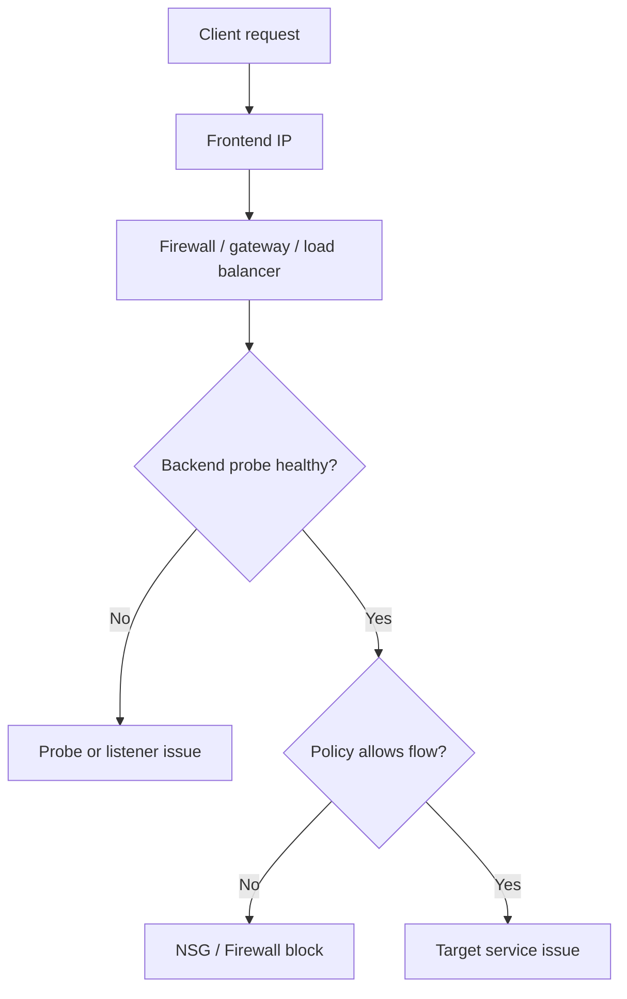

---
hide:
  - toc
content_sources:
  diagrams:
    - id: summary
      type: flowchart
      source: self-generated
      justification: "Synthesized troubleshooting flow for this guide from Microsoft Learn diagnostic and service documentation."
      based_on:
        - https://learn.microsoft.com/en-us/troubleshoot/azure/application-gateway/welcome-app-gateway
        - https://learn.microsoft.com/en-us/azure/load-balancer/load-balancer-troubleshoot-health-probe-status
---

# Inbound Connectivity Issues

## 1. Summary
Inbound failures usually occur because the published frontend, backend probe, policy layer, or target listener is unhealthy or misaligned.

<!-- diagram-id: summary -->

## 2. Common Misreadings
- "The public IP exists, so the service should be reachable."
- "Firewall application rules handle inbound publishing."
- "If the backend VM is up, the load-balanced service must be healthy."

## 3. Competing Hypotheses
- H1: Frontend IP or listener configuration is wrong.
- H2: Backend probe fails, so traffic never reaches the service.
- H3: NSG or Firewall denies inbound traffic.
- H4: Service listener or host firewall is not accepting the connection.

## 4. What to Check First

| Check | Tool | Expected good signal |
| --- | --- | --- |
| Frontend listener | `curl`, browser, port test | Expected response code or handshake |
| Probe path | LB / Application Gateway diagnostics | Backend marked healthy |
| Security policy | Effective NSG and firewall logs | Matching allow rule |
| Public IP assignment | Resource configuration | Correct frontend IP in place |

## 5. Evidence to Collect
- Frontend IP and listener configuration.
- Backend health / probe status screenshots or metrics.
- Effective NSG rules and firewall/NVA decision logs.
- Target listener status on expected port.
- Connection troubleshoot output from client or test VM.

## 6. Validation

| Hypothesis | Signals that support | Signals that weaken |
| --- | --- | --- |
| H1 Frontend wrong | wrong IP, wrong port, wrong DNS mapping | frontend matches expected publishing config |
| H2 Probe failure | backend unhealthy in LB/AppGW | probe healthy and stable |
| H3 Policy block | allow path absent, deny log present | inbound allow confirmed end to end |
| H4 Listener issue | TCP reaches host but app does not answer | listener responds normally |

## 7. Root Cause Patterns
- Backend health probe path or port drifted from the application.
- NSG allowed east-west traffic but denied internet ingress.
- Firewall DNAT or listener publication was incomplete.
- Public IP or frontend association was changed during maintenance.

## 8. Immediate Mitigations
- Correct the probe path, port, or listener configuration.
- Add or fix the inbound NSG / Firewall allow rule.
- Reassociate the correct public IP or frontend listener.
- Validate backend service is actually listening on the expected port.

## 9. Prevention
- Include probe validation in deployment checks.
- Treat frontend IP, listener, and probe settings as version-controlled configuration.
- Review NSG and Firewall intent together for published services.

## See Also

- [NSG vs UDR vs Firewall](../routing/nsg-vs-udr-vs-firewall.md)
- [Monitor Network Paths](../../../operations/monitor-network-paths.md)
- [Configure NSG](../../../operations/configure-nsg.md)
- [Network Security Basics](../../../platform/network-security-basics.md)

## Sources

- [Troubleshoot common issues with Azure Application Gateway](https://learn.microsoft.com/en-us/troubleshoot/azure/application-gateway/welcome-app-gateway)
- [Troubleshoot Azure Load Balancer health probes](https://learn.microsoft.com/en-us/azure/load-balancer/load-balancer-troubleshoot-health-probe-status)
