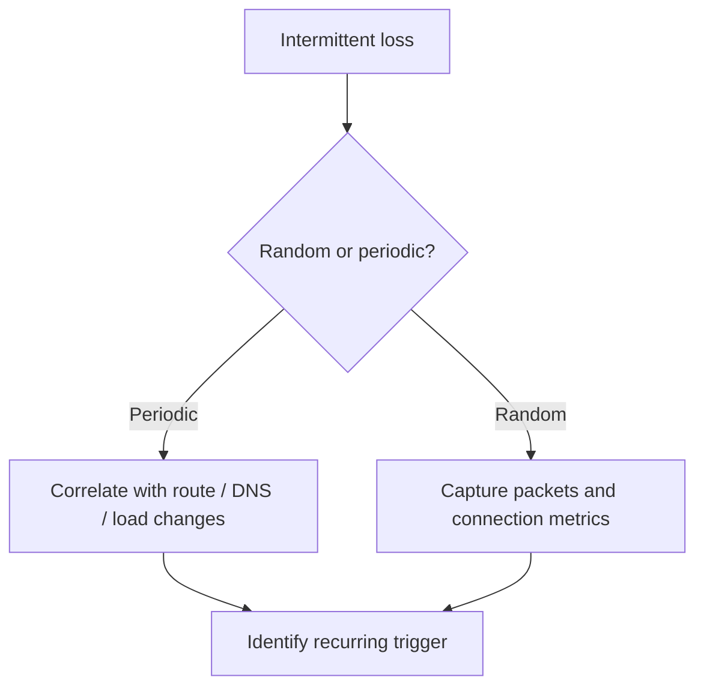

---
hide:
  - toc
---

# Intermittent Network Failures

## 1. Summary
Intermittent network failures require time-correlated evidence because the control plane may look healthy between failure windows.

## 2. Common Misreadings
- "It worked once, so networking is healthy."
- "Random failures mean Azure is flaky."
- "A single successful packet capture disproves the incident."

## 3. Competing Hypotheses
- H1: DNS answers flap because of cache, TTL, or resolver path changes.
- H2: Route, tunnel, or peering state changes during the incident window.
- H3: Burst-driven port, dependency, or policy pressure causes temporary failure.
- H4: The target or provider path is unstable rather than Azure core routing.

## 4. What to Check First

| Check | Data source | Expected good signal |
| --- | --- | --- |
| Time-based spikes | Metrics timeline | No alignment with load or config events |
| DNS behavior | Resolver logs / repeated query output | Stable answer over time |
| Port allocation / connections | SNAT and connection counters | No exhaustion pattern |
| Hybrid or peering state | Connection status timeline | Stable connected state |

## 5. Evidence to Collect
- Failure timeline with UTC timestamps.
- Repeated DNS answers during good and bad windows.
- Connection Monitor or packet capture output during the incident window.
- Metrics or logs showing load, route, or tunnel state changes.
- Provider-side or on-prem evidence if the path leaves Azure.

## 6. Validation

| Hypothesis | Signals that support | Signals that weaken |
| --- | --- | --- |
| H1 DNS flap | answers change across windows | DNS answer remains stable |
| H2 State change | tunnel/peering/route transitions align to failures | control-plane state is steady |
| H3 Burst pressure | failures match traffic bursts or connection churn | failures happen at idle too |
| H4 External instability | issue reproduces beyond Azure local path | Azure-local path alone shows failure |

## 7. Root Cause Patterns
- DNS cache expiry exposed a broken forwarder chain.
- Hybrid tunnel or BGP session flapped under load or provider instability.
- Connection churn or port pressure created short-lived outages.
- Upstream provider loss was misread as Azure VNet instability.

## 8. Immediate Mitigations
- Extend monitoring across good and bad windows before changing design.
- Stabilize DNS forwarders and validate TTL-sensitive records.
- Reduce burst concurrency or reroute around unstable transit.
- Capture packet and route evidence during the next failure window.

## 9. Prevention
- Maintain continuous probes for critical paths.
- Keep UTC-aligned incident timelines and route-change records.
- Add repeated resolver checks for Private Endpoint and hybrid dependencies.

## See Also

- [Latency and Packet Loss](latency-and-packet-loss.md)
- [Hybrid Connectivity Issues](../routing/hybrid-connectivity-issues.md)
- [Monitor Network Paths](../../../operations/monitor-network-paths.md)
- [Packet Capture and Diagnostics](../../../operations/packet-capture-and-diagnostics.md)

## Sources

- [Azure Monitor Network Insights overview](https://learn.microsoft.com/en-us/azure/network-watcher/network-insights-overview)
- [Troubleshoot VPN Gateway configurations and connections](https://learn.microsoft.com/en-us/troubleshoot/azure/vpn-gateway/vpn-gateway-troubleshoot)
