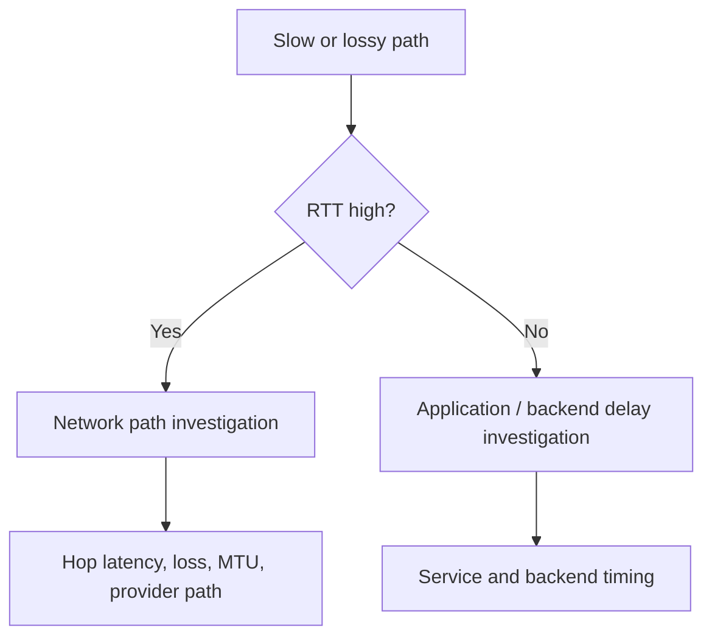

---
hide:
  - toc
content_sources:
  diagrams:
    - id: summary
      type: flowchart
      source: self-generated
      justification: "Synthesized troubleshooting flow for this guide from Microsoft Learn diagnostic and service documentation."
      based_on:
        - https://learn.microsoft.com/en-us/azure/virtual-network/virtual-network-test-latency
        - https://learn.microsoft.com/en-us/azure/expressroute/monitor-expressroute
---

# Latency and Packet Loss

## 1. Summary
Latency and loss troubleshooting starts by separating real network-path delay from application-side processing delay.

<!-- diagram-id: summary -->

## 2. Common Misreadings
- "Slow HTTP means the network is slow."
- "One bad ping proves Azure networking is the root cause."
- "Packet loss and application timeout are interchangeable symptoms."

## 3. Competing Hypotheses
- H1: Network RTT is genuinely high because of geography, hop path, or provider issues.
- H2: Packet loss occurs on a specific segment or due to MTU / fragmentation issues.
- H3: Backend or application processing dominates the observed latency.
- H4: Bursts or saturation create transient queueing rather than constant path delay.

## 4. What to Check First

| Measurement | Tool | Expected good signal |
| --- | --- | --- |
| Round-trip time | Connection Monitor | Near known baseline |
| Hop latency | Traceroute | No single-hop jump or black hole |
| Loss percentage | Continuous probes | Near-zero sustained loss |
| App response time | App telemetry / HTTP timing | Similar to network-only view |

## 5. Evidence to Collect
- RTT baseline and incident RTT.
- Hop-by-hop latency or route path output.
- Packet loss trend with timestamps.
- Application response timing to compare network and backend delay.
- ExpressRoute / provider or hybrid path metrics if applicable.

## 6. Validation

| Hypothesis | Signals that support | Signals that weaken |
| --- | --- | --- |
| H1 Real RTT increase | RTT baseline shifts up consistently | RTT normal while app remains slow |
| H2 Loss / MTU | retransmits, fragmentation, hop-specific loss | stable path and clean packets |
| H3 Backend delay | app timing exceeds raw network timing | network RTT dominates total latency |
| H4 Burst queueing | issue appears mainly under load | same latency at idle |

## 7. Root Cause Patterns
- Region distance or provider path changed effective RTT.
- One hop or provider segment introduced loss or jitter.
- Backend saturation was misread as network delay.
- MTU mismatch caused retransmits and poor throughput.

## 8. Immediate Mitigations
- Compare RTT, traceroute, and app timing before changing routes.
- Reduce MTU or clamp MSS if fragmentation is suspected.
- Reroute around unstable provider or hybrid segments when possible.
- Offload or optimize backend work if network is proven healthy.

## 9. Prevention
- Maintain latency baselines for critical paths.
- Monitor both network RTT and application timing together.
- Include path and provider dependencies in performance reviews.

## See Also

- [Intermittent Network Failures](intermittent-network-failures.md)
- [Monitor Network Paths](../../../operations/monitor-network-paths.md)
- [Observability Best Practices](../../../best-practices/observability-best-practices.md)

## Sources

- [Test network latency between Azure virtual machines](https://learn.microsoft.com/en-us/azure/virtual-network/virtual-network-test-latency)
- [Monitor ExpressRoute performance](https://learn.microsoft.com/en-us/azure/expressroute/monitor-expressroute)
