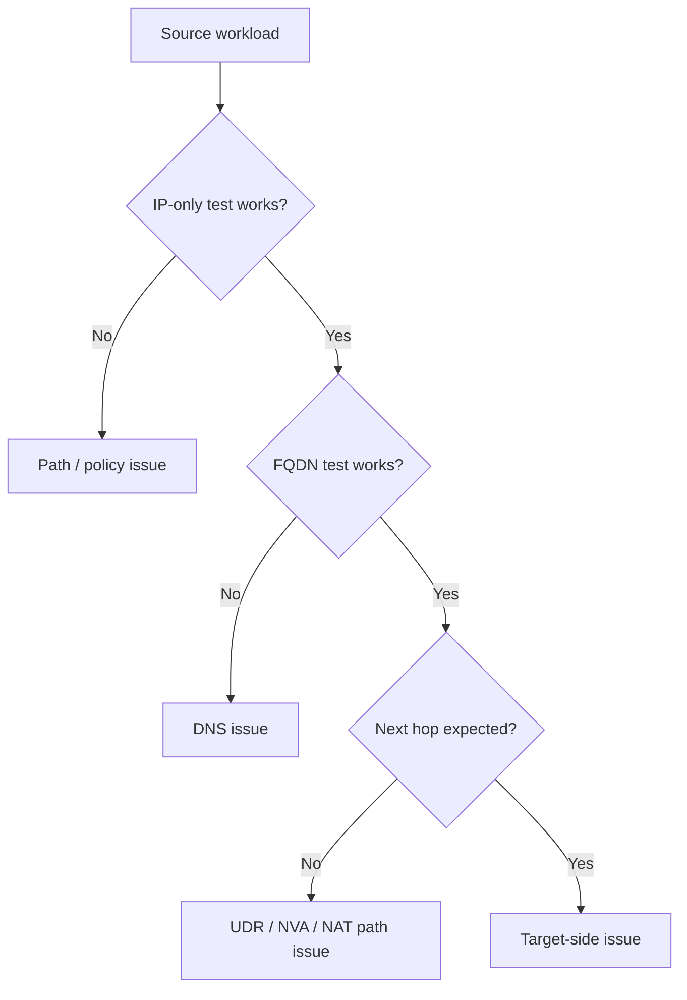

# Outbound Connectivity Issues

## 1. Summary
Outbound failures happen when workloads cannot reach internet or external targets because DNS, default routing, SNAT design, or egress policy is wrong.

## 2. Common Misreadings
- "If outbound fails, it must be firewall-only."
- "A workload without a public IP always has internet reachability."
- "A DNS failure and a TCP failure are the same incident."

## 3. Competing Hypotheses
- H1: DNS resolution fails before any connection attempt.
- H2: The default route sends traffic to the wrong next hop.
- H3: NSG, Firewall, or NVA blocks outbound traffic.
- H4: NAT/SNAT path is missing or exhausted for the scenario.

## 4. What to Check First

| Check | Command / tool | Expected good signal |
| --- | --- | --- |
| IP-only egress | `Test-NetConnection 1.1.1.1 -Port 443` | TCP reachable by IP |
| Name-based egress | `nslookup` then TCP test | DNS and path succeed |
| Route decision | Next hop diagnostic | Correct egress device selected |
| Egress policy | Effective NSG / firewall logs | Matching allow rule |

## 5. Evidence to Collect
- IP-only and FQDN-based egress test results.
- Effective routes for `0.0.0.0/0` and destination-specific prefixes.
- NAT Gateway, Load Balancer outbound, or firewall/NVA design evidence.
- Effective NSG and firewall decision logs.
- Timestamped target-side error or refusal evidence if available.

## 6. Validation

| Hypothesis | Signals that support | Signals that weaken |
| --- | --- | --- |
| H1 DNS | IP test works, FQDN test fails | both IP and FQDN fail equally |
| H2 Route wrong | next hop points to wrong NVA or no path | route is correct and stable |
| H3 Policy deny | effective deny or firewall block logged | policy path clearly allows |
| H4 NAT/SNAT issue | design lacks expected outbound translation or port pressure appears | healthy outbound design and low connection pressure |

## 7. Root Cause Patterns
- Workload used custom DNS that could not resolve target names.
- A `0.0.0.0/0` UDR redirected all egress through an unprepared NVA.
- NSG denied outbound internet or dependency prefixes.
- NAT path assumed by design was not actually attached to the source subnet.

## 8. Immediate Mitigations
- Separate DNS from path issues using IP-only and FQDN tests.
- Correct the `0.0.0.0/0` route or NVA/firewall rule set.
- Attach the intended NAT path or fix egress translation design.
- Add temporary allow rules for validated destination prefixes and ports.

## 9. Prevention
- Validate outbound design after every route-table or firewall change.
- Keep internet egress architecture explicit: NAT Gateway, Firewall, NVA, or platform default.
- Include name-based and IP-based egress probes in standard health checks.

## See Also

- [DNS Resolution Failures](../dns/dns-resolution-failures.md)
- [NSG vs UDR vs Firewall](../routing/nsg-vs-udr-vs-firewall.md)
- [Configure UDR](../../../operations/configure-udr.md)
- [Routing Basics](../../../platform/routing-basics.md)

## Sources

- [Troubleshoot outbound connections in Azure](https://learn.microsoft.com/en-us/azure/load-balancer/troubleshoot-outbound-connection)
- [Azure Load Balancer outbound connections](https://learn.microsoft.com/en-us/azure/load-balancer/load-balancer-outbound-connections)
