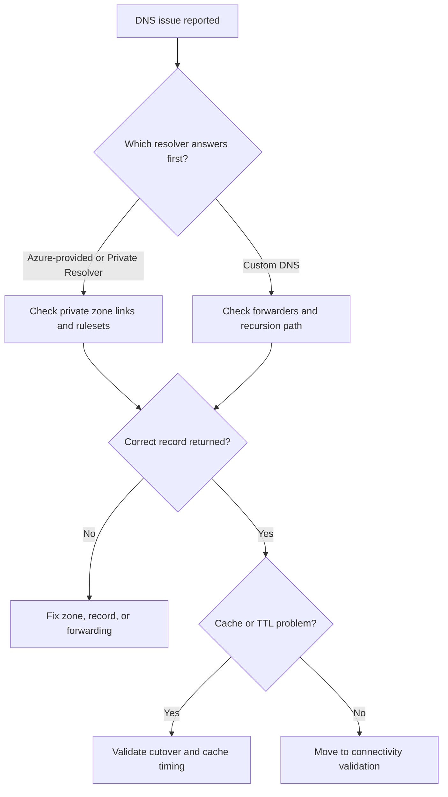

---
hide:
  - toc
content_sources:
  diagrams:
    - id: symptoms
      type: flowchart
      source: self-generated
      justification: "Synthesized troubleshooting flow for this guide from Microsoft Learn diagnostic and service documentation."
      based_on:
        - https://learn.microsoft.com/en-us/azure/dns/private-dns-overview
        - https://learn.microsoft.com/en-us/azure/dns/dns-private-resolver-overview
        - https://learn.microsoft.com/en-us/azure/private-link/private-endpoint-dns
---

# DNS Resolution Issues

## 1. Summary

Use this playbook when clients get NXDOMAIN, timeouts, stale answers, or the wrong public-versus-private answer while accessing Azure services, private endpoints, or hybrid resources.

The key is to identify which resolver answered, which zone should have been authoritative, whether conditional forwarding was correct, and whether the answer was cached or live. Most Azure DNS incidents are topology misunderstandings rather than platform outages.

### Symptoms

- Connections time out or are refused.
- Traffic works from one source but fails from another seemingly similar source.
- A private endpoint or hybrid path behaves differently after a recent change.
- Operators have a healthy-looking control plane but an unhealthy application path.

<!-- diagram-id: symptoms -->


## 2. Common Misreadings

| Observation | Often Misread As | Actually Means |
|---|---|---|
| One VM resolves correctly | The environment DNS is healthy | Another subnet or on-premises forwarder may still use a different resolver path. |
| The private endpoint is Approved | Private DNS is configured | Approval state does not prove correct zone groups or VNet links. |
| Public resolution works | Private access should also work | Split-horizon design may intentionally differ, or the private path may be incomplete. |
| A retry eventually succeeds | Azure DNS is flaky | The real issue may be cache expiry, conditional forwarding, or an overloaded custom resolver. |

## 3. Competing Hypotheses

| Hypothesis | Likelihood | Key Discriminator |
|---|---|---|
| The client uses the wrong DNS server | High | Client NIC or OS settings point to an unexpected resolver. |
| The private zone, zone link, or zone group is missing | High | The record exists somewhere, but not in the resolver path the client actually uses. |
| Conditional forwarding between Azure and on-premises is incomplete | High | Azure works but on-premises fails, or the reverse. |
| The answer is stale because of cache or TTL behavior | Medium | Fresh queries show the new answer but long-lived clients keep the old one. |
| The resolver is healthy but connectivity to the resolved target is broken | Medium | DNS returns the correct record and the issue moves to routing or policy. |

## 4. What to Check First

1. **List private DNS zone links**

```bash
az network private-dns link vnet list \
    --resource-group $RG \
    --zone-name $ZONE_NAME \
    --output table
```

2. **Inspect Private Resolver forwarding rulesets**

```bash
az network dns-resolver forwarding-ruleset list \
    --resource-group $RG \
    --output table
```

3. **Review custom DNS servers on the VNet**

```bash
az network vnet show \
    --resource-group $RG \
    --name $VNET_NAME \
    --query "dhcpOptions.dnsServers"
```

4. **Inspect private endpoint DNS configuration**

```bash
az network private-endpoint show \
    --resource-group $RG \
    --name $PE_NAME \
    --query "{customDnsConfigs:customDnsConfigs}"
```

5. **Query a name from Azure and on-premises test points**

```bash
az network watcher test-connectivity \
    --resource-group $RG \
    --source-resource $SOURCE_ID \
    --dest-address $TARGET_FQDN \
    --dest-port 443
```

## 5. Evidence to Collect

### 5.1 KQL Queries

#### DNS-related Azure Activity changes

```kusto
AzureActivity
| where TimeGenerated > ago(7d)
| where OperationNameValue has_any (
    "Microsoft.Network/privateDnsZones/write",
    "Microsoft.Network/dnsResolvers/write",
    "Microsoft.Network/privateEndpoints/write"
)
| project TimeGenerated, OperationNameValue, ActivityStatusValue, Caller, ResourceGroup, ResourceId
| order by TimeGenerated desc
```

| Column | Interpretation |
|---|---|
| `OperationNameValue` | Recent writes often explain when the answer changed. |
| `ResourceId` | Confirms whether the changed object was the zone, resolver, or private endpoint. |

!!! tip "How to Read This"
    Start with the rows nearest the incident start time. Use them to separate configuration changes from recurring background noise.

#### Private Resolver events

```kusto
AzureDiagnostics
| where TimeGenerated > ago(6h)
| where Category has "DnsResolver"
| project TimeGenerated, Category, Resource, msg_s, ResponseCode=tostring(ResponseCode_s)
| order by TimeGenerated desc
```

| Column | Interpretation |
|---|---|
| `ResponseCode` | Use SERVFAIL or NXDOMAIN patterns to separate configuration from connectivity issues. |
| `msg_s` | Helpful for pinpointing which ruleset or endpoint handled the query. |

!!! tip "How to Read This"
    Start with the rows nearest the incident start time. Use them to separate configuration changes from recurring background noise.

#### Application-side evidence of wrong destination

```kusto
AzureDiagnostics
| where TimeGenerated > ago(6h)
| where msg_s has_any ("Name or service not known", "No such host", "temporary failure in name resolution")
| summarize Failures=count() by Resource, msg_s, bin(TimeGenerated, 15m)
| order by TimeGenerated desc
```

| Column | Interpretation |
|---|---|
| `Failures` | Spikes align the DNS issue with application symptoms. |
| `Resource` | Shows which consumer workloads felt the impact first. |

!!! tip "How to Read This"
    Start with the rows nearest the incident start time. Use them to separate configuration changes from recurring background noise.

### 5.2 CLI Investigation

#### Show zone links for the target namespace

```bash
az network private-dns link vnet list \
    --resource-group $RG \
    --zone-name $ZONE_NAME \
    --output table
```

Sample output:

```json
[{"name":"link-hub","virtualNetwork":{"id":"/subscriptions/<subscription-id>/.../vnet-hub"}}]
```

Interpretation:

- If the consumer VNet is missing here, the resolver path is incomplete.
- Link presence is necessary but still must be paired with actual client testing.

#### Show Private Resolver rulesets

```bash
az network dns-resolver forwarding-ruleset list \
    --resource-group $RG \
    --output json
```

Sample output:

```json
[{"name":"frs-hybrid","dnsResolverOutboundEndpoints":[{"id":"/subscriptions/<subscription-id>/..."}]}]
```

Interpretation:

- Confirm the intended ruleset exists and is attached where expected.
- Rulesets that exist but are not linked to a VNet do not help clients there.

#### Inspect private endpoint DNS settings

```bash
az network private-endpoint show \
    --resource-group $RG \
    --name $PE_NAME \
    --query "{customDnsConfigs:customDnsConfigs,manualPrivateLinkServiceConnections:manualPrivateLinkServiceConnections}"
```

Sample output:

```json
{"customDnsConfigs":[{"fqdn":"myserver.database.windows.net","ipAddresses":["10.40.4.10"]}]}
```

Interpretation:

- The FQDN list tells you which names should resolve privately.
- If the expected FQDN is missing, fix zone-group or endpoint configuration.

## 6. Validation and Disproof by Hypothesis

### Hypothesis: Wrong resolver path

**Proves if**: Client configuration points to a resolver that does not know the target namespace.

**Disproves if**: The client uses the expected Azure-provided DNS, Private Resolver, or approved custom DNS path.

```bash
az network vnet show \
    --resource-group $RG \
    --name $VNET_NAME \
    --query "dhcpOptions.dnsServers"
```

### Hypothesis: Missing private DNS linkage

**Proves if**: Zone links or private endpoint zone groups are absent for the consumer network.

**Disproves if**: The zone link, zone group, and record exist and the client resolves the private answer.

```bash
az network private-dns link vnet list \
    --resource-group $RG \
    --zone-name $ZONE_NAME
```

### Hypothesis: Hybrid forwarding gap

**Proves if**: Azure resolves but on-premises does not, or the reverse, based on conditional forwarder coverage.

**Disproves if**: Both Azure and on-premises queries follow the documented resolver chain and return the same intended answer.

```bash
az network dns-resolver forwarding-ruleset list \
    --resource-group $RG
```

### Hypothesis: Cache or TTL behavior

**Proves if**: A fresh query after cache flush returns a different answer than a long-lived client still holds.

**Disproves if**: Both cached and fresh queries converge after TTL expiry or controlled flush.

```bash
az network private-dns record-set a show \
    --resource-group $RG \
    --zone-name $ZONE_NAME \
    --name $RECORD_NAME
```

## 7. Likely Root Cause Patterns

| Pattern | Evidence | Resolution |
|---|---|---|
| Missing VNet link | Private zone exists but consumer VNet is not linked | Add the correct virtual network link and retest from the client subnet. |
| Incomplete zone group on private endpoint | Endpoint is approved but custom DNS configs are missing or incomplete | Add the required private DNS zone group to the endpoint. |
| Stale custom forwarder | On-premises queries fail while Azure-hosted queries work | Update the conditional forwarder to use the current resolver endpoint. |
| Cache-driven cutover delay | Newly started clients work while long-lived clients still fail | Wait for TTL or flush caches as part of the cutover plan. |
| Correct DNS, broken network path | Queries return the right private IP but the connection still fails | Move immediately to routing or NSG diagnostics instead of changing DNS again. |

## 8. Immediate Mitigations

1. Restore the last known-good forwarder or zone link if a recent DNS change caused the outage.
2. Flush or restart test clients only after capturing evidence of the stale answer.
3. Use one canonical resolver path during incident response; avoid parallel ad hoc changes by multiple teams.
4. Once correct answers are restored, run connectivity validation to confirm the issue is truly resolved.

## 9. Prevention

### Prevention checklist

- [ ] Standardize which team owns private zones, resolver rulesets, and on-premises conditional forwarders.
- [ ] Include DNS validation in every private endpoint and hybrid onboarding runbook.
- [ ] Alert on DNS control-plane changes for critical production namespaces.
- [ ] Keep a registry of private namespaces, authoritative sources, and linked VNets.
- [ ] Test both cached and fresh query behavior during cutovers.

## See Also

- [Dns](../first-10-minutes/dns.md)
- [Evidence Map](../evidence-map.md)
- [Dns Resolution Failures](dns/dns-resolution-failures.md)
- [Dns Resolution Cheatsheet](../../reference/dns-resolution-cheatsheet.md)

## Sources

- [private-dns-overview](https://learn.microsoft.com/en-us/azure/dns/private-dns-overview)
- [dns-private-resolver-overview](https://learn.microsoft.com/en-us/azure/dns/dns-private-resolver-overview)
- [private-endpoint-dns](https://learn.microsoft.com/en-us/azure/private-link/private-endpoint-dns)
