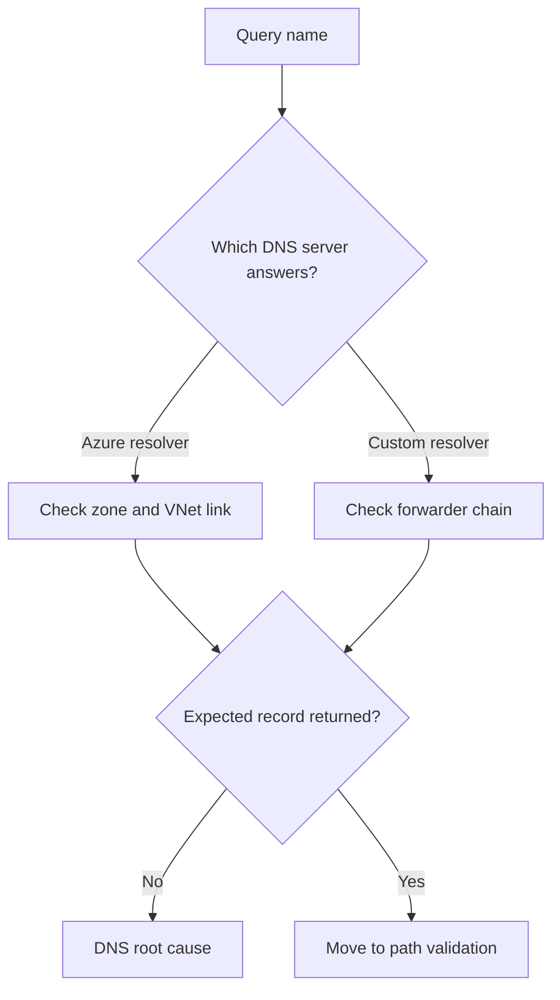

---
hide:
  - toc
---

# DNS Resolution Failures

## 1. Summary
DNS failures in Azure usually originate from the wrong resolver, missing private DNS linkage, broken forwarders, or overlapping zone design.

## 2. Common Misreadings
- "If DNS works on one host, Azure DNS is fine everywhere."
- "Private DNS failures always mean the record is missing."
- "A timeout on port 53 proves the zone is wrong."

## 3. Competing Hypotheses
- H1: The client uses the wrong DNS server.
- H2: The relevant zone or record is missing or stale.
- H3: Private DNS zone link is missing.
- H4: Custom DNS conditional forwarding is incomplete or incorrect.

## 4. What to Check First

| Quick check | Where to inspect | Expected good signal |
| --- | --- | --- |
| Client DNS server | NIC or OS resolver settings | Expected DNS server is active |
| Zone link | Private DNS zone virtual network links | Correct VNet linked |
| Forwarders | Custom DNS conditional forwarding | Rule forwards to Azure resolver path |
| Record answer | `nslookup`, `dig`, `Resolve-DnsName` | Expected IP or CNAME chain |

## 5. Evidence to Collect
- Active resolver settings from the failing source.
- Exact query results from the failing source and a known-good source.
- Zone records and private zone VNet links.
- Conditional forwarder configuration and test output.
- Timestamps for inconsistent or intermittent answers.

## 6. Validation

| Hypothesis | Signals that support | Signals that weaken |
| --- | --- | --- |
| H1 Wrong resolver | unexpected DNS server in use | expected resolver confirmed |
| H2 Missing/stale record | NXDOMAIN or wrong IP returned | correct record chain returned |
| H3 Missing link | zone exists but VNet absent from links | correct VNet linked |
| H4 Forwarder issue | custom DNS fails while Azure resolver succeeds | both resolver paths answer correctly |

## 7. Root Cause Patterns
- VM or workload used unexpected custom DNS servers.
- Private DNS zone existed but the workload VNet was not linked.
- Conditional forwarders did not handle Azure private zones.
- Overlapping or split-horizon zones returned the wrong answer.

## 8. Immediate Mitigations
- Point the client at the intended resolver path.
- Add or fix the private DNS zone link.
- Correct the record set or stale alias/CNAME chain.
- Update conditional forwarders for Azure private suffixes.

## 9. Prevention
- Keep DNS architecture documented per VNet.
- Test private and public name resolution after DNS changes.
- Standardize forwarder rules for Azure private zones.

## See Also

- [Cannot Reach Private Endpoint](../connectivity/cannot-reach-private-endpoint.md)
- [DNS Basics](../../../platform/dns-basics.md)
- [Configure DNS](../../../operations/configure-dns.md)
- [DNS Resolution Cheatsheet](../../../reference/dns-resolution-cheatsheet.md)

## Sources

- [Azure DNS troubleshooting guide](https://learn.microsoft.com/en-us/azure/dns/dns-troubleshoot)
- [Azure Private DNS overview](https://learn.microsoft.com/en-us/azure/dns/private-dns-overview)
