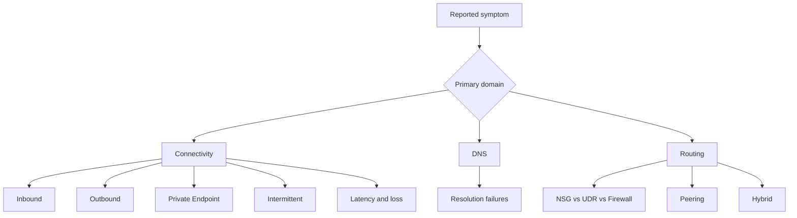

# Playbooks

Symptom-oriented Azure Networking playbooks organized by connectivity, DNS, and routing.

## Connectivity

| Playbook | Symptom |
| --- | --- |
| [Inbound Connectivity Issues](connectivity/inbound-connectivity-issues.md) | Clients cannot reach a published service or frontend |
| [Outbound Connectivity Issues](connectivity/outbound-connectivity-issues.md) | Workloads cannot reach internet or external dependencies |
| [Cannot Reach Private Endpoint](connectivity/cannot-reach-private-endpoint.md) | Private Link traffic fails or resolves incorrectly |
| [Intermittent Network Failures](connectivity/intermittent-network-failures.md) | Flapping or time-window connectivity failures |
| [Latency and Packet Loss](connectivity/latency-and-packet-loss.md) | High RTT, jitter, or packet loss without hard denial |

## DNS

| Playbook | Symptom |
| --- | --- |
| [DNS Resolution Failures](dns/dns-resolution-failures.md) | Wrong IP, NXDOMAIN, timeout, or custom DNS forwarding issues |

## Routing

| Playbook | Symptom |
| --- | --- |
| [NSG vs UDR vs Firewall](routing/nsg-vs-udr-vs-firewall.md) | Need to identify which policy or path component blocks traffic |
| [Peering and Routing Issues](routing/peering-and-routing-issues.md) | VNet-to-VNet paths fail across peering or transit assumptions |
| [Hybrid Connectivity Issues](routing/hybrid-connectivity-issues.md) | VPN or ExpressRoute tunnels/routes fail |

## See Also

- [Troubleshooting Home](../index.md)
- [First 10 Minutes](../first-10-minutes/index.md)
- [Decision Tree](../decision-tree.md)
- [Evidence Map](../evidence-map.md)

## Sources

- [Azure networking documentation](https://learn.microsoft.com/en-us/azure/networking/)
