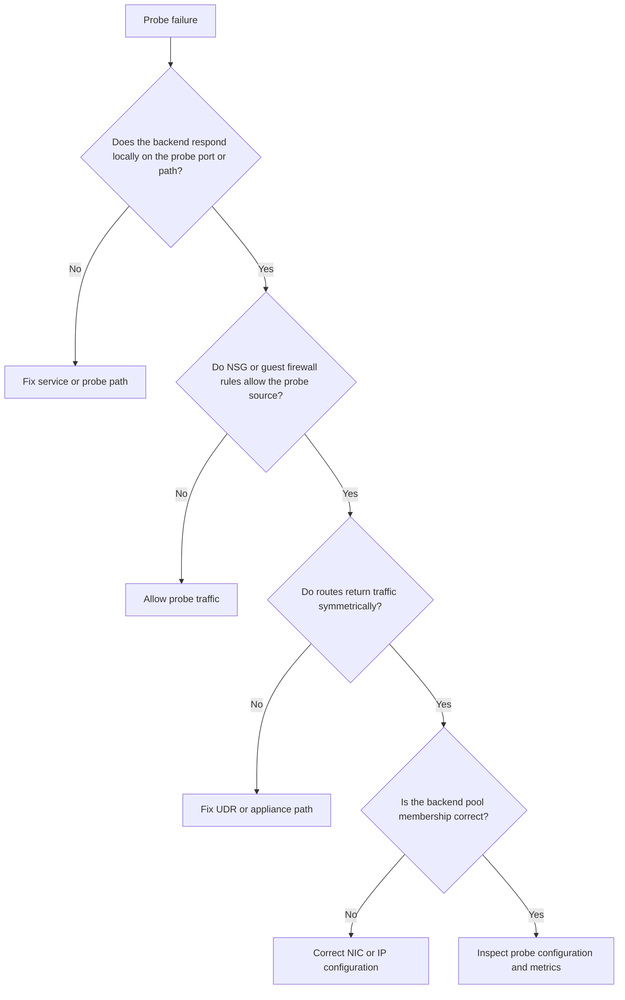

# Load Balancer Health Probe Failures

## 1. Summary

Use this playbook when Azure Load Balancer backends are marked unhealthy, traffic stops reaching healthy-looking instances, or failover never happens because health probes are failing.

Health probe incidents are usually not load balancer defects. They are often NSG denies, probe path mismatches, guest firewall blocks, backend listener failures, or UDRs that send probe responses down an asymmetric return path.

### Symptoms

- Connections time out or are refused.
- Traffic works from one source but fails from another seemingly similar source.
- A private endpoint or hybrid path behaves differently after a recent change.
- Operators have a healthy-looking control plane but an unhealthy application path.



## 2. Common Misreadings

| Observation | Often Misread As | Actually Means |
|---|---|---|
| The VM is running | The backend should be healthy | A running VM can still fail the specific probe port, path, or return path. |
| Application traffic works from inside the subnet | Probe traffic must also work | Probe source, path, and guest firewall behavior can differ from internal tests. |
| The NSG allows user traffic | It also allows probes | Probe traffic may use different source ranges or ports that are not covered. |
| One backend is healthy | The probe configuration is correct for all backends | Different instances may have different guest firewalls, listeners, or routes. |

## 3. Competing Hypotheses

| Hypothesis | Likelihood | Key Discriminator |
|---|---|---|
| The application is not listening on the configured probe port or path | High | Local listener checks fail or the probe path returns the wrong status code. |
| NSG or guest firewall blocks probe traffic | High | Effective NSG or OS firewall rules deny the probe source and port. |
| UDR or appliance routing breaks symmetric return traffic | Medium | Probe requests arrive but responses leave through the wrong path. |
| Backend pool membership or NIC IP configuration is wrong | Medium | The expected backend instance is missing or uses the wrong IP config. |
| The probe itself is misconfigured | Medium | Probe protocol, port, interval, or path does not match the application behavior. |

## 4. What to Check First

1. **Show health probe configuration**

```bash
az network lb probe show \
    --resource-group $RG \
    --lb-name $LB_NAME \
    --name $PROBE_NAME
```

2. **Show backend pool configuration**

```bash
az network lb address-pool show \
    --resource-group $RG \
    --lb-name $LB_NAME \
    --name $BACKEND_POOL_NAME
```

3. **Review load balancer metrics**

```bash
az monitor metrics list \
    --resource $LOAD_BALANCER_ID \
    --metric DipAvailability,HealthProbeStatus \
    --interval PT5M
```

4. **Inspect effective NSG rules on a backend NIC**

```bash
az network nic show-effective-nsg \
    --resource-group $RG \
    --name $BACKEND_NIC_NAME
```

5. **Inspect effective routes on the backend NIC**

```bash
az network nic show-effective-route-table \
    --resource-group $RG \
    --name $BACKEND_NIC_NAME
```

## 5. Evidence to Collect

### 5.1 KQL Queries

#### Load balancer metric trend

```kusto
AzureMetrics
| where TimeGenerated > ago(6h)
| where ResourceProvider == "MICROSOFT.NETWORK"
| where MetricName in ("DipAvailability", "HealthProbeStatus")
| summarize AvgValue=avg(Average) by ResourceId, MetricName, bin(TimeGenerated, 5m)
| order by TimeGenerated desc
```

| Column | Interpretation |
|---|---|
| `MetricName` | Compare DipAvailability and HealthProbeStatus to see whether probe failures map to traffic loss. |
| `AvgValue` | Values near zero indicate broad backend health problems. |

!!! tip "How to Read This"
    Start with the rows nearest the incident start time. Use them to separate configuration changes from recurring background noise.

#### Guest or application errors near probe windows

```kusto
AzureDiagnostics
| where TimeGenerated > ago(6h)
| where msg_s has_any ("connection refused", "503", "404", "timeout")
| summarize Hits=count() by Resource, msg_s, bin(TimeGenerated, 5m)
| order by TimeGenerated desc
```

| Column | Interpretation |
|---|---|
| `msg_s` | Helps prove whether the application returned the wrong status or was unavailable. |
| `Hits` | Correlate spikes with probe-failure metrics. |

!!! tip "How to Read This"
    Start with the rows nearest the incident start time. Use them to separate configuration changes from recurring background noise.

#### Control-plane changes to load balancer or NSG

```kusto
AzureActivity
| where TimeGenerated > ago(24h)
| where OperationNameValue has_any (
    "Microsoft.Network/loadBalancers/write",
    "Microsoft.Network/networkSecurityGroups/write",
    "Microsoft.Network/routeTables/write"
)
| project TimeGenerated, OperationNameValue, Caller, ActivityStatusValue, ResourceId
| order by TimeGenerated desc
```

| Column | Interpretation |
|---|---|
| `OperationNameValue` | Use recent writes to identify whether the probe issue followed a policy or load balancer change. |
| `Caller` | Useful when automation silently changed the probe definition. |

!!! tip "How to Read This"
    Start with the rows nearest the incident start time. Use them to separate configuration changes from recurring background noise.

### 5.2 CLI Investigation

#### Show the current probe definition

```bash
az network lb probe show \
    --resource-group $RG \
    --lb-name $LB_NAME \
    --name $PROBE_NAME
```

Sample output:

```json
{"protocol":"Tcp","port":443,"intervalInSeconds":5,"numberOfProbes":2}
```

Interpretation:

- Confirm that protocol, port, and path match the application design.
- A mismatch here is often simpler than any deeper network cause.

#### Show backend pool members

```bash
az network lb address-pool show \
    --resource-group $RG \
    --lb-name $LB_NAME \
    --name $BACKEND_POOL_NAME
```

Sample output:

```json
{"backendIPConfigurations":[{"id":"/subscriptions/<subscription-id>/.../ipConfigurations/ipconfig1"}]}
```

Interpretation:

- Verify the expected NIC or IP configuration is actually in the pool.
- If the unhealthy instance is missing, fix pool membership before chasing probes.

#### Inspect backend NSG behavior

```bash
az network nic show-effective-nsg \
    --resource-group $RG \
    --name $BACKEND_NIC_NAME
```

Sample output:

```json
{"effectiveSecurityRules":[{"access":"Deny","destinationPortRange":"443"}]}
```

Interpretation:

- Look for probe-port denies and missing allow rules.
- Remember to consider the guest firewall as well if Azure-side policy looks correct.

## 6. Validation and Disproof by Hypothesis

### Hypothesis: Probe path or port mismatch

**Proves if**: The application does not answer on the configured port or probe path returns an unhealthy status.

**Disproves if**: The local service returns the expected response and the probe definition matches it.

```bash
az network lb probe show \
    --resource-group $RG \
    --lb-name $LB_NAME \
    --name $PROBE_NAME
```

### Hypothesis: NSG or guest firewall block

**Proves if**: Azure or guest-side firewall rules deny probe traffic.

**Disproves if**: Probe traffic is explicitly allowed and health recovers after policy correction.

```bash
az network nic show-effective-nsg \
    --resource-group $RG \
    --name $BACKEND_NIC_NAME
```

### Hypothesis: Asymmetric route issue

**Proves if**: Effective routes send response traffic to a virtual appliance or unexpected next hop.

**Disproves if**: Return traffic uses the intended path and the backend becomes healthy.

```bash
az network nic show-effective-route-table \
    --resource-group $RG \
    --name $BACKEND_NIC_NAME
```

### Hypothesis: Wrong backend membership

**Proves if**: The expected backend NIC or IP configuration is absent from the pool.

**Disproves if**: The correct backend appears in the pool and receives healthy probe results.

```bash
az network lb address-pool show \
    --resource-group $RG \
    --lb-name $LB_NAME \
    --name $BACKEND_POOL_NAME
```

## 7. Likely Root Cause Patterns

| Pattern | Evidence | Resolution |
|---|---|---|
| Application listener missing | Local checks fail on the probe port | Start or fix the application listener and retest health probes. |
| Probe path returns 404 or 503 | HTTP probe uses the wrong URL or app health endpoint | Update the probe path or implement a stable health endpoint. |
| Backend NSG deny | Effective NSG output blocks the probe port | Allow the probe source and document the rule purpose. |
| Virtual appliance return-path asymmetry | Probe requests arrive but responses exit through a forced-tunnel path | Correct the UDR or bypass the appliance for probe traffic if appropriate. |
| Backend pool drift | Expected NIC IP config is missing from the pool | Reattach the correct backend member and validate metrics again. |

## 8. Immediate Mitigations

1. Switch traffic to known healthy backends or a fallback listener while investigating the unhealthy nodes.
2. Revert recent probe or NSG changes if they align exactly with the incident window.
3. Capture metrics and effective policy before restarting backends so evidence is preserved.
4. Validate backend health from both the guest OS and Azure control plane after every change.

## 9. Prevention

### Prevention checklist

- [ ] Expose a stable health endpoint that tests only critical dependencies.
- [ ] Template NSG rules required for load balancer probes rather than recreating them manually.
- [ ] Review UDR changes on backend subnets for asymmetric-return impact.
- [ ] Alert on HealthProbeStatus and DipAvailability drops for production load balancers.
- [ ] Test health probes after patching, image refresh, or autoscale changes.

## See Also

- [Quick Diagnosis Cards](../quick-diagnosis-cards.md)
- [Load Balancing Options](../../platform/load-balancing-options.md)
- [Inbound Connectivity Issues](connectivity/inbound-connectivity-issues.md)
- [Latency And Packet Loss](connectivity/latency-and-packet-loss.md)

## Sources

- [load-balancer-custom-probe-overview](https://learn.microsoft.com/en-us/azure/load-balancer/load-balancer-custom-probe-overview)
- [load-balancer-troubleshoot-health-probe-status](https://learn.microsoft.com/en-us/azure/load-balancer/load-balancer-troubleshoot-health-probe-status)
- [quickstart-load-balancer-standard-public-portal](https://learn.microsoft.com/en-us/azure/load-balancer/quickstart-load-balancer-standard-public-portal)
