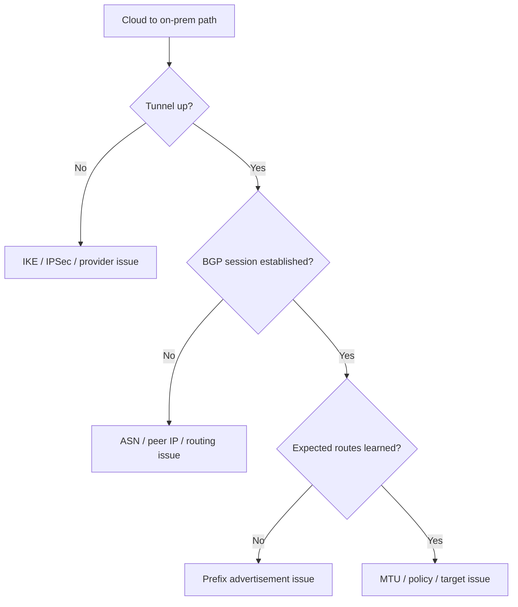

# Hybrid Connectivity Issues

## 1. Summary
Hybrid failures across VPN or ExpressRoute usually come from tunnel health, BGP route learning, prefix advertisement, or MTU and provider-path issues.

## 2. Common Misreadings
- "Tunnel up means routing is healthy."
- "All missing prefixes are Azure route bugs."
- "Packet loss on hybrid paths is always a VPN problem."

## 3. Competing Hypotheses
- H1: Tunnel is down because of IKE/IPSec mismatch or provider issue.
- H2: BGP session is down or misconfigured.
- H3: Required prefixes are not being advertised or learned.
- H4: MTU, MSS, or asymmetric policy/path issues affect only some traffic.

## 4. What to Check First

| Validation point | View | Expected good signal |
| --- | --- | --- |
| Tunnel health | Gateway connection status | `Connected` |
| Route learning | Effective routes and BGP tables | On-prem prefixes present |
| BGP state | Connection diagnostics | Established session |
| Path continuity | Connection troubleshoot / traceroute | Probe reaches on-prem target |

## 5. Evidence to Collect
- Gateway connection status and timestamps.
- BGP peer state, ASN, and learned routes.
- Local Network Gateway prefixes or on-prem advertisements.
- Traceroute / Connection Monitor results across the hybrid path.
- MTU / fragmentation evidence for problematic workloads.

## 6. Validation

| Hypothesis | Signals that support | Signals that weaken |
| --- | --- | --- |
| H1 Tunnel down | disconnected status, IKE/IPSec errors | tunnel stable and connected |
| H2 BGP down | BGP not established, wrong ASN or peer IP | BGP established normally |
| H3 Missing routes | required prefixes absent from learned routes | prefixes present and active |
| H4 MTU / asymmetry | partial failures, fragmentation, one-way issues | clean symmetric path and no frag signs |

## 7. Root Cause Patterns
- Phase 1/2 settings drifted between Azure and on-prem device.
- Wrong BGP ASN or peer IP prevented route learning.
- Static prefixes in the Local Network Gateway were stale.
- MTU or asymmetric return path caused partial connectivity and retransmits.

## 8. Immediate Mitigations
- Restore tunnel health before changing downstream policies.
- Correct BGP peer settings and advertised prefixes.
- Update Local Network Gateway entries for static-route scenarios.
- Reduce MTU or clamp MSS when fragmentation is suspected.

## 9. Prevention
- Keep hybrid connection parameters version-controlled and documented.
- Validate learned routes after every gateway or on-prem change.
- Continuously monitor tunnel and BGP state for critical prefixes.

## See Also

- [Peering and Routing Issues](peering-and-routing-issues.md)
- [Hybrid Connectivity Basics](../../../platform/hybrid-connectivity-basics.md)
- [VPN and ExpressRoute Basics](../../../operations/vpn-and-expressroute-basics.md)
- [Hybrid Connectivity Best Practices](../../../best-practices/hybrid-connectivity-best-practices.md)

## Sources

- [Troubleshoot VPN Gateway site-to-site connection issues](https://learn.microsoft.com/en-us/azure/vpn-gateway/vpn-gateway-troubleshoot-site-to-site-cannot-connect)
- [Troubleshoot ExpressRoute performance and connectivity](https://learn.microsoft.com/en-us/troubleshoot/azure/expressroute/expressroute-troubleshooting-network-performance)
