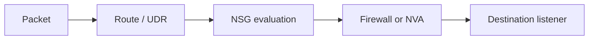

# NSG vs UDR vs Firewall

## 1. Summary
This playbook helps determine whether traffic is failing because Azure chose the wrong path, the correct path was denied by policy, or the target listener never handled the packet.

## 2. Common Misreadings
- "NSG decides the path." 
- "Firewall replaces the need to inspect effective routes." 
- "If the route is right, policy cannot still block the packet."

## 3. Competing Hypotheses
- H1: UDR selected the wrong next hop.
- H2: NSG denied the flow after route selection.
- H3: Firewall or NVA denied or mispublished the flow.
- H4: Traffic reached the target network but not the service listener.

## 4. What to Check First

| Decision point | Check | Expected good signal |
| --- | --- | --- |
| Route selection | Effective routes / next hop | Correct target next hop |
| Security filtering | Effective NSG and firewall policy | Matching allow path |
| Service handling | App listener and host firewall | Listener answers on expected port |

## 5. Evidence to Collect
- Effective route table for the source NIC/subnet.
- Next hop output for the failing destination.
- Effective NSG rules and IP Flow Verify result.
- Firewall/NVA logs and matched rule evidence.
- Target listener or host-firewall validation.

## 6. Validation

| Hypothesis | Signals that support | Signals that weaken |
| --- | --- | --- |
| H1 Wrong route | unexpected next hop or prefix match | route matches intended design |
| H2 NSG deny | effective NSG deny or IP Flow Verify deny | NSG allows the flow |
| H3 Firewall deny | firewall log deny or missing DNAT/network rule | firewall rule hit is allow |
| H4 Listener issue | path allowed but target port closed | target listener healthy |

## 7. Root Cause Patterns
- UDR overrode a system route and sent traffic to an unexpected NVA.
- NSG rules looked correct at subnet level but NIC-level policy denied the flow.
- Firewall network rules, DNAT rules, and expectations were misaligned.
- Engineers stopped at policy analysis even though the service was not listening.

## 8. Immediate Mitigations
- Prove next hop before changing any NSG or firewall rule.
- Add or adjust the correct allow rule only after route validation.
- Validate inbound DNAT versus outbound network-rule expectations separately.
- Confirm the destination listener before escalating to platform networking.

## 9. Prevention
- Review route and security changes together as one change set.
- Use effective routes and effective NSG checks in every major incident.
- Document which flows are expected to traverse firewall/NVA versus direct paths.

## See Also

- [Outbound Connectivity Issues](../connectivity/outbound-connectivity-issues.md)
- [Inbound Connectivity Issues](../connectivity/inbound-connectivity-issues.md)
- [Routing Basics](../../../platform/routing-basics.md)
- [Configure UDR](../../../operations/configure-udr.md)

## Sources

- [How security rules are evaluated in NSGs](https://learn.microsoft.com/en-us/azure/virtual-network/network-security-groups-overview#how-security-rules-are-evaluated)
- [How Azure selects a route](https://learn.microsoft.com/en-us/azure/virtual-network/virtual-networks-udr-overview#how-azure-selects-a-route)
