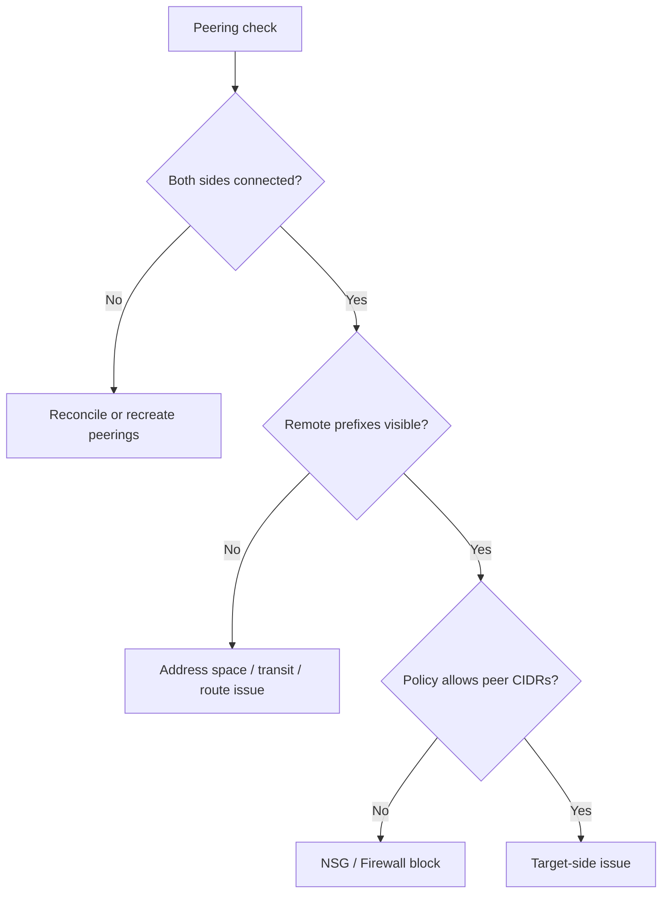

---
hide:
  - toc
---

# Peering and Routing Issues

## 1. Summary
Peering failures usually come from bilateral configuration mismatch, overlapping address space, missing transit assumptions, or route overrides after peering is healthy.

## 2. Common Misreadings
- "Peering is one object, so checking one side is enough."
- "Peering is transitive across chained VNets."
- "If peering is connected, routes must be correct."

## 3. Competing Hypotheses
- H1: One side of the peering is disconnected or misconfigured.
- H2: Address space overlap or changes invalidated the path.
- H3: Gateway transit or forwarded-traffic expectations are wrong.
- H4: A UDR, NSG, or firewall policy overrides otherwise healthy peering.

## 4. What to Check First

| Verification | Tool | Expected good signal |
| --- | --- | --- |
| Peering settings | Portal or CLI | Matching flags on both sides |
| Effective routes | NIC route table | Remote CIDRs present |
| Reachability | Connection troubleshoot | End-to-end test succeeds |
| Address spaces | VNet configuration | No overlap introduced |

## 5. Evidence to Collect
- Both peering objects and their state.
- Address spaces on both VNets.
- Effective routes from the failing source NIC.
- Any UDRs applied to source or destination subnets.
- Effective NSG / Firewall evidence for remote CIDRs.

## 6. Validation

| Hypothesis | Signals that support | Signals that weaken |
| --- | --- | --- |
| H1 Peering mismatch | one side disconnected or flags differ | both sides connected and aligned |
| H2 Overlap | overlapping prefixes or recent address change | address space clean and unchanged |
| H3 Transit mismatch | gateway/forwarded traffic expectation not configured | required transit flags present |
| H4 Override after peering | remote route missing or policy blocks peer CIDR | route and allow path both intact |

## 7. Root Cause Patterns
- One peering object was deleted or drifted during change.
- Engineers expected transitive routing across chained peering.
- Gateway transit or remote gateway settings were asymmetric.
- UDR or NSG changes later overrode healthy peering connectivity.

## 8. Immediate Mitigations
- Compare both peering sides and re-create if states diverge.
- Remove address-space overlap from the design.
- Correct transit settings or redesign around non-transitive peering limits.
- Remove conflicting UDR or policy entries for remote CIDRs.

## 9. Prevention
- Treat peering as bilateral configuration in all change reviews.
- Document transit assumptions explicitly.
- Revalidate effective routes after peering or address-space changes.

## See Also

- [NSG vs UDR vs Firewall](nsg-vs-udr-vs-firewall.md)
- [Peering Basics](../../../operations/peering-basics.md)
- [Routing Cheatsheet](../../../reference/routing-cheatsheet.md)
- [Routing Basics](../../../platform/routing-basics.md)

## Sources

- [Troubleshoot virtual network peering issues](https://learn.microsoft.com/en-us/troubleshoot/azure/virtual-network/virtual-network-troubleshoot-peering-issues)
- [Configure gateway transit for virtual network peering](https://learn.microsoft.com/en-us/azure/vpn-gateway/vpn-gateway-peering-gateway-transit)
