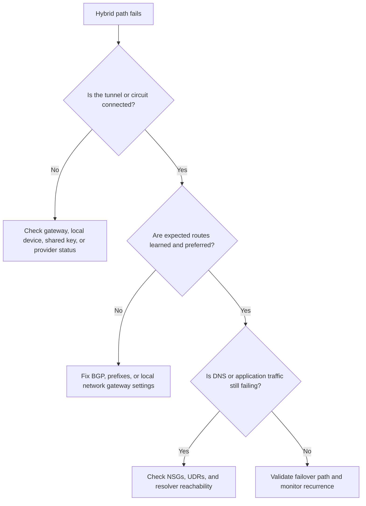

# VPN Gateway Troubleshooting

## 1. Summary

Use this playbook when Site-to-Site (S2S), Point-to-Site (P2S), or ExpressRoute backup/failover paths are unstable, disconnected, or routing traffic inconsistently.

Hybrid incidents often involve more than tunnel status. The real issue may be BGP advertisement mismatch, local network gateway drift, DNS dependency across the tunnel, or failover behavior that was never tested under load.

### Symptoms

- Connections time out or are refused.
- Traffic works from one source but fails from another seemingly similar source.
- A private endpoint or hybrid path behaves differently after a recent change.
- Operators have a healthy-looking control plane but an unhealthy application path.



## 2. Common Misreadings

| Observation | Often Misread As | Actually Means |
|---|---|---|
| Gateway shows Connected | All hybrid traffic should work | A connected tunnel can still carry the wrong routes or no useful DNS traffic. |
| A backup VPN tunnel is up | ExpressRoute failover is ready | Failover may still send traffic down the wrong path or use stale DNS assumptions. |
| P2S clients can connect | They can reach every internal resource | P2S address pools, DNS settings, and route pushes may still be wrong. |
| One prefix is reachable | BGP and local prefixes are correct | Another learned route may override the intended path for other subnets. |

## 3. Competing Hypotheses

| Hypothesis | Likelihood | Key Discriminator |
|---|---|---|
| The VPN tunnel or gateway connection is unhealthy | High | Gateway connection status is Disconnected, NotConnected, or flapping. |
| Local network gateway or BGP prefixes are wrong | High | Learned routes do not include the remote prefixes or prefer the wrong path. |
| Failover design between ExpressRoute and VPN backup is untested or mispreferred | Medium | Traffic still prefers the degraded path or fails to return after failover. |
| P2S clients receive wrong DNS or routes | Medium | Clients connect to the gateway but cannot resolve or reach internal prefixes. |
| Traffic is blocked after leaving the gateway | Medium | The tunnel is healthy but NSGs, UDRs, or firewall rules deny the path deeper inside Azure. |

## 4. What to Check First

1. **Show gateway connections and state**

```bash
az network vpn-connection list \
    --resource-group $RG \
    --output table
```

2. **Show BGP peer status**

```bash
az network vnet-gateway list-bgp-peer-status \
    --resource-group $RG \
    --name $VPN_GATEWAY_NAME
```

3. **Show learned routes**

```bash
az network vnet-gateway list-learned-routes \
    --resource-group $RG \
    --name $VPN_GATEWAY_NAME
```

4. **Show local network gateway prefixes**

```bash
az network local-gateway show \
    --resource-group $RG \
    --name $LOCAL_GATEWAY_NAME \
    --query "localNetworkAddressSpace.addressPrefixes"
```

5. **Show P2S configuration**

```bash
az network vnet-gateway show \
    --resource-group $RG \
    --name $VPN_GATEWAY_NAME \
    --query "vpnClientConfiguration"
```

## 5. Evidence to Collect

### 5.1 KQL Queries

#### Gateway-related activity changes

```kusto
AzureActivity
| where TimeGenerated > ago(7d)
| where OperationNameValue has_any (
    "Microsoft.Network/virtualNetworkGateways/write",
    "Microsoft.Network/connections/write",
    "Microsoft.Network/localNetworkGateways/write"
)
| project TimeGenerated, OperationNameValue, ActivityStatusValue, Caller, ResourceGroup, ResourceId
| order by TimeGenerated desc
```

| Column | Interpretation |
|---|---|
| `OperationNameValue` | Configuration writes often explain why a healthy tunnel stopped carrying the right routes. |
| `Caller` | Useful when automation or provider handoffs changed settings. |

!!! tip "How to Read This"
    Start with the rows nearest the incident start time. Use them to separate configuration changes from recurring background noise.

#### Gateway diagnostics and tunnel state

```kusto
AzureDiagnostics
| where TimeGenerated > ago(6h)
| where Category has_any ("GatewayDiagnosticLog", "TunnelDiagnosticLog", "RouteDiagnosticLog")
| project TimeGenerated, Category, Resource, msg_s, status_s
| order by TimeGenerated desc
```

| Column | Interpretation |
|---|---|
| `status_s` | Look for transition patterns that align with outage start or failover. |
| `msg_s` | Messages often reveal negotiation, route, or keepalive problems. |

!!! tip "How to Read This"
    Start with the rows nearest the incident start time. Use them to separate configuration changes from recurring background noise.

#### Hybrid application symptom correlation

```kusto
AzureDiagnostics
| where TimeGenerated > ago(6h)
| where msg_s has_any ("connection timed out", "host unreachable", "temporary failure in name resolution")
| summarize Failures=count() by Resource, msg_s, bin(TimeGenerated, 15m)
| order by TimeGenerated desc
```

| Column | Interpretation |
|---|---|
| `Failures` | Correlate gateway-level instability with application-visible impact. |
| `Resource` | Shows which workloads are most sensitive to the hybrid outage. |

!!! tip "How to Read This"
    Start with the rows nearest the incident start time. Use them to separate configuration changes from recurring background noise.

### 5.2 CLI Investigation

#### List gateway connections

```bash
az network vpn-connection list \
    --resource-group $RG \
    --output json
```

Sample output:

```json
[{"connectionStatus":"Connected","egressBytesTransferred":1234567}]
```

Interpretation:

- Flapping state or zero transfer counters during expected traffic is suspicious.
- Compare timestamps with provider-side monitoring.

#### List learned routes

```bash
az network vnet-gateway list-learned-routes \
    --resource-group $RG \
    --name $VPN_GATEWAY_NAME
```

Sample output:

```json
[{"network":"192.0.2.0/24","nextHop":"10.60.0.254"}]
```

Interpretation:

- Missing prefixes point to BGP or local gateway drift.
- Unexpected more-specific routes can override your intended failover path.

#### Show BGP peer status

```bash
az network vnet-gateway list-bgp-peer-status \
    --resource-group $RG \
    --name $VPN_GATEWAY_NAME
```

Sample output:

```json
[{"neighbor":"203.0.113.10","state":"Connected"}]
```

Interpretation:

- Healthy BGP is necessary but not sufficient; still verify learned and advertised routes.
- Disconnected or Idle states justify immediate investigation of peer configuration or provider path.

## 6. Validation and Disproof by Hypothesis

### Hypothesis: Tunnel or connection instability

**Proves if**: Connection state is Disconnected or flaps repeatedly in diagnostics.

**Disproves if**: The connection remains stable and traffic counters advance during the test window.

```bash
az network vpn-connection show \
    --resource-group $RG \
    --name $VPN_CONNECTION_NAME
```

### Hypothesis: Prefix or BGP mismatch

**Proves if**: Learned routes or local gateway prefixes do not include the expected remote network.

**Disproves if**: The required prefix is present and preferred as designed.

```bash
az network vnet-gateway list-learned-routes \
    --resource-group $RG \
    --name $VPN_GATEWAY_NAME
```

### Hypothesis: Failover preference problem

**Proves if**: Backup routes exist but remain less preferred or do not activate during a primary-path failure.

**Disproves if**: Traffic shifts to the intended backup path during a controlled failover test.

```bash
az network vnet-gateway list-advertised-routes \
    --resource-group $RG \
    --name $VPN_GATEWAY_NAME \
    --peer 203.0.113.10
```

### Hypothesis: P2S client route or DNS issue

**Proves if**: P2S clients connect but cannot resolve or reach remote private networks.

**Disproves if**: P2S clients receive the documented DNS servers and route set and can reach the required prefixes.

```bash
az network vnet-gateway show \
    --resource-group $RG \
    --name $VPN_GATEWAY_NAME \
    --query "vpnClientConfiguration"
```

## 7. Likely Root Cause Patterns

| Pattern | Evidence | Resolution |
|---|---|---|
| Wrong local network gateway prefixes | Tunnel is connected but the destination prefix is absent | Correct the local network gateway address space or BGP advertisements. |
| Shared key or provider issue | Connection status drops or renegotiates frequently | Coordinate with the on-premises or provider team and stabilize the tunnel first. |
| Unverified ExpressRoute to VPN failover | Backup exists but traffic does not shift as expected | Test failover and route preference in a controlled maintenance window. |
| P2S DNS gap | P2S users connect but internal names fail | Publish the correct DNS servers and validate split-horizon resolution. |
| Healthy gateway, blocked inside Azure | Hybrid routes exist but Azure-side NSGs or UDRs still deny the traffic | Move the investigation from gateway state to subnet policy and effective routes. |

## 8. Immediate Mitigations

1. If a recent change caused the issue, restore the last known-good local network gateway or connection settings.
2. Prefer the stable path temporarily by adjusting route preference only after verifying the security implications.
3. Capture learned routes, advertised routes, and connection state before making simultaneous changes on both sides.
4. Validate DNS across the hybrid path after the tunnel returns to Connected status.

## 9. Prevention

### Prevention checklist

- [ ] Test S2S, P2S, and backup failover paths on a regular schedule.
- [ ] Keep local network gateway prefixes and BGP advertisements under strict change control.
- [ ] Record provider contact paths and escalation data in the same runbook as Azure commands.
- [ ] Monitor gateway diagnostics and alert on flapping connections or route changes.
- [ ] Document which applications depend on which hybrid path so triage can prioritize correctly.

## See Also

- [Routing](../first-10-minutes/routing.md)
- [Hybrid Connectivity Issues](routing/hybrid-connectivity-issues.md)
- [Architecture Overview](../architecture-overview.md)
- [Vpn And Expressroute Basics](../../operations/vpn-and-expressroute-basics.md)

## Sources

- [vpn-gateway-about-vpn-gateway-settings](https://learn.microsoft.com/en-us/azure/vpn-gateway/vpn-gateway-about-vpn-gateway-settings)
- [bgp-howto](https://learn.microsoft.com/en-us/azure/vpn-gateway/bgp-howto)
- [expressroute-introduction](https://learn.microsoft.com/en-us/azure/expressroute/expressroute-introduction)
