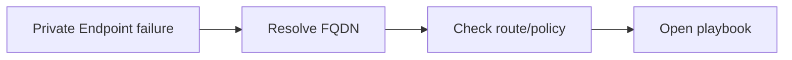

---
hide:
  - toc
content_sources:
  diagrams:
    - id: card-1-private-endpoint-unreachable
      type: flowchart
      source: self-generated
      justification: "Synthesized troubleshooting flow for this guide from Microsoft Learn diagnostic and service documentation."
      based_on:
        - https://learn.microsoft.com/en-us/azure/network-watcher/network-watcher-connectivity-overview
        - https://learn.microsoft.com/en-us/azure/private-link/troubleshoot-private-endpoint-connectivity
---

# Quick Diagnosis Cards

Use these cards when you need a fast symptom-to-playbook route in under 60 seconds.

## Card 1: Private Endpoint unreachable

<!-- diagram-id: card-1-private-endpoint-unreachable -->


| Step | Action |
| --- | --- |
| Symptom | Private resource should be reachable, but connection fails |
| First check | `nslookup <service-fqdn>` from the failing source |
| What to look for | Public IP, NXDOMAIN, or wrong private IP |
| Playbook | [Cannot Reach Private Endpoint](playbooks/connectivity/cannot-reach-private-endpoint.md) |

## Card 2: Generic DNS failure

| Step | Action |
| --- | --- |
| Symptom | FQDN does not resolve or resolves inconsistently |
| First check | Verify active resolver settings, then run `nslookup` / `dig` |
| What to look for | Wrong DNS server, zone-link gap, broken forwarder |
| Playbook | [DNS Resolution Failures](playbooks/dns/dns-resolution-failures.md) |

## Card 3: Inbound access failure

| Step | Action |
| --- | --- |
| Symptom | Clients cannot reach a published endpoint |
| First check | Frontend IP, probe health, listener port |
| What to look for | Unhealthy backend, missing public IP, NSG or firewall deny |
| Playbook | [Inbound Connectivity Issues](playbooks/connectivity/inbound-connectivity-issues.md) |

## Card 4: Outbound access failure

| Step | Action |
| --- | --- |
| Symptom | Workload cannot reach internet or dependency |
| First check | IP-only test, name-based test, next hop |
| What to look for | DNS-only issue, wrong 0.0.0.0/0 route, blocked egress |
| Playbook | [Outbound Connectivity Issues](playbooks/connectivity/outbound-connectivity-issues.md) |

## Card 5: Peering or route confusion

| Step | Action |
| --- | --- |
| Symptom | VNets should talk but traffic does not arrive |
| First check | Peering state on both sides plus effective routes |
| What to look for | Disconnected peering, overlap, transit mismatch |
| Playbook | [Peering and Routing Issues](playbooks/routing/peering-and-routing-issues.md) |

## Card 6: Hybrid tunnel or BGP issue

| Step | Action |
| --- | --- |
| Symptom | VPN or ExpressRoute path is down or missing routes |
| First check | Tunnel state, BGP state, learned routes |
| What to look for | Phase mismatch, ASN issue, missing advertised prefixes |
| Playbook | [Hybrid Connectivity Issues](playbooks/routing/hybrid-connectivity-issues.md) |

## Card 7: Intermittent or flapping failure

| Step | Action |
| --- | --- |
| Symptom | Failure appears and disappears without obvious config change |
| First check | Timeline correlation against DNS TTL, load, route, or link changes |
| What to look for | recurring time window, cache expiry, burst-driven failures |
| Playbook | [Intermittent Network Failures](playbooks/connectivity/intermittent-network-failures.md) |

## Card 8: Latency and packet loss

| Step | Action |
| --- | --- |
| Symptom | Reachable path but poor RTT, jitter, or loss |
| First check | Baseline RTT, hop latency, app-vs-network timing |
| What to look for | sustained RTT increase, hop-specific delay, backend saturation masquerading as network |
| Playbook | [Latency and Packet Loss](playbooks/connectivity/latency-and-packet-loss.md) |

## Universal first bundle

```bash
nslookup <fqdn>
az network watcher test-connectivity --source-resource <source-id> --dest-address <fqdn-or-ip> --dest-port 443
az network nic show-effective-route-table --resource-group <resource-group> --name <nic-name>
```

## See Also

- [Decision Tree](decision-tree.md)
- [Evidence Map](evidence-map.md)
- [First 10 Minutes](first-10-minutes/index.md)
- [Playbooks Index](playbooks/index.md)

## Sources

- [Azure Network Watcher connectivity checks](https://learn.microsoft.com/en-us/azure/network-watcher/network-watcher-connectivity-overview)
- [Troubleshoot Azure Private Endpoint connectivity](https://learn.microsoft.com/en-us/azure/private-link/troubleshoot-private-endpoint-connectivity)
