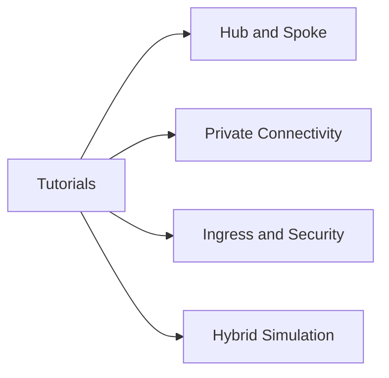

---
hide:
  - toc
---

# Tutorials

Hands-on networking labs for validating Azure design patterns, common failure modes, and operational checks with repeatable Azure CLI steps.

## What You Will Find Here

| Lab | Focus |
|---|---|
| [Lab 01: Hub-Spoke Topology](lab-guides/lab-01-hub-spoke-topology.md) | Peering, route validation, shared services layout |
| [Lab 02: Private Endpoints](lab-guides/lab-02-private-endpoints.md) | Private Link, Private DNS, end-to-end validation |
| [Lab 03: Application Gateway WAF](lab-guides/lab-03-application-gateway-waf.md) | Ingress, probes, backend health, WAF-ready design |
| [Lab 04: Azure Firewall](lab-guides/lab-04-azure-firewall.md) | Forced tunneling, firewall rules, diagnostics |
| [Lab 05: ExpressRoute Simulation](lab-guides/lab-05-expressroute-simulation.md) | Hybrid route thinking and failover validation |

## See Also

- [Best Practices](../best-practices/index.md)
- [Operations](../operations/index.md)
- [Troubleshooting](../troubleshooting/index.md)

## Sources

- [Azure networking documentation](https://learn.microsoft.com/en-us/azure/networking/)
