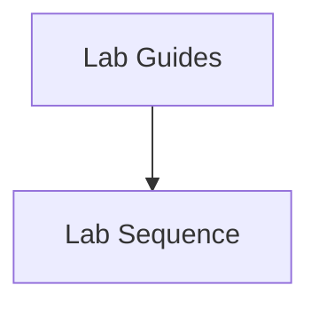

---
content_sources:
  sources:
  - type: mslearn-adapted
    url: https://learn.microsoft.com/en-us/azure/networking/
  diagrams:
  - id: index-page-flow
    type: flowchart
    source: self-generated
    justification: Synthesized from the page structure and Microsoft Learn sources
      listed in this document.
    based_on:
    - https://learn.microsoft.com/en-us/azure/networking/
content_validation:
  status: verified
  last_reviewed: '2026-05-23'
  reviewer: agent
  core_claims:
  - claim: This page uses Microsoft Learn as the primary source basis for its Azure-specific
      guidance.
    source: https://learn.microsoft.com/en-us/azure/networking/
    verified: true
---
# Lab Guides

These labs turn architecture guidance into repeatable exercises. Run them in order if you want a progressive path from hub-spoke fundamentals to hybrid simulation.

## Lab Sequence

1. [Lab 01: Hub-Spoke Topology](lab-01-hub-spoke-topology.md)
2. [Lab 02: Private Endpoints](lab-02-private-endpoints.md)
3. [Lab 03: Application Gateway WAF](lab-03-application-gateway-waf.md)
4. [Lab 04: Azure Firewall](lab-04-azure-firewall.md)
5. [Lab 05: ExpressRoute Simulation](lab-05-expressroute-simulation.md)

## Page Flow

<!-- diagram-id: index-page-flow -->

## Review Matrix

| Review area | Page-specific check |
|---|---|
| Scope | Confirm the guidance applies to Lab Guides. |
| Source basis | Validate the recommendation against the Microsoft Learn sources in this page. |
| Evidence | Capture command output, portal state, metrics, logs, or screenshots before treating the result as proven. |

## See Also

- [Tutorials Home](../index.md)
- [Troubleshooting Playbooks](../../troubleshooting/playbooks/index.md)

## Sources

- [Azure networking documentation](https://learn.microsoft.com/en-us/azure/networking/)
