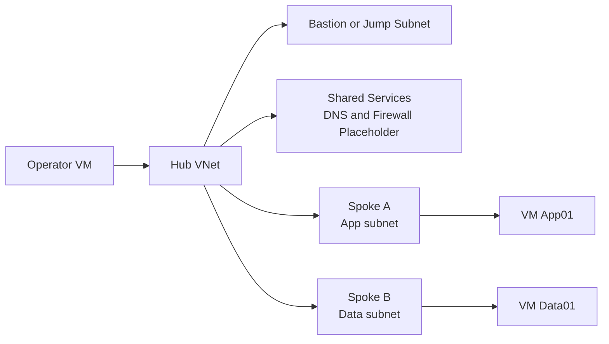

# Lab 01: Hub-Spoke Topology

Build a small hub-spoke landing zone with shared services, peering, route validation, and basic connectivity testing so teams can understand how central transit works before adding private endpoints or hybrid links.

## Lab Metadata

| Field | Value |
|---|---|
| Difficulty | Intermediate |
| Estimated Duration | 60-90 minutes |
| Focus | Hub-spoke design, peering, route validation, shared services placement |
| Tooling | Azure CLI, Network Watcher, Log Analytics optional |

## Prerequisites

- An Azure subscription with permission to create VNets, subnets, network watcher resources, and virtual machines.
- Azure CLI 2.60 or later or Azure Cloud Shell.
- Quota for at least three small test VMs or alternative test endpoints.
- A region variable such as `$LOCATION=koreacentral` and a clean resource group name such as `$RG=rg-net-lab01`.

## Architecture Diagram



## Step-by-Step Instructions

### Step 1: Create the resource group and core VNets

```bash
az group create \
    --name $RG \
    --location $LOCATION

az network vnet create \
    --resource-group $RG \
    --name vnet-hub-lab01 \
    --location $LOCATION \
    --address-prefixes 10.110.0.0/16 \
    --subnet-name GatewaySubnet \
    --subnet-prefixes 10.110.0.0/24

az network vnet create \
    --resource-group $RG \
    --name vnet-spoke-app-lab01 \
    --location $LOCATION \
    --address-prefixes 10.111.0.0/16 \
    --subnet-name app \
    --subnet-prefixes 10.111.1.0/24

az network vnet create \
    --resource-group $RG \
    --name vnet-spoke-data-lab01 \
    --location $LOCATION \
    --address-prefixes 10.112.0.0/16 \
    --subnet-name data \
    --subnet-prefixes 10.112.1.0/24
```

Use non-overlapping prefixes and reserve space in the hub for future DNS, firewall, and gateway services.

#### Why this step matters

- It establishes an observable checkpoint for the lab before you continue.
- It mirrors a real production activity that often appears in troubleshooting tickets.
- Save command output and timestamps so you can compare expected versus actual behavior later.

### Step 2: Add optional shared-services subnets in the hub

```bash
az network vnet subnet create \
    --resource-group $RG \
    --vnet-name vnet-hub-lab01 \
    --name shared-services \
    --address-prefixes 10.110.10.0/24

az network vnet subnet create \
    --resource-group $RG \
    --vnet-name vnet-hub-lab01 \
    --name ingress \
    --address-prefixes 10.110.20.0/24
```

These subnets are placeholders for later labs and make the topology closer to a real landing zone.

#### Why this step matters

- It establishes an observable checkpoint for the lab before you continue.
- It mirrors a real production activity that often appears in troubleshooting tickets.
- Save command output and timestamps so you can compare expected versus actual behavior later.

### Step 3: Create bidirectional peerings

```bash
HUB_ID=$(az network vnet show --resource-group $RG --name vnet-hub-lab01 --query id --output tsv)
APP_ID=$(az network vnet show --resource-group $RG --name vnet-spoke-app-lab01 --query id --output tsv)
DATA_ID=$(az network vnet show --resource-group $RG --name vnet-spoke-data-lab01 --query id --output tsv)

az network vnet peering create \
    --resource-group $RG \
    --name hub-to-app \
    --vnet-name vnet-hub-lab01 \
    --remote-vnet $APP_ID \
    --allow-vnet-access true \
    --allow-forwarded-traffic true

az network vnet peering create \
    --resource-group $RG \
    --name app-to-hub \
    --vnet-name vnet-spoke-app-lab01 \
    --remote-vnet $HUB_ID \
    --allow-vnet-access true \
    --use-remote-gateways false

az network vnet peering create \
    --resource-group $RG \
    --name hub-to-data \
    --vnet-name vnet-hub-lab01 \
    --remote-vnet $DATA_ID \
    --allow-vnet-access true \
    --allow-forwarded-traffic true

az network vnet peering create \
    --resource-group $RG \
    --name data-to-hub \
    --vnet-name vnet-spoke-data-lab01 \
    --remote-vnet $HUB_ID \
    --allow-vnet-access true
```

Keep notes about which side would use remote gateways in a real design. This lab uses simple peering first.

#### Why this step matters

- It establishes an observable checkpoint for the lab before you continue.
- It mirrors a real production activity that often appears in troubleshooting tickets.
- Save command output and timestamps so you can compare expected versus actual behavior later.

### Step 4: Deploy small test VMs or use existing test endpoints

```bash
az vm create \
    --resource-group $RG \
    --name vm-app01 \
    --image Ubuntu2204 \
    --size Standard_B1s \
    --vnet-name vnet-spoke-app-lab01 \
    --subnet app \
    --admin-username azureuser \
    --generate-ssh-keys \
    --public-ip-address ""

az vm create \
    --resource-group $RG \
    --name vm-data01 \
    --image Ubuntu2204 \
    --size Standard_B1s \
    --vnet-name vnet-spoke-data-lab01 \
    --subnet data \
    --admin-username azureuser \
    --generate-ssh-keys \
    --public-ip-address ""
```

Private-only VMs make validation closer to a production pattern.

#### Why this step matters

- It establishes an observable checkpoint for the lab before you continue.
- It mirrors a real production activity that often appears in troubleshooting tickets.
- Save command output and timestamps so you can compare expected versus actual behavior later.

### Step 5: Inspect effective routes and verify cross-spoke reachability

```bash
APP_NIC=$(az vm show --resource-group $RG --name vm-app01 --query "networkProfile.networkInterfaces[0].id" --output tsv | awk -F/ '{print $NF}')
az network nic show-effective-route-table \
    --resource-group $RG \
    --name $APP_NIC

az network watcher test-connectivity \
    --resource-group $RG \
    --source-resource $(az vm show --resource-group $RG --name vm-app01 --query id --output tsv) \
    --dest-address 10.112.1.4 \
    --dest-port 22
```

The goal is to prove that peering plus correct routes equals a reachable path. If not, this becomes a troubleshooting baseline for later labs.

#### Why this step matters

- It establishes an observable checkpoint for the lab before you continue.
- It mirrors a real production activity that often appears in troubleshooting tickets.
- Save command output and timestamps so you can compare expected versus actual behavior later.

### Step 6: Introduce a route-table experiment

```bash
az network route-table create \
    --resource-group $RG \
    --name rt-app-lab01 \
    --location $LOCATION

az network route-table route create \
    --resource-group $RG \
    --route-table-name rt-app-lab01 \
    --name route-to-data \
    --address-prefix 10.112.0.0/16 \
    --next-hop-type VnetLocal

az network vnet subnet update \
    --resource-group $RG \
    --vnet-name vnet-spoke-app-lab01 \
    --name app \
    --route-table rt-app-lab01
```

Although the route is not strictly needed here, the exercise teaches how to validate effective routes and prepares you for a forced-tunneling variant.

#### Why this step matters

- It establishes an observable checkpoint for the lab before you continue.
- It mirrors a real production activity that often appears in troubleshooting tickets.
- Save command output and timestamps so you can compare expected versus actual behavior later.

## Validation Steps

- [ ] All four peering objects show `Connected` state.
- [ ] Effective routes on the app NIC include the data spoke prefix.
- [ ] Connection tests from app to data succeed on the tested port.
- [ ] Diagrams and resource names are updated in your notes before teardown.

## Cleanup Instructions

```bash
az group delete --name $RG --yes --no-wait
```

Before cleanup, record any private IPs, route table names, or diagnostic screenshots you want to reuse in troubleshooting notes.

## See Also

- [Network Design Baseline](../../best-practices/network-design-baseline.md)
- [Subnet Design Best Practices](../../best-practices/subnet-design-best-practices.md)
- [Peering Basics](../../operations/peering-basics.md)
- [Connectivity Failures](../../troubleshooting/playbooks/connectivity-failures.md)

## Sources

- [virtual-network-peering-overview](https://learn.microsoft.com/en-us/azure/virtual-network/virtual-network-peering-overview)
- [network-topology-and-connectivity](https://learn.microsoft.com/en-us/azure/cloud-adoption-framework/ready/landing-zone/design-area/network-topology-and-connectivity)
