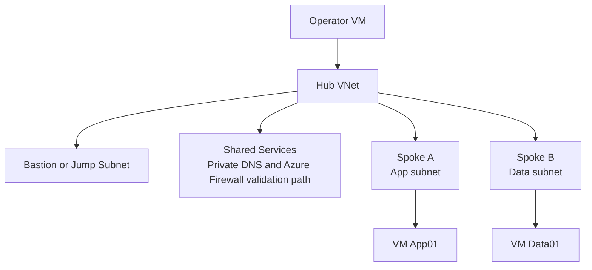

---
content_sources:
  diagrams:
  - id: lab-01-hub-spoke-topology
    type: flowchart
    source: mslearn-adapted
    mslearn_url: https://learn.microsoft.com/en-us/azure/virtual-network/virtual-network-peering-overview
    based_on:
    - https://learn.microsoft.com/en-us/azure/cloud-adoption-framework/ready/landing-zone/design-area/network-topology-and-connectivity
validation:
  az_cli:
    last_tested: null
    cli_version: null
    result: not_tested
  bicep:
    last_tested: null
    result: not_tested
---

# Lab 01: Hub-Spoke Topology

Build a small hub-spoke landing zone with shared services, peering, route validation, and basic connectivity testing so teams can understand how central transit works before adding private endpoints or hybrid links.

## Lab Metadata

| Field | Value |
|---|---|
| Difficulty | Intermediate |
| Estimated Duration | 60-90 minutes |
| Focus | Hub-spoke design, peering, route validation, shared services placement |
| Tooling | Azure CLI, Network Watcher, Log Analytics optional |

## Prerequisites

- An Azure subscription with permission to create VNets, subnets, network watcher resources, and virtual machines.
- Azure CLI 2.60 or later or Azure Cloud Shell.
- Quota for at least three small test VMs or alternative test endpoints.
- A region variable such as `$LOCATION=koreacentral` and a clean resource group name such as `$RG=rg-net-lab01`.

## Architecture Diagram

<!-- diagram-id: lab-01-hub-spoke-topology -->

```mermaid
flowchart TD
                Admin[Operator VM] --> Hub[Hub VNet]
                Hub --> Bastion[Bastion or Jump Subnet]
                Hub --> Shared[Shared Services
Private DNS and Azure Firewall validation path]
                Hub --> SpokeA[Spoke A
App subnet]
                Hub --> SpokeB[Spoke B
Data subnet]
                SpokeA --> WorkloadA[VM App01]
                SpokeB --> WorkloadB[VM Data01]
```

## Step-by-Step Instructions

### Step 1: Create the resource group and core VNets

```bash
az group create \
    --name $RG \
    --location $LOCATION

az network vnet create \
    --resource-group $RG \
    --name vnet-hub-lab01 \
    --location $LOCATION \
    --address-prefixes 10.110.0.0/16 \
    --subnet-name GatewaySubnet \
    --subnet-prefixes 10.110.0.0/24

az network vnet create \
    --resource-group $RG \
    --name vnet-spoke-app-lab01 \
    --location $LOCATION \
    --address-prefixes 10.111.0.0/16 \
    --subnet-name app \
    --subnet-prefixes 10.111.1.0/24

az network vnet create \
    --resource-group $RG \
    --name vnet-spoke-data-lab01 \
    --location $LOCATION \
    --address-prefixes 10.112.0.0/16 \
    --subnet-name data \
    --subnet-prefixes 10.112.1.0/24
```

| Element | Purpose |
|---|---|
| `$RG` | Resource group containing the networking resources. |
| `$LOCATION` | Azure region for regional networking resources. |
| `--name` | Identifies the target Azure networking resource. |
| `--location` | Selects the Azure region for creation or lookup. |
| `--resource-group` | Scopes the command to the intended resource group. |
| `--address-prefixes` | Defines VNet address ranges. |
| `--subnet-name` | Names the subnet created with a VNet. |
| `--subnet-prefixes` | Defines subnet address ranges. |
| Expected result | Command succeeds and returns resource state, path evidence, or operation status for the change record. |

Use non-overlapping prefixes and reserve space in the hub for future DNS, firewall, and gateway services.

#### Why this step matters

- Validate hub-spoke routing, peering state, DNS forwarding intent, and firewall path evidence before continuing.
- It mirrors a real production activity that often appears in troubleshooting tickets.
- Save command output and timestamps so you can compare expected versus actual behavior later.

### Step 2: Add optional shared-services subnets in the hub

```bash
az network vnet subnet create \
    --resource-group $RG \
    --vnet-name vnet-hub-lab01 \
    --name shared-services \
    --address-prefixes 10.110.10.0/24

az network vnet subnet create \
    --resource-group $RG \
    --vnet-name vnet-hub-lab01 \
    --name ingress \
    --address-prefixes 10.110.20.0/24
```

| Element | Purpose |
|---|---|
| `$RG` | Resource group containing the networking resources. |
| `--resource-group` | Scopes the command to the intended resource group. |
| `--vnet-name` | Selects the virtual network containing the subnet or peering. |
| `--name` | Identifies the target Azure networking resource. |
| `--address-prefixes` | Defines VNet address ranges. |
| Expected result | Command succeeds and returns resource state, path evidence, or operation status for the change record. |

These subnets are placeholders for later labs and make the topology closer to a real landing zone.

#### Why this step matters

- Validate hub-spoke routing, peering state, DNS forwarding intent, and firewall path evidence before continuing.
- It mirrors a real production activity that often appears in troubleshooting tickets.
- Save command output and timestamps so you can compare expected versus actual behavior later.

### Step 3: Create bidirectional peerings

```bash
HUB_ID=$(az network vnet show --resource-group $RG --name vnet-hub-lab01 --query id --output tsv)
APP_ID=$(az network vnet show --resource-group $RG --name vnet-spoke-app-lab01 --query id --output tsv)
DATA_ID=$(az network vnet show --resource-group $RG --name vnet-spoke-data-lab01 --query id --output tsv)

az network vnet peering create \
    --resource-group $RG \
    --name hub-to-app \
    --vnet-name vnet-hub-lab01 \
    --remote-vnet $APP_ID \
    --allow-vnet-access true \
    --allow-forwarded-traffic true

az network vnet peering create \
    --resource-group $RG \
    --name app-to-hub \
    --vnet-name vnet-spoke-app-lab01 \
    --remote-vnet $HUB_ID \
    --allow-vnet-access true \
    --use-remote-gateways false

az network vnet peering create \
    --resource-group $RG \
    --name hub-to-data \
    --vnet-name vnet-hub-lab01 \
    --remote-vnet $DATA_ID \
    --allow-vnet-access true \
    --allow-forwarded-traffic true

az network vnet peering create \
    --resource-group $RG \
    --name data-to-hub \
    --vnet-name vnet-spoke-data-lab01 \
    --remote-vnet $HUB_ID \
    --allow-vnet-access true
```

| Element | Purpose |
|---|---|
| `$RG` | Resource group containing the networking resources. |
| `$APP_ID` | Operator-supplied environment variable for this command. |
| `$HUB_ID` | Operator-supplied environment variable for this command. |
| `$DATA_ID` | Operator-supplied environment variable for this command. |
| `--resource-group` | Scopes the command to the intended resource group. |
| `--name` | Identifies the target Azure networking resource. |
| `--query` | Filters output to the evidence operators need. |
| `--output` | Controls output format for review or automation. |
| `--vnet-name` | Selects the virtual network containing the subnet or peering. |
| `--remote-vnet` | Identifies the remote VNet in a peering. |
| `--allow-vnet-access` | Allows traffic over VNet peering. |
| `--allow-forwarded-traffic` | Allows forwarded traffic over peering when required. |
| `--use-remote-gateways` | Azure CLI option used to scope or shape the network operation. |
| Expected result | Command succeeds and returns resource state, path evidence, or operation status for the change record. |

Keep notes about which side would use remote gateways in a real design. This lab uses simple peering first.

#### Why this step matters

- Validate hub-spoke routing, peering state, DNS forwarding intent, and firewall path evidence before continuing.
- It mirrors a real production activity that often appears in troubleshooting tickets.
- Save command output and timestamps so you can compare expected versus actual behavior later.

### Step 4: Deploy small test VMs or use existing test endpoints

```bash
az vm create \
    --resource-group $RG \
    --name vm-app01 \
    --image Ubuntu2204 \
    --size Standard_B1s \
    --vnet-name vnet-spoke-app-lab01 \
    --subnet app \
    --admin-username azureuser \
    --generate-ssh-keys \
    --public-ip-address ""

az vm create \
    --resource-group $RG \
    --name vm-data01 \
    --image Ubuntu2204 \
    --size Standard_B1s \
    --vnet-name vnet-spoke-data-lab01 \
    --subnet data \
    --admin-username azureuser \
    --generate-ssh-keys \
    --public-ip-address ""
```

| Element | Purpose |
|---|---|
| `$RG` | Resource group containing the networking resources. |
| `--resource-group` | Scopes the command to the intended resource group. |
| `--name` | Identifies the target Azure networking resource. |
| `--image` | Azure CLI option used to scope or shape the network operation. |
| `--size` | Azure CLI option used to scope or shape the network operation. |
| `--vnet-name` | Selects the virtual network containing the subnet or peering. |
| `--subnet` | Azure CLI option used to scope or shape the network operation. |
| `--admin-username` | Azure CLI option used to scope or shape the network operation. |
| `--generate-ssh-keys` | Azure CLI option used to scope or shape the network operation. |
| `--public-ip-address` | Azure CLI option used to scope or shape the network operation. |
| Expected result | Command succeeds and returns resource state, path evidence, or operation status for the change record. |

Private-only VMs make validation closer to a production pattern.

#### Why this step matters

- Validate hub-spoke routing, peering state, DNS forwarding intent, and firewall path evidence before continuing.
- It mirrors a real production activity that often appears in troubleshooting tickets.
- Save command output and timestamps so you can compare expected versus actual behavior later.

### Step 5: Inspect effective routes and verify cross-spoke reachability

```bash
APP_NIC=$(az vm show --resource-group $RG --name vm-app01 --query "networkProfile.networkInterfaces[0].id" --output tsv | awk -F/ '{print $NF}')
az network nic show-effective-route-table \
    --resource-group $RG \
    --name $APP_NIC

az network watcher test-connectivity \
    --resource-group $RG \
    --source-resource $(az vm show --resource-group $RG --name vm-app01 --query id --output tsv) \
    --dest-address 10.112.1.4 \
    --dest-port 22
```

| Element | Purpose |
|---|---|
| `$RG` | Resource group containing the networking resources. |
| `$NF` | Operator-supplied environment variable for this command. |
| `$APP_NIC` | Operator-supplied environment variable for this command. |
| `--resource-group` | Scopes the command to the intended resource group. |
| `--name` | Identifies the target Azure networking resource. |
| `--query` | Filters output to the evidence operators need. |
| `--output` | Controls output format for review or automation. |
| `--source-resource` | Azure CLI option used to scope or shape the network operation. |
| `--dest-address` | Azure CLI option used to scope or shape the network operation. |
| `--dest-port` | Azure CLI option used to scope or shape the network operation. |
| Expected result | Command succeeds and returns resource state, path evidence, or operation status for the change record. |

The goal is to prove that peering plus correct routes equals a reachable path. If not, this becomes a troubleshooting baseline for later labs.

#### Why this step matters

- Validate hub-spoke routing, peering state, DNS forwarding intent, and firewall path evidence before continuing.
- It mirrors a real production activity that often appears in troubleshooting tickets.
- Save command output and timestamps so you can compare expected versus actual behavior later.

### Step 6: Introduce a route-table experiment

```bash
az network route-table create \
    --resource-group $RG \
    --name rt-app-lab01 \
    --location $LOCATION

az network route-table route create \
    --resource-group $RG \
    --route-table-name rt-app-lab01 \
    --name route-to-data \
    --address-prefix 10.112.0.0/16 \
    --next-hop-type VnetLocal

az network vnet subnet update \
    --resource-group $RG \
    --vnet-name vnet-spoke-app-lab01 \
    --name app \
    --route-table rt-app-lab01
```

| Element | Purpose |
|---|---|
| `$RG` | Resource group containing the networking resources. |
| `$LOCATION` | Azure region for regional networking resources. |
| `--resource-group` | Scopes the command to the intended resource group. |
| `--name` | Identifies the target Azure networking resource. |
| `--location` | Selects the Azure region for creation or lookup. |
| `--route-table-name` | Azure CLI option used to scope or shape the network operation. |
| `--address-prefix` | Defines the route prefix being overridden. |
| `--next-hop-type` | Defines route next-hop behavior. |
| `--vnet-name` | Selects the virtual network containing the subnet or peering. |
| `--route-table` | Azure CLI option used to scope or shape the network operation. |
| Expected result | Command succeeds and returns resource state, path evidence, or operation status for the change record. |

Although the route is not strictly needed here, the exercise teaches how to validate effective routes and prepares you for a forced-tunneling variant.

#### Why this step matters

- Validate hub-spoke routing, peering state, DNS forwarding intent, and firewall path evidence before continuing.
- It mirrors a real production activity that often appears in troubleshooting tickets.
- Save command output and timestamps so you can compare expected versus actual behavior later.

## Validation Steps

- [ ] All four peering objects show `Connected` state.
- [ ] Effective routes on the app NIC include the data spoke prefix.
- [ ] Connection tests from app to data succeed on the tested port.
- [ ] Diagrams and resource names are updated in your notes before teardown.

## Cleanup Instructions

```bash
az group delete \
    --name $RG \
    --yes \
    --no-wait
```

| Element | Purpose |
|---|---|
| `$RG` | Resource group containing the networking resources. |
| `--name` | Identifies the target Azure networking resource. |
| `--yes` | Confirms a destructive command without prompting. |
| `--no-wait` | Starts an operation and returns before completion. |
| Expected result | Command succeeds and returns resource state, path evidence, or operation status for the change record. |

Before cleanup, record any private IPs, route table names, or diagnostic screenshots you want to reuse in troubleshooting notes.

## See Also

- [Network Design Baseline](../../best-practices/network-design-baseline.md)
- [Subnet Design Best Practices](../../best-practices/subnet-design-best-practices.md)
- [Peering Basics](../../operations/peering-basics.md)
- [Connectivity Failures](../../troubleshooting/playbooks/connectivity-failures.md)

## Sources

- [virtual-network-peering-overview](https://learn.microsoft.com/en-us/azure/virtual-network/virtual-network-peering-overview)
- [network-topology-and-connectivity](https://learn.microsoft.com/en-us/azure/cloud-adoption-framework/ready/landing-zone/design-area/network-topology-and-connectivity)
