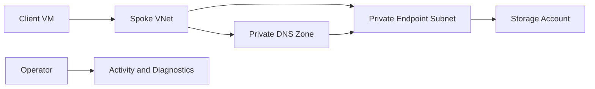

---
hide:
  - toc
content_sources:
  diagrams:
    - id: lab-02-private-endpoints
      type: flowchart
      source: mslearn-adapted
      mslearn_url: https://learn.microsoft.com/en-us/azure/private-link/private-endpoint-overview
      based_on:
        - https://learn.microsoft.com/en-us/azure/private-link/private-endpoint-dns
        - https://learn.microsoft.com/en-us/azure/storage/common/storage-private-endpoints
---

# Lab 02: Private Endpoints

Create a private endpoint for a storage account, wire up Private DNS, validate private access from a client subnet, and practice the exact checks used when private link deployments look healthy but application traffic still fails.

## Lab Metadata

| Field | Value |
|---|---|
| Difficulty | Intermediate |
| Estimated Duration | 60-90 minutes |
| Focus | Private Link, private DNS zones, validation from client networks |
| Tooling | Azure CLI, Network Watcher, Log Analytics optional |

## Prerequisites

- Permission to create storage accounts, private endpoints, private DNS zones, and a test VM.
- A fresh resource group such as `$RG=rg-net-lab02` and location such as `$LOCATION=koreacentral`.
- A unique storage account name in `$STORAGE_NAME` and a VNet name in `$VNET_NAME`.
- A client subnet and a dedicated private-endpoint subnet planned in advance.

## Architecture Diagram

<!-- diagram-id: lab-02-private-endpoints -->


## Step-by-Step Instructions

### Step 1: Create network and storage resources

```bash
az group create \
    --name $RG \
    --location $LOCATION

az network vnet create \
    --resource-group $RG \
    --name $VNET_NAME \
    --location $LOCATION \
    --address-prefixes 10.120.0.0/16 \
    --subnet-name client \
    --subnet-prefixes 10.120.1.0/24

az network vnet subnet create \
    --resource-group $RG \
    --vnet-name $VNET_NAME \
    --name private-endpoints \
    --address-prefixes 10.120.2.0/24

az storage account create \
    --resource-group $RG \
    --name $STORAGE_NAME \
    --location $LOCATION \
    --sku Standard_LRS \
    --kind StorageV2 \
    --allow-blob-public-access false
```

This keeps the storage account simple while emphasizing the networking workflow.

#### Why this step matters

- It establishes an observable checkpoint for the lab before you continue.
- It mirrors a real production activity that often appears in troubleshooting tickets.
- Save command output and timestamps so you can compare expected versus actual behavior later.

### Step 2: Create the client VM

```bash
az vm create \
    --resource-group $RG \
    --name vm-client02 \
    --image Ubuntu2204 \
    --size Standard_B1s \
    --vnet-name $VNET_NAME \
    --subnet client \
    --admin-username azureuser \
    --generate-ssh-keys \
    --public-ip-address ""
```

Use a private-only client if you already have Bastion or another jump method. Otherwise adapt for safe temporary access.

#### Why this step matters

- It establishes an observable checkpoint for the lab before you continue.
- It mirrors a real production activity that often appears in troubleshooting tickets.
- Save command output and timestamps so you can compare expected versus actual behavior later.

### Step 3: Create the private endpoint and zone group

```bash
STORAGE_ID=$(az storage account show --resource-group $RG --name $STORAGE_NAME --query id --output tsv)
az network private-endpoint create \
    --resource-group $RG \
    --name pe-storage02 \
    --vnet-name $VNET_NAME \
    --subnet private-endpoints \
    --private-connection-resource-id $STORAGE_ID \
    --group-id blob \
    --connection-name peconn-storage02

az network private-dns zone create \
    --resource-group $RG \
    --name privatelink.blob.core.windows.net

az network private-dns link vnet create \
    --resource-group $RG \
    --zone-name privatelink.blob.core.windows.net \
    --name link-vnet-lab02 \
    --virtual-network $VNET_NAME \
    --registration-enabled false

az network private-endpoint dns-zone-group create \
    --resource-group $RG \
    --endpoint-name pe-storage02 \
    --name zonegroup-default \
    --private-dns-zone privatelink.blob.core.windows.net \
    --zone-name privatelink.blob.core.windows.net
```

Bundling endpoint, zone, and zone group together avoids the most common private link mistake.

#### Why this step matters

- It establishes an observable checkpoint for the lab before you continue.
- It mirrors a real production activity that often appears in troubleshooting tickets.
- Save command output and timestamps so you can compare expected versus actual behavior later.

### Step 4: Inspect endpoint DNS configuration

```bash
az network private-endpoint show \
    --resource-group $RG \
    --name pe-storage02 \
    --query "{customDnsConfigs:customDnsConfigs,networkInterfaces:networkInterfaces}"

az network private-dns record-set a list \
    --resource-group $RG \
    --zone-name privatelink.blob.core.windows.net \
    --output table
```

These commands tell you which FQDNs should resolve privately and which records were actually created.

#### Why this step matters

- It establishes an observable checkpoint for the lab before you continue.
- It mirrors a real production activity that often appears in troubleshooting tickets.
- Save command output and timestamps so you can compare expected versus actual behavior later.

### Step 5: Validate from the client network

```bash
az network watcher test-connectivity \
    --resource-group $RG \
    --source-resource $(az vm show --resource-group $RG --name vm-client02 --query id --output tsv) \
    --dest-address $STORAGE_NAME.blob.core.windows.net \
    --dest-port 443

az vm run-command invoke \
    --resource-group $RG \
    --name vm-client02 \
    --command-id RunShellScript \
    --scripts "nslookup $STORAGE_NAME.blob.core.windows.net"
```

A successful private resolution plus connectivity test proves the end-to-end path much better than portal status alone.

#### Why this step matters

- It establishes an observable checkpoint for the lab before you continue.
- It mirrors a real production activity that often appears in troubleshooting tickets.
- Save command output and timestamps so you can compare expected versus actual behavior later.

### Step 6: Practice a controlled failure and recovery

```bash
az network private-dns link vnet delete \
    --resource-group $RG \
    --zone-name privatelink.blob.core.windows.net \
    --name link-vnet-lab02 \
    --yes

az network private-dns link vnet create \
    --resource-group $RG \
    --zone-name privatelink.blob.core.windows.net \
    --name link-vnet-lab02 \
    --virtual-network $VNET_NAME \
    --registration-enabled false
```

This gives you a safe way to reproduce a missing-zone-link scenario and then fix it cleanly.

#### Why this step matters

- It establishes an observable checkpoint for the lab before you continue.
- It mirrors a real production activity that often appears in troubleshooting tickets.
- Save command output and timestamps so you can compare expected versus actual behavior later.

## Validation Steps

- [ ] The private endpoint is Approved and provisioned successfully.
- [ ] The private DNS zone contains the expected A record.
- [ ] The client VM resolves the storage account to a private IP.
- [ ] Connectivity test to the storage FQDN succeeds on port 443 after the zone link is restored.

## Cleanup Instructions

```bash
az group delete --name $RG --yes --no-wait
```

Before cleanup, record any private IPs, route table names, or diagnostic screenshots you want to reuse in troubleshooting notes.

## See Also

- [Private Endpoint Best Practices](../../best-practices/private-endpoint-best-practices.md)
- [Dns Best Practices](../../best-practices/dns-best-practices.md)
- [Connect Private Endpoints](../../operations/connect-private-endpoints.md)
- [Dns Resolution Issues](../../troubleshooting/playbooks/dns-resolution-issues.md)

## Sources

- [private-endpoint-overview](https://learn.microsoft.com/en-us/azure/private-link/private-endpoint-overview)
- [private-endpoint-dns](https://learn.microsoft.com/en-us/azure/private-link/private-endpoint-dns)
- [storage-private-endpoints](https://learn.microsoft.com/en-us/azure/storage/common/storage-private-endpoints)
