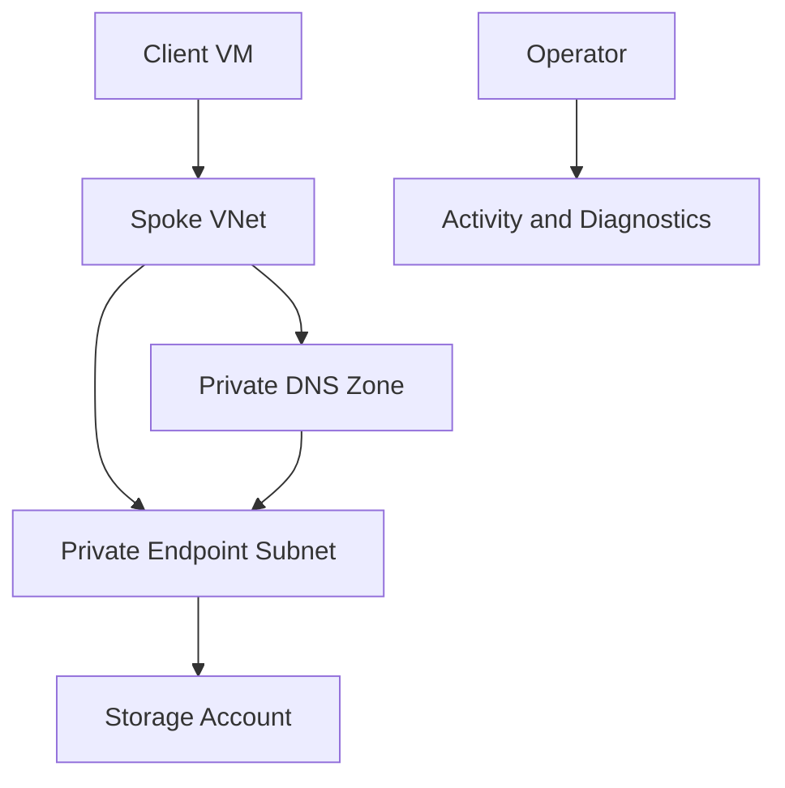

---
content_sources:
  diagrams:
    - id: lab-02-private-endpoints
      type: flowchart
      source: mslearn-adapted
      mslearn_url: https://learn.microsoft.com/en-us/azure/private-link/private-endpoint-overview
      based_on:
        - https://learn.microsoft.com/en-us/azure/private-link/private-endpoint-dns
        - https://learn.microsoft.com/en-us/azure/storage/common/storage-private-endpoints
validation:
  az_cli:
    last_tested:
    result: not_tested
  bicep:
    last_tested:
    result: not_tested
---
# Lab 02: Private Endpoints

Create a private endpoint for a storage account, wire up Private DNS, validate private access from a client subnet, and practice the exact checks used when private link deployments look healthy but application traffic still fails.

## Lab Metadata

| Field | Value |
|---|---|
| Difficulty | Intermediate |
| Estimated Duration | 60-90 minutes |
| Focus | Private Link, private DNS zones, validation from client networks |
| Tooling | Azure CLI, Network Watcher, Log Analytics optional |

## Prerequisites

- Permission to create storage accounts, private endpoints, private DNS zones, and a test VM.
- A fresh resource group such as `$RG=rg-net-lab02` and location such as `$LOCATION=koreacentral`.
- A unique storage account name in `$STORAGE_NAME` and a VNet name in `$VNET_NAME`.
- A client subnet and a dedicated private-endpoint subnet planned in advance.

## Architecture Diagram

<!-- diagram-id: lab-02-private-endpoints -->

```mermaid
flowchart TD
    Client[Client VM] --> VNet[Spoke VNet]
    VNet --> PE[Private Endpoint Subnet]
    PE --> Storage[Storage Account]
    VNet --> DNS[Private DNS Zone]
    DNS --> PE
    Ops[Operator] --> Logs[Activity and Diagnostics]
```

## Step-by-Step Instructions

### Step 1: Create network and storage resources

```bash
az group create \
    --name $RG \
    --location $LOCATION

az network vnet create \
    --resource-group $RG \
    --name $VNET_NAME \
    --location $LOCATION \
    --address-prefixes 10.120.0.0/16 \
    --subnet-name client \
    --subnet-prefixes 10.120.1.0/24

az network vnet subnet create \
    --resource-group $RG \
    --vnet-name $VNET_NAME \
    --name private-endpoints \
    --address-prefixes 10.120.2.0/24

az storage account create \
    --resource-group $RG \
    --name $STORAGE_NAME \
    --location $LOCATION \
    --sku Standard_LRS \
    --kind StorageV2 \
    --allow-blob-public-access false
```

| Command | Purpose |
|---------|---------|
| `az group create` | Creates the resource group that holds all lab resources. |
| `--name $RG` | Names the resource group. |
| `--location $LOCATION` | Sets the Azure region. |
| `az network vnet create` | Creates a virtual network with an initial subnet. |
| `--name $VNET_NAME` | Names the virtual network. |
| `--address-prefixes 10.120.0.0/16` | Sets the VNet address space. |
| `--subnet-name client` | Creates an initial subnet named `client`. |
| `--subnet-prefixes 10.120.1.0/24` | Sets the initial subnet's address range. |
| `az network vnet subnet create` | Adds a subnet for private endpoints. |
| `--vnet-name $VNET_NAME` | Names the parent virtual network. |
| `--name private-endpoints` | Names the new subnet. |
| `--address-prefixes 10.120.2.0/24` | Sets the subnet's address range. |
| `az storage account create` | Creates the storage account used as the private-link target. |
| `--name $STORAGE_NAME` | Names the storage account. |
| `--sku Standard_LRS` | Selects locally redundant storage. |
| `--kind StorageV2` | Uses the general-purpose v2 account kind. |
| `--allow-blob-public-access false` | Disables anonymous public blob access. |

This keeps the storage account simple while emphasizing the networking workflow.

#### Why this step matters

- Verify that the client and private-endpoint subnets exist before you create any private link resources.
- Capture the storage account name and VNet details because they are referenced in every later DNS and connectivity check.
- If the initial network layout is wrong here, private DNS validation later will be noisy and misleading.

### Step 2: Create the client VM

```bash
az vm create \
    --resource-group $RG \
    --name vm-client02 \
    --image Ubuntu2204 \
    --size Standard_B1s \
    --vnet-name $VNET_NAME \
    --subnet client \
    --admin-username azureuser \
    --generate-ssh-keys \
    --public-ip-address ""
```

| Command | Purpose |
|---------|---------|
| `az vm create` | Creates the client VM used to test private resolution. |
| `--resource-group $RG` | Places the VM in the lab resource group. |
| `--name vm-client02` | Names the virtual machine. |
| `--image Ubuntu2204` | Sets the OS image. |
| `--size Standard_B1s` | Selects a small burstable VM size. |
| `--vnet-name $VNET_NAME` | Attaches the VM to this virtual network. |
| `--subnet client` | Places the VM's NIC in the client subnet. |
| `--admin-username azureuser` | Sets the administrator account name. |
| `--generate-ssh-keys` | Generates SSH key pair for authentication. |
| `--public-ip-address ""` | Creates the VM without a public IP (private only). |

Use a private-only client if you already have Bastion or another jump method. Otherwise adapt for safe temporary access.

#### Why this step matters

- Confirm that `vm-client02` is deployed into the client subnet and does not receive a public IP.
- Save the VM resource ID because later connectivity tests should be run from the actual consumer workload, not from an operator shell.
- If you need temporary access, document that deviation so private-only validation remains understandable.

### Step 3: Create the private endpoint and zone group

```bash
STORAGE_ID=$(az storage account show --resource-group $RG --name $STORAGE_NAME --query id --output tsv)
az network private-endpoint create \
    --resource-group $RG \
    --name pe-storage02 \
    --vnet-name $VNET_NAME \
    --subnet private-endpoints \
    --private-connection-resource-id $STORAGE_ID \
    --group-id blob \
    --connection-name peconn-storage02

az network private-dns zone create \
    --resource-group $RG \
    --name privatelink.blob.core.windows.net

az network private-dns link vnet create \
    --resource-group $RG \
    --zone-name privatelink.blob.core.windows.net \
    --name link-vnet-lab02 \
    --virtual-network $VNET_NAME \
    --registration-enabled false

az network private-endpoint dns-zone-group create \
    --resource-group $RG \
    --endpoint-name pe-storage02 \
    --name zonegroup-default \
    --private-dns-zone privatelink.blob.core.windows.net \
    --zone-name privatelink.blob.core.windows.net
```

| Command | Purpose |
|---------|---------|
| `az storage account show` | Retrieves the storage account's properties. |
| `--query id` | Extracts only the resource ID. |
| `--output tsv` | Emits the value as plain text for shell capture. |
| `az network private-endpoint create` | Creates a private endpoint targeting the storage account. |
| `--name pe-storage02` | Names the private endpoint. |
| `--vnet-name $VNET_NAME` | Sets the VNet hosting the endpoint. |
| `--subnet private-endpoints` | Places the endpoint NIC in this subnet. |
| `--private-connection-resource-id $STORAGE_ID` | References the target resource by ID. |
| `--group-id blob` | Selects the `blob` sub-resource to connect to. |
| `--connection-name peconn-storage02` | Names the private-link connection. |
| `az network private-dns zone create` | Creates the private DNS zone for blob private link. |
| `--name privatelink.blob.core.windows.net` | Sets the private DNS zone name. |
| `az network private-dns link vnet create` | Links a VNet to the private DNS zone. |
| `--zone-name privatelink.blob.core.windows.net` | Identifies the target private DNS zone. |
| `--name link-vnet-lab02` | Names the VNet link. |
| `--virtual-network $VNET_NAME` | References the VNet to link. |
| `--registration-enabled false` | Disables auto-registration of VM records. |
| `az network private-endpoint dns-zone-group create` | Binds the endpoint to the private DNS zone. |
| `--endpoint-name pe-storage02` | Identifies the private endpoint. |
| `--name zonegroup-default` | Names the DNS zone group. |
| `--private-dns-zone privatelink.blob.core.windows.net` | References the private DNS zone resource. |
| `--zone-name privatelink.blob.core.windows.net` | Sets the zone name within the group. |

Bundling endpoint, zone, and zone group together avoids the most common private link mistake.

#### Why this step matters

- Check that the private endpoint, the private DNS zone, and the zone group all finish provisioning before you test resolution.
- Capture the private endpoint connection name and zone-link name because those are the first objects to inspect during failure drills.
- Bundling these outputs now gives you the control-plane baseline for the DNS checks in the next step.

### Step 4: Inspect endpoint DNS configuration

```bash
az network private-endpoint show \
    --resource-group $RG \
    --name pe-storage02 \
    --query "{customDnsConfigs:customDnsConfigs,networkInterfaces:networkInterfaces}"

az network private-dns record-set a list \
    --resource-group $RG \
    --zone-name privatelink.blob.core.windows.net \
    --output table
```

| Command | Purpose |
|---------|---------|
| `az network private-endpoint show` | Retrieves a private endpoint's configuration. |
| `--resource-group $RG` | Scopes the query to the lab resource group. |
| `--name pe-storage02` | Identifies the private endpoint to read. |
| `--query "{customDnsConfigs:customDnsConfigs,networkInterfaces:networkInterfaces}"` | Projects only DNS config and NIC references. |
| `az network private-dns record-set a list` | Lists the A records in the private DNS zone. |
| `--zone-name privatelink.blob.core.windows.net` | Identifies the private DNS zone. |
| `--output table` | Formats the output as a readable table. |

These commands tell you which FQDNs should resolve privately and which records were actually created.

#### Why this step matters

- Verify that the endpoint exposes the expected blob FQDN mapping and that the A record exists in the private zone.
- Save the record data and NIC reference so you can prove whether later failures are DNS-related or path-related.
- If the zone is empty here, stop and fix DNS wiring before running client connectivity tests.

### Step 5: Validate from the client network

```bash
az network watcher test-connectivity \
    --resource-group $RG \
    --source-resource $(az vm show --resource-group $RG --name vm-client02 --query id --output tsv) \
    --dest-address $STORAGE_NAME.blob.core.windows.net \
    --dest-port 443

az vm run-command invoke \
    --resource-group $RG \
    --name vm-client02 \
    --command-id RunShellScript \
    --scripts "nslookup $STORAGE_NAME.blob.core.windows.net"
```

| Command | Purpose |
|---------|---------|
| `az network watcher test-connectivity` | Tests reachability from the client VM to the storage FQDN. |
| `--source-resource ...` | Sets the source resource (the client VM) for the test. |
| `--dest-address $STORAGE_NAME.blob.core.windows.net` | Sets the destination storage FQDN. |
| `--dest-port 443` | Sets the destination TCP port (HTTPS). |
| `az vm run-command invoke` | Runs a command inside the VM to check DNS resolution. |
| `--name vm-client02` | Identifies the VM to run the command on. |
| `--command-id RunShellScript` | Uses the shell-script run-command. |
| `--scripts "nslookup ..."` | Supplies the shell script to execute. |

A successful private resolution plus connectivity test proves the end-to-end path much better than portal status alone.

#### Why this step matters

- Confirm that the client VM resolves the storage FQDN to the private IP and can reach port 443.
- Save both the `test-connectivity` result and the in-guest `nslookup` output because together they prove end-to-end private consumption.
- If one succeeds and the other fails, you already know whether to investigate DNS or routing and filtering first.

### Step 6: Practice a controlled failure and recovery

```bash
az network private-dns link vnet delete \
    --resource-group $RG \
    --zone-name privatelink.blob.core.windows.net \
    --name link-vnet-lab02 \
    --yes

az network private-dns link vnet create \
    --resource-group $RG \
    --zone-name privatelink.blob.core.windows.net \
    --name link-vnet-lab02 \
    --virtual-network $VNET_NAME \
    --registration-enabled false
```

| Command | Purpose |
|---------|---------|
| `az network private-dns link vnet delete` | Removes the VNet link to reproduce a missing-link failure. |
| `--zone-name privatelink.blob.core.windows.net` | Identifies the private DNS zone. |
| `--name link-vnet-lab02` | Identifies the VNet link to delete. |
| `--yes` | Skips the interactive confirmation prompt. |
| `az network private-dns link vnet create` | Recreates the VNet link to recover resolution. |
| `--virtual-network $VNET_NAME` | References the VNet to link. |
| `--registration-enabled false` | Disables auto-registration of VM records. |

This gives you a safe way to reproduce a missing-zone-link scenario and then fix it cleanly.

#### Why this step matters

- Use the deleted VNet link to reproduce the exact "endpoint looks healthy but resolution fails" scenario that operators see in production.
- Capture the failed and restored lookup results so you can compare pre-fix and post-fix evidence in one incident note.
- This step teaches rollback discipline: the DNS link is the change, and the client lookup is the proof.

## Validation Steps

- [ ] The private endpoint is Approved and provisioned successfully.
- [ ] The private DNS zone contains the expected A record.
- [ ] The client VM resolves the storage account to a private IP.
- [ ] Connectivity test to the storage FQDN succeeds on port 443 after the zone link is restored.

## Cleanup Instructions

```bash
az group delete --name $RG --yes --no-wait
```

| Command | Purpose |
|---------|---------|
| `az group delete` | Deletes the resource group and all lab resources. |
| `--name $RG` | Identifies the resource group to delete. |
| `--yes` | Skips the interactive confirmation prompt. |
| `--no-wait` | Returns immediately without waiting for completion. |

Before cleanup, record any private IPs, route table names, or diagnostic screenshots you want to reuse in troubleshooting notes.

## See Also

- [Private Endpoint Best Practices](../../best-practices/private-endpoint-best-practices.md)
- [Dns Best Practices](../../best-practices/dns-best-practices.md)
- [Connect Private Endpoints](../../operations/connect-private-endpoints.md)
- [DNS Resolution Failures](../../troubleshooting/playbooks/dns/dns-resolution-failures.md)

## Sources

- [private-endpoint-overview](https://learn.microsoft.com/en-us/azure/private-link/private-endpoint-overview)
- [private-endpoint-dns](https://learn.microsoft.com/en-us/azure/private-link/private-endpoint-dns)
- [storage-private-endpoints](https://learn.microsoft.com/en-us/azure/storage/common/storage-private-endpoints)
