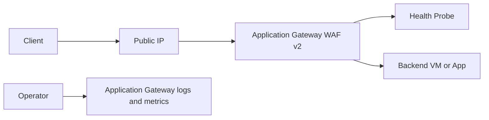

# Lab 03: Application Gateway WAF

Deploy a small WAF v2 Application Gateway in front of a test backend so you can understand subnet requirements, listener and probe behavior, and the validation steps used when applications are reachable internally but not through the gateway.

## Lab Metadata

| Field | Value |
|---|---|
| Difficulty | Intermediate |
| Estimated Duration | 75-105 minutes |
| Focus | Application Gateway subnetting, WAF policy, backend health, probe validation |
| Tooling | Azure CLI, Network Watcher, Log Analytics optional |

## Prerequisites

- Permission to create Application Gateway, public IPs, VNets, and at least one backend VM.
- A lab resource group such as `$RG=rg-net-lab03` and location such as `$LOCATION=koreacentral`.
- Basic familiarity with HTTP listeners and health probe semantics.
- Awareness that Application Gateway requires a dedicated subnet.

## Architecture Diagram



## Step-by-Step Instructions

### Step 1: Create the VNet and dedicated subnets

```bash
az group create \
    --name $RG \
    --location $LOCATION

az network vnet create \
    --resource-group $RG \
    --name vnet-agw-lab03 \
    --location $LOCATION \
    --address-prefixes 10.130.0.0/16 \
    --subnet-name appgw \
    --subnet-prefixes 10.130.1.0/24

az network vnet subnet create \
    --resource-group $RG \
    --vnet-name vnet-agw-lab03 \
    --name backend \
    --address-prefixes 10.130.2.0/24
```

Keep Application Gateway isolated in its own subnet. That pattern matters in production and during troubleshooting.

#### Why this step matters

- It establishes an observable checkpoint for the lab before you continue.
- It mirrors a real production activity that often appears in troubleshooting tickets.
- Save command output and timestamps so you can compare expected versus actual behavior later.

### Step 2: Deploy the backend and public IP

```bash
az vm create \
    --resource-group $RG \
    --name vm-web03 \
    --image Ubuntu2204 \
    --size Standard_B1s \
    --vnet-name vnet-agw-lab03 \
    --subnet backend \
    --admin-username azureuser \
    --generate-ssh-keys \
    --public-ip-address ""

az network public-ip create \
    --resource-group $RG \
    --name pip-agw03 \
    --sku Standard \
    --allocation-method Static
```

Install a simple web server on the backend or adapt to a prebuilt image with an HTTP listener.

#### Why this step matters

- It establishes an observable checkpoint for the lab before you continue.
- It mirrors a real production activity that often appears in troubleshooting tickets.
- Save command output and timestamps so you can compare expected versus actual behavior later.

### Step 3: Create a WAF policy and Application Gateway

```bash
az network application-gateway waf-policy create \
    --resource-group $RG \
    --name wafp-lab03 \
    --location $LOCATION

az network application-gateway create \
    --resource-group $RG \
    --name agw-lab03 \
    --location $LOCATION \
    --capacity 1 \
    --sku WAF_v2 \
    --public-ip-address pip-agw03 \
    --vnet-name vnet-agw-lab03 \
    --subnet appgw \
    --servers 10.130.2.4 \
    --frontend-port 80 \
    --http-settings-port 80 \
    --http-settings-protocol Http \
    --priority 100
```

If your backend IP differs, replace the server address with the backend NIC private IP.

#### Why this step matters

- It establishes an observable checkpoint for the lab before you continue.
- It mirrors a real production activity that often appears in troubleshooting tickets.
- Save command output and timestamps so you can compare expected versus actual behavior later.

### Step 4: Attach a custom health probe and inspect backend health

```bash
az network application-gateway probe create \
    --resource-group $RG \
    --gateway-name agw-lab03 \
    --name probe-web03 \
    --protocol Http \
    --host 127.0.0.1 \
    --path / \
    --interval 30 \
    --timeout 30 \
    --threshold 3

az network application-gateway show-backend-health \
    --resource-group $RG \
    --name agw-lab03
```

Backend health is the single most useful command during ingress incidents.

#### Why this step matters

- It establishes an observable checkpoint for the lab before you continue.
- It mirrors a real production activity that often appears in troubleshooting tickets.
- Save command output and timestamps so you can compare expected versus actual behavior later.

### Step 5: Enable diagnostics and review WAF/Application Gateway state

```bash
az monitor diagnostic-settings create \
    --name send-agw-logs \
    --resource $(az network application-gateway show --resource-group $RG --name agw-lab03 --query id --output tsv) \
    --workspace $WORKSPACE_ID \
    --logs "[{"category":"ApplicationGatewayAccessLog","enabled":true},{"category":"ApplicationGatewayFirewallLog","enabled":true},{"category":"ApplicationGatewayPerformanceLog","enabled":true}]"

az monitor metrics list \
    --resource $(az network application-gateway show --resource-group $RG --name agw-lab03 --query id --output tsv) \
    --metric HealthyHostCount,UnhealthyHostCount \
    --interval PT5M
```

This step shows how to connect control-plane configuration with runtime evidence.

#### Why this step matters

- It establishes an observable checkpoint for the lab before you continue.
- It mirrors a real production activity that often appears in troubleshooting tickets.
- Save command output and timestamps so you can compare expected versus actual behavior later.

### Step 6: Practice a probe failure and recovery

```bash
az network application-gateway probe update \
    --resource-group $RG \
    --gateway-name agw-lab03 \
    --name probe-web03 \
    --path /broken

az network application-gateway show-backend-health \
    --resource-group $RG \
    --name agw-lab03

az network application-gateway probe update \
    --resource-group $RG \
    --gateway-name agw-lab03 \
    --name probe-web03 \
    --path /
```

This reproduces one of the most common Application Gateway incidents in a safe way.

#### Why this step matters

- It establishes an observable checkpoint for the lab before you continue.
- It mirrors a real production activity that often appears in troubleshooting tickets.
- Save command output and timestamps so you can compare expected versus actual behavior later.

## Validation Steps

- [ ] Application Gateway deploys successfully in its dedicated subnet.
- [ ] Backend health shows Healthy for the backend after the correct probe path is restored.
- [ ] HealthyHostCount increases and UnhealthyHostCount drops in metrics.
- [ ] The lab notes capture the difference between a gateway issue and a backend-probe issue.

## Cleanup Instructions

```bash
az group delete --name $RG --yes --no-wait
```

Before cleanup, record any private IPs, route table names, or diagnostic screenshots you want to reuse in troubleshooting notes.

## See Also

- [Load Balancing Options](../../platform/load-balancing-options.md)
- [Nsg And Firewall Best Practices](../../best-practices/nsg-and-firewall-best-practices.md)
- [Load Balancer Health Probe Failures](../../troubleshooting/playbooks/load-balancer-health-probe-failures.md)
- [Inbound Connectivity Issues](../../troubleshooting/playbooks/connectivity/inbound-connectivity-issues.md)

## Sources

- [overview-v2](https://learn.microsoft.com/en-us/azure/application-gateway/overview-v2)
- [application-gateway-probe-overview](https://learn.microsoft.com/en-us/azure/application-gateway/application-gateway-probe-overview)
- [ag-overview](https://learn.microsoft.com/en-us/azure/web-application-firewall/ag/ag-overview)
