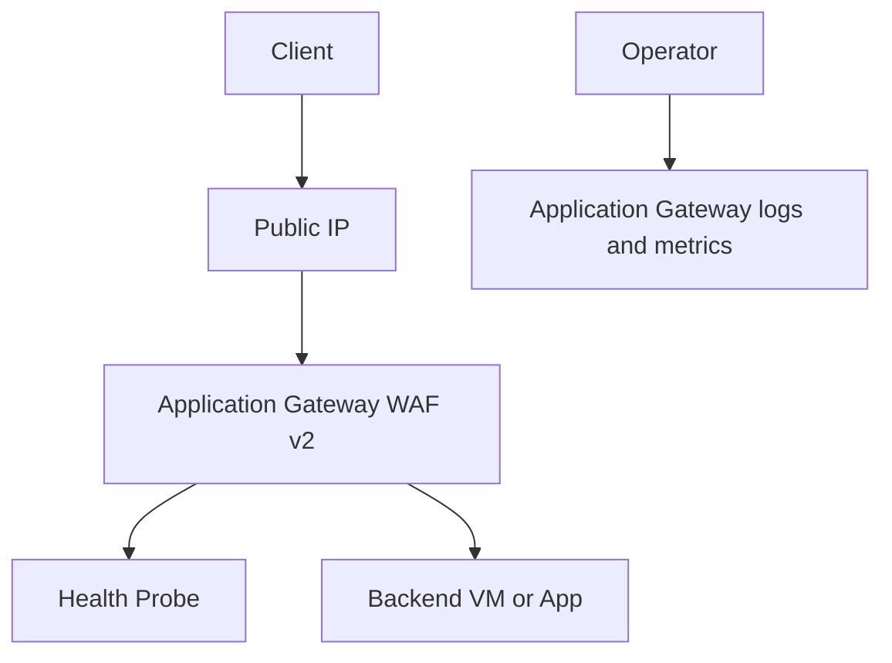

---
content_sources:
  diagrams:
    - id: lab-03-application-gateway-waf
      type: flowchart
      source: mslearn-adapted
      mslearn_url: https://learn.microsoft.com/en-us/azure/application-gateway/overview-v2
      based_on:
        - https://learn.microsoft.com/en-us/azure/application-gateway/application-gateway-probe-overview
        - https://learn.microsoft.com/en-us/azure/web-application-firewall/ag/ag-overview
validation:
  az_cli:
    last_tested:
    result: not_tested
  bicep:
    last_tested:
    result: not_tested
---
# Lab 03: Application Gateway WAF

Deploy a small WAF v2 Application Gateway in front of a test backend so you can understand subnet requirements, listener and probe behavior, and the validation steps used when applications are reachable internally but not through the gateway.

## Lab Metadata

| Field | Value |
|---|---|
| Difficulty | Intermediate |
| Estimated Duration | 75-105 minutes |
| Focus | Application Gateway subnetting, WAF policy, backend health, probe validation |
| Tooling | Azure CLI, Network Watcher, Log Analytics optional |

## Prerequisites

- Permission to create Application Gateway, public IPs, VNets, and at least one backend VM.
- A lab resource group such as `$RG=rg-net-lab03` and location such as `$LOCATION=koreacentral`.
- Basic familiarity with HTTP listeners and health probe semantics.
- Awareness that Application Gateway requires a dedicated subnet.

## Architecture Diagram

<!-- diagram-id: lab-03-application-gateway-waf -->

```mermaid
flowchart TD
    Internet[Client] --> PublicIP[Public IP]
    PublicIP --> AppGw[Application Gateway WAF v2]
    AppGw --> Probe[Health Probe]
    AppGw --> Backend[Backend VM or App]
    Ops[Operator] --> Logs[Application Gateway logs and metrics]
```

## Step-by-Step Instructions

### Step 1: Create the VNet and dedicated subnets

```bash
az group create \
    --name $RG \
    --location $LOCATION

az network vnet create \
    --resource-group $RG \
    --name vnet-agw-lab03 \
    --location $LOCATION \
    --address-prefixes 10.130.0.0/16 \
    --subnet-name appgw \
    --subnet-prefixes 10.130.1.0/24

az network vnet subnet create \
    --resource-group $RG \
    --vnet-name vnet-agw-lab03 \
    --name backend \
    --address-prefixes 10.130.2.0/24
```

| Command | Purpose |
|---|---|
| `az group create` | Create the resource group that holds all lab resources. |
| `--name` | Name of the resource group. |
| `--location` | Azure region for the resource group. |
| `az network vnet create` | Create the lab virtual network with an initial subnet. |
| `--resource-group` | Resource group that contains the virtual network. |
| `--name` | Name of the virtual network. |
| `--location` | Azure region for the virtual network. |
| `--address-prefixes` | Address space for the virtual network. |
| `--subnet-name` | Name of the first subnet to create (the Application Gateway subnet). |
| `--subnet-prefixes` | Address range for the first subnet. |
| `az network vnet subnet create` | Add the dedicated backend subnet to the virtual network. |
| `--resource-group` | Resource group that contains the virtual network. |
| `--vnet-name` | Virtual network the subnet is added to. |
| `--name` | Name of the backend subnet. |
| `--address-prefixes` | Address range for the backend subnet. |

Keep Application Gateway isolated in its own subnet. That pattern matters in production and during troubleshooting.

#### Why this step matters

- Verify that the Application Gateway subnet is dedicated and that no backend workload is placed into it.
- Record the exact subnet prefixes because later backend-health or scaling issues are often rooted in bad subnet layout.
- Save the VNet output now so you can prove the gateway started from a supported topology.

### Step 2: Deploy the backend and public IP

```bash
az vm create \
    --resource-group $RG \
    --name vm-web03 \
    --image Ubuntu2204 \
    --size Standard_B1s \
    --vnet-name vnet-agw-lab03 \
    --subnet backend \
    --admin-username azureuser \
    --generate-ssh-keys \
    --public-ip-address ""

az network public-ip create \
    --resource-group $RG \
    --name pip-agw03 \
    --sku Standard \
    --allocation-method Static
```

| Command | Purpose |
|---|---|
| `az vm create` | Create the backend virtual machine that Application Gateway routes to. |
| `--resource-group` | Resource group that contains the virtual machine. |
| `--name` | Name of the virtual machine. |
| `--image` | Operating system image for the virtual machine. |
| `--size` | Virtual machine SKU size. |
| `--vnet-name` | Virtual network the virtual machine joins. |
| `--subnet` | Subnet the virtual machine joins (the backend subnet). |
| `--admin-username` | Administrator user name for the virtual machine. |
| `--generate-ssh-keys` | Generate SSH key pair for authentication if not present. |
| `--public-ip-address` | Public IP for the virtual machine; empty string disables a public IP. |
| `az network public-ip create` | Create the static public IP used by the Application Gateway frontend. |
| `--resource-group` | Resource group that contains the public IP. |
| `--name` | Name of the public IP resource. |
| `--sku` | Public IP SKU (Standard is required by Application Gateway v2). |
| `--allocation-method` | IP allocation method (Static for Application Gateway v2). |

Install a simple web server on the backend or adapt to a prebuilt image with an HTTP listener.

#### Why this step matters

- Confirm that the backend VM lands in the backend subnet and that the gateway public IP is Standard and Static.
- Capture the backend private IP because the gateway creation step depends on the right target address.
- If the backend host is wrong here, later probe failures may look like WAF or listener problems when they are not.

### Step 3: Create a WAF policy and Application Gateway

```bash
az network application-gateway waf-policy create \
    --resource-group $RG \
    --name wafp-lab03 \
    --location $LOCATION

az network application-gateway create \
    --resource-group $RG \
    --name agw-lab03 \
    --location $LOCATION \
    --capacity 1 \
    --sku WAF_v2 \
    --public-ip-address pip-agw03 \
    --vnet-name vnet-agw-lab03 \
    --subnet appgw \
    --servers 10.130.2.4 \
    --frontend-port 80 \
    --http-settings-port 80 \
    --http-settings-protocol Http \
    --priority 100
```

| Command | Purpose |
|---|---|
| `az network application-gateway waf-policy create` | Create the Web Application Firewall policy to associate with the gateway. |
| `--resource-group` | Resource group that contains the WAF policy. |
| `--name` | Name of the WAF policy. |
| `--location` | Azure region for the WAF policy. |
| `az network application-gateway create` | Create the WAF_v2 Application Gateway with frontend, backend, and listener settings. |
| `--resource-group` | Resource group that contains the Application Gateway. |
| `--name` | Name of the Application Gateway. |
| `--location` | Azure region for the Application Gateway. |
| `--capacity` | Number of gateway instances to provision. |
| `--sku` | Gateway SKU tier (WAF_v2 enables the firewall). |
| `--public-ip-address` | Public IP used for the gateway frontend. |
| `--vnet-name` | Virtual network the gateway joins. |
| `--subnet` | Dedicated subnet for the Application Gateway. |
| `--servers` | Backend server address(es) the gateway routes to. |
| `--frontend-port` | Port the gateway listens on. |
| `--http-settings-port` | Port used to reach the backend servers. |
| `--http-settings-protocol` | Protocol used to reach the backend servers. |
| `--priority` | Routing rule priority. |

If your backend IP differs, replace the server address with the backend NIC private IP.

#### Why this step matters

- Wait for the gateway deployment to finish and record the frontend configuration and backend target you used.
- Save the gateway creation output because it becomes the control-plane baseline for every later health and WAF check.
- If you had to substitute a different backend IP, note that now so probe evidence remains interpretable.

### Step 4: Attach a custom health probe and inspect backend health

```bash
az network application-gateway probe create \
    --resource-group $RG \
    --gateway-name agw-lab03 \
    --name probe-web03 \
    --protocol Http \
    --host 127.0.0.1 \
    --path / \
    --interval 30 \
    --timeout 30 \
    --threshold 3

az network application-gateway show-backend-health \
    --resource-group $RG \
    --name agw-lab03
```

| Command | Purpose |
|---|---|
| `az network application-gateway probe create` | Create a custom health probe for the backend pool. |
| `--resource-group` | Resource group that contains the Application Gateway. |
| `--gateway-name` | Application Gateway the probe belongs to. |
| `--name` | Name of the health probe. |
| `--protocol` | Protocol used by the probe. |
| `--host` | Host header sent with the probe request. |
| `--path` | URL path the probe requests. |
| `--interval` | Seconds between probe attempts. |
| `--timeout` | Seconds to wait before a probe attempt times out. |
| `--threshold` | Consecutive failures before the backend is marked unhealthy. |
| `az network application-gateway show-backend-health` | Show the current health of the gateway backend pool. |
| `--resource-group` | Resource group that contains the Application Gateway. |
| `--name` | Name of the Application Gateway. |

Backend health is the single most useful command during ingress incidents.

#### Why this step matters

- Confirm that backend health turns Healthy with the intended probe configuration before you enable any failure drill.
- Save the backend-health output because it shows the exact transition from configuration to runtime evidence.
- If the pool is unhealthy here, fix the backend listener or probe path before continuing to diagnostics.

### Step 5: Enable diagnostics and review WAF/Application Gateway state

```bash
az monitor diagnostic-settings create \
    --name send-agw-logs \
    --resource $(az network application-gateway show --resource-group $RG --name agw-lab03 --query id --output tsv) \
    --workspace $WORKSPACE_ID \
    --logs "[{"category":"ApplicationGatewayAccessLog","enabled":true},{"category":"ApplicationGatewayFirewallLog","enabled":true},{"category":"ApplicationGatewayPerformanceLog","enabled":true}]"

az monitor metrics list \
    --resource $(az network application-gateway show --resource-group $RG --name agw-lab03 --query id --output tsv) \
    --metric HealthyHostCount,UnhealthyHostCount \
    --interval PT5M
```

| Command | Purpose |
|---|---|
| `az monitor diagnostic-settings create` | Send Application Gateway and WAF logs to a Log Analytics workspace. |
| `--name` | Name of the diagnostic setting. |
| `--resource` | Resource ID of the Application Gateway to collect logs from. |
| `--workspace` | Log Analytics workspace that receives the logs. |
| `--logs` | JSON array of log categories to enable. |
| `az monitor metrics list` | List runtime metrics for the Application Gateway. |
| `--resource` | Resource ID of the Application Gateway to query. |
| `--metric` | Metric names to retrieve. |
| `--interval` | Aggregation interval for the metrics. |

This step shows how to connect control-plane configuration with runtime evidence.

#### Why this step matters

- Verify that diagnostics start flowing to the workspace and that gateway health metrics return values.
- Capture one metric snapshot so you can compare healthy and unhealthy states after the probe failure drill.
- This is the evidence bridge between control-plane settings and what operators actually monitor during ingress incidents.

### Step 6: Practice a probe failure and recovery

```bash
az network application-gateway probe update \
    --resource-group $RG \
    --gateway-name agw-lab03 \
    --name probe-web03 \
    --path /broken

az network application-gateway show-backend-health \
    --resource-group $RG \
    --name agw-lab03

az network application-gateway probe update \
    --resource-group $RG \
    --gateway-name agw-lab03 \
    --name probe-web03 \
    --path /
```

| Command | Purpose |
|---|---|
| `az network application-gateway probe update` | Update the probe path to simulate and then recover a backend health failure. |
| `--resource-group` | Resource group that contains the Application Gateway. |
| `--gateway-name` | Application Gateway the probe belongs to. |
| `--name` | Name of the health probe. |
| `--path` | URL path the probe requests (set to a broken path, then restored). |
| `az network application-gateway show-backend-health` | Show backend health to observe the failure and recovery. |
| `--resource-group` | Resource group that contains the Application Gateway. |
| `--name` | Name of the Application Gateway. |

This reproduces one of the most common Application Gateway incidents in a safe way.

#### Why this step matters

- Save the backend-health output before and after changing the probe path so the failure transition is explicit.
- Compare the unhealthy state with the earlier healthy metric snapshot to distinguish backend issues from listener or WAF issues.
- Restoring the probe path should give you a clear pre-fix and post-fix evidence pair for future troubleshooting notes.

## Validation Steps

- [ ] Application Gateway deploys successfully in its dedicated subnet.
- [ ] Backend health shows Healthy for the backend after the correct probe path is restored.
- [ ] HealthyHostCount increases and UnhealthyHostCount drops in metrics.
- [ ] The lab notes capture the difference between a gateway issue and a backend-probe issue.

## Cleanup Instructions

```bash
az group delete --name $RG --yes --no-wait
```

| Command | Purpose |
|---|---|
| `az group delete` | Delete the resource group and all lab resources. |
| `--name` | Name of the resource group to delete. |
| `--yes` | Skip the interactive confirmation prompt. |
| `--no-wait` | Return immediately without waiting for deletion to finish. |

Before cleanup, record any private IPs, route table names, or diagnostic screenshots you want to reuse in troubleshooting notes.

## See Also

- [Load Balancing Options](../../platform/load-balancing-options.md)
- [Nsg And Firewall Best Practices](../../best-practices/nsg-and-firewall-best-practices.md)
- [Load Balancer Health Probe Failures](../../troubleshooting/playbooks/load-balancer-health-probe-failures.md)
- [Inbound Connectivity Issues](../../troubleshooting/playbooks/connectivity/inbound-connectivity-issues.md)

## Sources

- [overview-v2](https://learn.microsoft.com/en-us/azure/application-gateway/overview-v2)
- [application-gateway-probe-overview](https://learn.microsoft.com/en-us/azure/application-gateway/application-gateway-probe-overview)
- [ag-overview](https://learn.microsoft.com/en-us/azure/web-application-firewall/ag/ag-overview)
