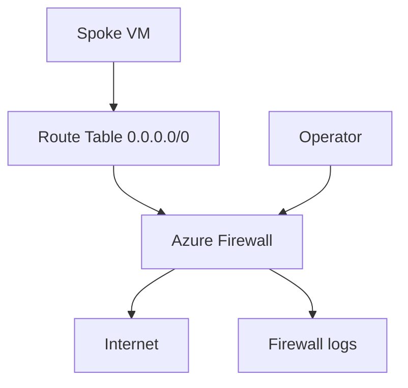

---
content_sources:
  diagrams:
    - id: lab-04-azure-firewall
      type: flowchart
      source: mslearn-adapted
      mslearn_url: https://learn.microsoft.com/en-us/azure/firewall/overview
      based_on:
        - https://learn.microsoft.com/en-us/azure/firewall/deploy-cli
        - https://learn.microsoft.com/en-us/azure/firewall/firewall-diagnostics
validation:
  az_cli:
    last_tested:
    result: not_tested
  bicep:
    last_tested:
    result: not_tested
---
# Lab 04: Azure Firewall

Deploy Azure Firewall with a simple spoke subnet, force egress through the firewall using a route table, and validate both allowed and denied traffic so teams can learn how routing and firewall policy interact in practice.

## Lab Metadata

| Field | Value |
|---|---|
| Difficulty | Advanced |
| Estimated Duration | 75-105 minutes |
| Focus | Azure Firewall deployment, UDR-based egress control, diagnostics, deny troubleshooting |
| Tooling | Azure CLI, Network Watcher, Log Analytics optional |

## Prerequisites

- Permission to create Azure Firewall, public IPs, route tables, and a test VM.
- A workspace ID if you want to stream logs to Log Analytics during the lab.
- A resource group such as `$RG=rg-net-lab04` and location such as `$LOCATION=koreacentral`.
- Budget awareness: Azure Firewall incurs hourly and data-processing charges. Tear down promptly after the lab.

## Architecture Diagram

<!-- diagram-id: lab-04-azure-firewall -->

```mermaid
flowchart TD
    Workload[Spoke VM] --> UDR[Route Table 0.0.0.0/0]
    UDR --> Firewall[Azure Firewall]
    Firewall --> Internet[Internet]
    Firewall --> Logs[Firewall logs]
    Ops[Operator] --> Firewall
```

## Step-by-Step Instructions

### Step 1: Create the VNet, subnets, and public IP

```bash
az group create \
    --name $RG \
    --location $LOCATION

az network vnet create \
    --resource-group $RG \
    --name vnet-fw-lab04 \
    --location $LOCATION \
    --address-prefixes 10.140.0.0/16 \
    --subnet-name AzureFirewallSubnet \
    --subnet-prefixes 10.140.1.0/24

az network vnet subnet create \
    --resource-group $RG \
    --vnet-name vnet-fw-lab04 \
    --name workload \
    --address-prefixes 10.140.2.0/24

az network public-ip create \
    --resource-group $RG \
    --name pip-fw04 \
    --sku Standard \
    --allocation-method Static
```

| Command | Purpose |
|---|---|
| `az group create` | Create the resource group that holds all lab resources. |
| `--name` | Name of the resource group. |
| `--location` | Azure region for the resource group. |
| `az network vnet create` | Create the virtual network with the dedicated AzureFirewallSubnet. |
| `--resource-group` | Resource group that contains the virtual network. |
| `--name` | Name of the virtual network. |
| `--location` | Azure region for the virtual network. |
| `--address-prefixes` | Address space for the virtual network. |
| `--subnet-name` | Name of the first subnet (must be AzureFirewallSubnet for the firewall). |
| `--subnet-prefixes` | Address range for the firewall subnet. |
| `az network vnet subnet create` | Add the workload subnet to the virtual network. |
| `--resource-group` | Resource group that contains the virtual network. |
| `--vnet-name` | Virtual network the subnet is added to. |
| `--name` | Name of the workload subnet. |
| `--address-prefixes` | Address range for the workload subnet. |
| `az network public-ip create` | Create the static public IP used by the firewall. |
| `--resource-group` | Resource group that contains the public IP. |
| `--name` | Name of the public IP resource. |
| `--sku` | Public IP SKU (Standard is required by Azure Firewall). |
| `--allocation-method` | IP allocation method (Static for Azure Firewall). |

This layout mirrors the minimum production pattern of firewall plus workload subnet.

#### Why this step matters

- It establishes an observable checkpoint for the lab before you continue.
- It mirrors a real production activity that often appears in troubleshooting tickets.
- Save command output and timestamps so you can compare expected versus actual behavior later.

### Step 2: Create the firewall and firewall policy

```bash
az network firewall policy create \
    --resource-group $RG \
    --name fwp-lab04 \
    --location $LOCATION

az network firewall create \
    --resource-group $RG \
    --name fw-lab04 \
    --location $LOCATION \
    --firewall-policy fwp-lab04

az network firewall ip-config create \
    --resource-group $RG \
    --firewall-name fw-lab04 \
    --name fwconfig \
    --public-ip-address pip-fw04 \
    --vnet-name vnet-fw-lab04
```

| Command | Purpose |
|---|---|
| `az network firewall policy create` | Create the firewall policy that holds rule collections. |
| `--resource-group` | Resource group that contains the firewall policy. |
| `--name` | Name of the firewall policy. |
| `--location` | Azure region for the firewall policy. |
| `az network firewall create` | Create the Azure Firewall instance and attach the policy. |
| `--resource-group` | Resource group that contains the firewall. |
| `--name` | Name of the firewall. |
| `--location` | Azure region for the firewall. |
| `--firewall-policy` | Firewall policy to associate with the firewall. |
| `az network firewall ip-config create` | Create the firewall IP configuration binding the public IP and VNet. |
| `--resource-group` | Resource group that contains the firewall. |
| `--firewall-name` | Firewall the IP configuration belongs to. |
| `--name` | Name of the IP configuration. |
| `--public-ip-address` | Public IP used by the firewall frontend. |
| `--vnet-name` | Virtual network that contains the AzureFirewallSubnet. |

Wait for provisioning to finish before moving on. Firewall deployment can take several minutes.

#### Why this step matters

- It establishes an observable checkpoint for the lab before you continue.
- It mirrors a real production activity that often appears in troubleshooting tickets.
- Save command output and timestamps so you can compare expected versus actual behavior later.

### Step 3: Deploy a test VM and forced-tunnel route table

```bash
az vm create \
    --resource-group $RG \
    --name vm-egress04 \
    --image Ubuntu2204 \
    --size Standard_B1s \
    --vnet-name vnet-fw-lab04 \
    --subnet workload \
    --admin-username azureuser \
    --generate-ssh-keys \
    --public-ip-address ""

FW_PRIVATE_IP=$(az network firewall ip-config list --resource-group $RG --firewall-name fw-lab04 --query "[0].privateIpAddress" --output tsv)
az network route-table create \
    --resource-group $RG \
    --name rt-workload04 \
    --location $LOCATION

az network route-table route create \
    --resource-group $RG \
    --route-table-name rt-workload04 \
    --name default-to-firewall \
    --address-prefix 0.0.0.0/0 \
    --next-hop-type VirtualAppliance \
    --next-hop-ip-address $FW_PRIVATE_IP

az network vnet subnet update \
    --resource-group $RG \
    --vnet-name vnet-fw-lab04 \
    --name workload \
    --route-table rt-workload04
```

| Command | Purpose |
|---|---|
| `az vm create` | Create the workload test virtual machine. |
| `--resource-group` | Resource group that contains the virtual machine. |
| `--name` | Name of the virtual machine. |
| `--image` | Operating system image for the virtual machine. |
| `--size` | Virtual machine SKU size. |
| `--vnet-name` | Virtual network the virtual machine joins. |
| `--subnet` | Subnet the virtual machine joins (the workload subnet). |
| `--admin-username` | Administrator user name for the virtual machine. |
| `--generate-ssh-keys` | Generate SSH key pair for authentication if not present. |
| `--public-ip-address` | Public IP for the virtual machine; empty string disables a public IP. |
| `az network firewall ip-config list` | List firewall IP configurations to read the firewall private IP. |
| `--resource-group` | Resource group that contains the firewall. |
| `--firewall-name` | Firewall to query. |
| `--query` | JMESPath expression selecting the private IP address. |
| `--output` | Output format (tsv for scripting). |
| `az network route-table create` | Create the route table used for forced tunneling. |
| `--resource-group` | Resource group that contains the route table. |
| `--name` | Name of the route table. |
| `--location` | Azure region for the route table. |
| `az network route-table route create` | Add a default route that sends all traffic to the firewall. |
| `--resource-group` | Resource group that contains the route table. |
| `--route-table-name` | Route table the route is added to. |
| `--name` | Name of the route. |
| `--address-prefix` | Destination prefix for the route (0.0.0.0/0 for all traffic). |
| `--next-hop-type` | Next hop type (VirtualAppliance for the firewall). |
| `--next-hop-ip-address` | Firewall private IP the traffic is forwarded to. |
| `az network vnet subnet update` | Associate the route table with the workload subnet. |
| `--resource-group` | Resource group that contains the virtual network. |
| `--vnet-name` | Virtual network that contains the subnet. |
| `--name` | Name of the workload subnet. |
| `--route-table` | Route table to associate with the subnet. |

This is the critical forced-tunneling pattern to validate in later steps.

#### Why this step matters

- It establishes an observable checkpoint for the lab before you continue.
- It mirrors a real production activity that often appears in troubleshooting tickets.
- Save command output and timestamps so you can compare expected versus actual behavior later.

### Step 4: Create allow and deny rule collections

```bash
az network firewall policy rule-collection-group create \
    --resource-group $RG \
    --policy-name fwp-lab04 \
    --name rcg-egress \
    --priority 100

az network firewall policy rule-collection-group collection add-filter-collection \
    --resource-group $RG \
    --policy-name fwp-lab04 \
    --rule-collection-group-name rcg-egress \
    --name allow-web \
    --priority 100 \
    --action Allow

az network firewall policy rule-collection-group collection rule add \
    --resource-group $RG \
    --policy-name fwp-lab04 \
    --rule-collection-group-name rcg-egress \
    --collection-name allow-web \
    --name allow-https \
    --rule-type NetworkRule \
    --ip-protocols TCP \
    --source-addresses 10.140.2.0/24 \
    --destination-addresses 20.42.0.0/16 \
    --destination-ports 443
```

| Command | Purpose |
|---|---|
| `az network firewall policy rule-collection-group create` | Create a rule collection group inside the firewall policy. |
| `--resource-group` | Resource group that contains the firewall policy. |
| `--policy-name` | Firewall policy the rule collection group belongs to. |
| `--name` | Name of the rule collection group. |
| `--priority` | Priority of the rule collection group. |
| `az network firewall policy rule-collection-group collection add-filter-collection` | Add a filter collection to the rule collection group. |
| `--resource-group` | Resource group that contains the firewall policy. |
| `--policy-name` | Firewall policy the collection belongs to. |
| `--rule-collection-group-name` | Rule collection group the collection is added to. |
| `--name` | Name of the filter collection. |
| `--priority` | Priority of the filter collection. |
| `--action` | Action for the collection (Allow or Deny). |
| `az network firewall policy rule-collection-group collection rule add` | Add an individual rule to the filter collection. |
| `--resource-group` | Resource group that contains the firewall policy. |
| `--policy-name` | Firewall policy the rule belongs to. |
| `--rule-collection-group-name` | Rule collection group that contains the collection. |
| `--collection-name` | Filter collection the rule is added to. |
| `--name` | Name of the rule. |
| `--rule-type` | Type of rule (NetworkRule for IP/port filtering). |
| `--ip-protocols` | Protocols the rule matches. |
| `--source-addresses` | Source address prefixes the rule matches. |
| `--destination-addresses` | Destination address prefixes the rule matches. |
| `--destination-ports` | Destination ports the rule matches. |

Adjust the destination to a test target you control, or use an application-rule variant for FQDN-based allowlists.

#### Why this step matters

- It establishes an observable checkpoint for the lab before you continue.
- It mirrors a real production activity that often appears in troubleshooting tickets.
- Save command output and timestamps so you can compare expected versus actual behavior later.

### Step 5: Enable diagnostics and inspect evidence

```bash
az monitor diagnostic-settings create \
    --name send-fw-logs \
    --resource $(az network firewall show --resource-group $RG --name fw-lab04 --query id --output tsv) \
    --workspace $WORKSPACE_ID \
    --logs "[{"category":"AzureFirewallNetworkRule","enabled":true},{"category":"AzureFirewallApplicationRule","enabled":true}]"

az network nic show-effective-route-table \
    --resource-group $RG \
    --name $(az vm show --resource-group $RG --name vm-egress04 --query "networkProfile.networkInterfaces[0].id" --output tsv | awk -F/ '{print $NF}')
```

| Command | Purpose |
|---|---|
| `az monitor diagnostic-settings create` | Send firewall network and application rule logs to Log Analytics. |
| `--name` | Name of the diagnostic setting. |
| `--resource` | Resource ID of the firewall to collect logs from. |
| `--workspace` | Log Analytics workspace that receives the logs. |
| `--logs` | JSON array of log categories to enable. |
| `az network nic show-effective-route-table` | Show the effective routes on the workload NIC to prove forced tunneling. |
| `--resource-group` | Resource group that contains the network interface. |
| `--name` | Name of the network interface to inspect. |

The route check proves the workload really sends internet traffic to the firewall, not directly to the internet.

#### Why this step matters

- It establishes an observable checkpoint for the lab before you continue.
- It mirrors a real production activity that often appears in troubleshooting tickets.
- Save command output and timestamps so you can compare expected versus actual behavior later.

### Step 6: Test an allow and a deny case

```bash
az network watcher test-connectivity \
    --resource-group $RG \
    --source-resource $(az vm show --resource-group $RG --name vm-egress04 --query id --output tsv) \
    --dest-address 20.42.10.10 \
    --dest-port 443

az monitor log-analytics query \
    --workspace $WORKSPACE_ID \
    --analytics-query "AzureDiagnostics | where TimeGenerated > ago(30m) | where Category has "AzureFirewall" | project TimeGenerated, action_s, msg_s | order by TimeGenerated desc" \
    --timespan PT30M
```

| Command | Purpose |
|---|---|
| `az network watcher test-connectivity` | Test reachability from the workload VM to a destination through the firewall. |
| `--resource-group` | Resource group that contains the source resource. |
| `--source-resource` | Resource ID of the source virtual machine. |
| `--dest-address` | Destination address to test connectivity to. |
| `--dest-port` | Destination port to test connectivity to. |
| `az monitor log-analytics query` | Query firewall diagnostic logs for allow and deny decisions. |
| `--workspace` | Log Analytics workspace to query. |
| `--analytics-query` | KQL query selecting recent firewall actions. |
| `--timespan` | Time range for the query. |

The goal is to see both routing evidence and firewall decision evidence in one workflow.

#### Why this step matters

- It establishes an observable checkpoint for the lab before you continue.
- It mirrors a real production activity that often appears in troubleshooting tickets.
- Save command output and timestamps so you can compare expected versus actual behavior later.

## Validation Steps

- [ ] The workload subnet uses a route table with `0.0.0.0/0` pointing to the firewall private IP.
- [ ] Effective routes on the workload NIC show VirtualAppliance for internet-bound traffic.
- [ ] Firewall diagnostics record allow or deny actions during your tests.
- [ ] You can explain whether a failure was caused by routing, rule logic, or the destination service.

## Cleanup Instructions

```bash
az group delete --name $RG --yes --no-wait
```

| Command | Purpose |
|---|---|
| `az group delete` | Delete the resource group and all lab resources. |
| `--name` | Name of the resource group to delete. |
| `--yes` | Skip the interactive confirmation prompt. |
| `--no-wait` | Return immediately without waiting for deletion to finish. |

Before cleanup, record any private IPs, route table names, or diagnostic screenshots you want to reuse in troubleshooting notes.

## See Also

- [Nsg And Firewall Best Practices](../../best-practices/nsg-and-firewall-best-practices.md)
- [Routing Best Practices](../../best-practices/routing-best-practices.md)
- [Configure Udr](../../operations/configure-udr.md)
- [Connectivity Failures](../../troubleshooting/playbooks/connectivity-failures.md)

## Sources

- [overview](https://learn.microsoft.com/en-us/azure/firewall/overview)
- [deploy-cli](https://learn.microsoft.com/en-us/azure/firewall/deploy-cli)
- [firewall-diagnostics](https://learn.microsoft.com/en-us/azure/firewall/firewall-diagnostics)
