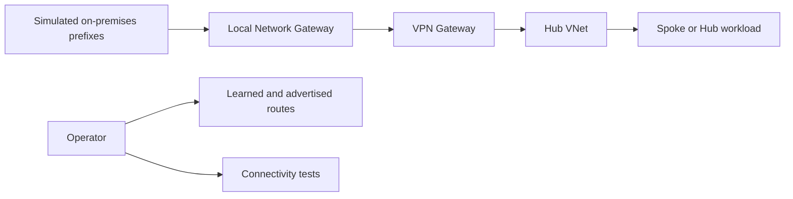

# Lab 05: ExpressRoute Simulation

Simulate ExpressRoute-style failover thinking without provisioning a real circuit by combining a hub VNet, a VPN gateway, local network gateway prefixes, and controlled route inspection. The goal is to learn route preference, failover expectations, and validation habits.

## Lab Metadata

| Field | Value |
|---|---|
| Difficulty | Advanced |
| Estimated Duration | 90-120 minutes |
| Focus | Hybrid route preference, local network gateway validation, backup-path thinking, route inspection |
| Tooling | Azure CLI, Network Watcher, Log Analytics optional |

## Prerequisites

- Permission to create VPN gateways, local network gateways, public IPs, and virtual networks.
- Awareness that gateway deployment takes significant time and incurs cost; tear down promptly afterward.
- A resource group such as `$RG=rg-net-lab05`, location such as `$LOCATION=koreacentral`, and a planned test prefix such as `192.0.2.0/24` for simulated on-premises.
- A note that this lab simulates route and failover thinking; it does not replace real ExpressRoute testing with a provider circuit.

## Architecture Diagram



## Step-by-Step Instructions

### Step 1: Create the hub VNet and gateway subnet

```bash
az group create \
    --name $RG \
    --location $LOCATION

az network vnet create \
    --resource-group $RG \
    --name vnet-hub-lab05 \
    --location $LOCATION \
    --address-prefixes 10.150.0.0/16 \
    --subnet-name GatewaySubnet \
    --subnet-prefixes 10.150.0.0/24

az network vnet subnet create \
    --resource-group $RG \
    --vnet-name vnet-hub-lab05 \
    --name shared \
    --address-prefixes 10.150.10.0/24
```

Keep a separate shared subnet available for a test VM or route validation endpoint.

#### Why this step matters

- It establishes an observable checkpoint for the lab before you continue.
- It mirrors a real production activity that often appears in troubleshooting tickets.
- Save command output and timestamps so you can compare expected versus actual behavior later.

### Step 2: Create public IP and VPN gateway

```bash
az network public-ip create \
    --resource-group $RG \
    --name pip-vpngw05 \
    --sku Standard \
    --allocation-method Static

az network vnet-gateway create \
    --resource-group $RG \
    --name vpngw-lab05 \
    --public-ip-addresses pip-vpngw05 \
    --vnet vnet-hub-lab05 \
    --gateway-type Vpn \
    --vpn-type RouteBased \
    --sku VpnGw1 \
    --asn 65515
```

This takes time. Use the wait period to review the expected route-learning workflow.

#### Why this step matters

- It establishes an observable checkpoint for the lab before you continue.
- It mirrors a real production activity that often appears in troubleshooting tickets.
- Save command output and timestamps so you can compare expected versus actual behavior later.

### Step 3: Create the simulated on-premises object

```bash
az network local-gateway create \
    --resource-group $RG \
    --name lng-sim05 \
    --gateway-ip-address 203.0.113.10 \
    --local-address-prefixes 192.0.2.0/24 198.51.100.0/24
```

The local network gateway represents the remote network definition you would expect from a provider or on-premises router.

#### Why this step matters

- It establishes an observable checkpoint for the lab before you continue.
- It mirrors a real production activity that often appears in troubleshooting tickets.
- Save command output and timestamps so you can compare expected versus actual behavior later.

### Step 4: Create the VPN connection shell

```bash
az network vpn-connection create \
    --resource-group $RG \
    --name conn-sim05 \
    --vnet-gateway1 vpngw-lab05 \
    --local-gateway2 lng-sim05 \
    --shared-key ContosoDemoKey123!
```

This creates the Azure-side object even though a real remote device is not connected in the simulation.

#### Why this step matters

- It establishes an observable checkpoint for the lab before you continue.
- It mirrors a real production activity that often appears in troubleshooting tickets.
- Save command output and timestamps so you can compare expected versus actual behavior later.

### Step 5: Inspect learned and advertised route commands

```bash
az network vnet-gateway list-learned-routes \
    --resource-group $RG \
    --name vpngw-lab05

az network vnet-gateway list-advertised-routes \
    --resource-group $RG \
    --name vpngw-lab05 \
    --peer 203.0.113.10
```

The returned data may be empty without a live peer, but the point is to learn the exact inspection path and compare it later with a real environment.

#### Why this step matters

- It establishes an observable checkpoint for the lab before you continue.
- It mirrors a real production activity that often appears in troubleshooting tickets.
- Save command output and timestamps so you can compare expected versus actual behavior later.

### Step 6: Add a route-table exercise for failover thinking

```bash
az network route-table create \
    --resource-group $RG \
    --name rt-shared05 \
    --location $LOCATION

az network route-table route create \
    --resource-group $RG \
    --route-table-name rt-shared05 \
    --name simulated-onprem \
    --address-prefix 192.0.2.0/24 \
    --next-hop-type VirtualNetworkGateway

az network vnet subnet update \
    --resource-group $RG \
    --vnet-name vnet-hub-lab05 \
    --name shared \
    --route-table rt-shared05
```

This step teaches how workload subnets can be directed toward gateway-managed prefixes in a hybrid design.

#### Why this step matters

- It establishes an observable checkpoint for the lab before you continue.
- It mirrors a real production activity that often appears in troubleshooting tickets.
- Save command output and timestamps so you can compare expected versus actual behavior later.

### Step 7: Document backup-path questions you would ask in a real ExpressRoute design

```bash
az network local-gateway show \
    --resource-group $RG \
    --name lng-sim05 \
    --query "localNetworkAddressSpace.addressPrefixes"

az network vpn-connection show \
    --resource-group $RG \
    --name conn-sim05 \
    --query "{connectionStatus:connectionStatus,ingressBytesTransferred:ingressBytesTransferred,egressBytesTransferred:egressBytesTransferred}"
```

Use this as a worksheet step: what routes should be preferred, how would VPN backup compare with ExpressRoute primary, and which tests would prove failover works?

#### Why this step matters

- It establishes an observable checkpoint for the lab before you continue.
- It mirrors a real production activity that often appears in troubleshooting tickets.
- Save command output and timestamps so you can compare expected versus actual behavior later.

## Validation Steps

- [ ] The gateway subnet, VPN gateway, local network gateway, and connection resources exist and can be inspected with CLI.
- [ ] You can list the commands required to inspect learned routes, advertised routes, and connection state.
- [ ] A route table can direct a subnet toward the virtual network gateway for simulated on-premises prefixes.
- [ ] Your notes identify what would still require a real provider-backed ExpressRoute test.

## Cleanup Instructions

```bash
az group delete --name $RG --yes --no-wait
```

Before cleanup, record any private IPs, route table names, or diagnostic screenshots you want to reuse in troubleshooting notes.

## See Also

- [Hybrid Connectivity Best Practices](../../best-practices/hybrid-connectivity-best-practices.md)
- [Vpn And Expressroute Basics](../../operations/vpn-and-expressroute-basics.md)
- [Vpn Gateway Troubleshooting](../../troubleshooting/playbooks/vpn-gateway-troubleshooting.md)
- [Connectivity Decision Guide](../../reference/connectivity-decision-guide.md)

## Sources

- [tutorial-site-to-site-portal](https://learn.microsoft.com/en-us/azure/vpn-gateway/tutorial-site-to-site-portal)
- [bgp-howto](https://learn.microsoft.com/en-us/azure/vpn-gateway/bgp-howto)
- [expressroute-introduction](https://learn.microsoft.com/en-us/azure/expressroute/expressroute-introduction)
